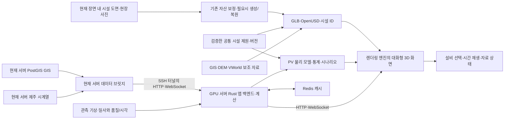
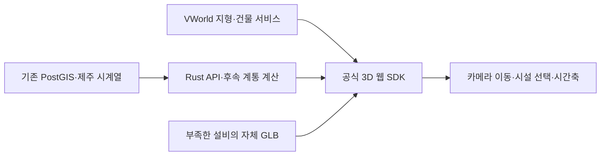

# 제주 전력망 디지털 트윈 구축 기획서 v0.4

> 2026-09-30 범위 수정: **현재 렌더링 장면 안의 실물 PV 우선 재현 → 관측 기상 동기화 → 같은 설비 제원으로 물리 모델·통계·시나리오 검증**을 현재 목표로 한다. 최신 우선 계약은 19절이다. 원천 `feat/async-data-bridge@3cc3a3b`의 이전 설계·데이터 서버 기록은 12절 및 14–18절에 과거 기록으로 보존한다. 그 기록의 “현재 서버”는 당시 데이터 서버이며, 현재 구현 범위는 [통합 장면](docs/estimated-twin.md)과 [수급·ESS 계산](docs/simulation.md)을 기준으로 구분한다.

## 현재 장면의 실물 설비 · 관측 기상 · 검증 가능한 재생에너지 모델

- 작성일: 2026-09-29, Asia/Seoul.
- 정본: 이 저장소의 `jeju_power_grid_digital_twin_design.md`. 이전 데이터 서버 경로는 과거 기록이다.
- 반영한 사용자 수정: Higgsfield를 제외하고 오픈소스 Image-to-3D 모델을 사용한다. 이전 대상 GPU는 사용자 확인 기준 A6000 두 장이다. Omniverse·Unity·Unreal 연동을 검증 가능한 요구사항으로 포함한다. VWorld/GIS/DEM은 위치·높이·배치의 보조 자료다.
- 문서 단계: 제주 문제해결형 제안의 설계와 구현 이력. 기존 GIS·Rust HTTP/WS·통합 3D·지역 수급/ESS 계산을 재사용한다. 기온·습도·최근 60분 강수의 API/WS 전달과 화면 표시는 구현했다([검증 기록](.omo/evidence/real-weather/implementation-evidence.md)). 실물 PV 형상 인증·일사 기반 PV 계산·통계 검증은 후속 계획이다.
- 작성 방식: Superpowers `brainstorming`의 architectural 경로. 기존 요구와 타당성 조사에 근거해 범위·구성·검증 기준을 정의한다.
- 선행 문서: [기획서 v0.1](jeju_power_grid_digital_twin_plan.md), [데이터·수학·Rust 타당성 검토](jeju_power_grid_data_and_modeling_review.md).
- 1차 결과물: 현재 장면 안의 검증된 PV 한 곳을 실제 형상·배치·치수·방위각·경사각으로 재현하고 같은 제원의 기상 기반 계산을 비교할 수 있는 연구·시연용 3D 앱.
- 추가 사용자 요구: Rust 백엔드를 Docker로 실행하고 Redis 캐시와 WebSocket을 사용한다. GPU는 3D 자산 제작과 선택한 렌더러에 사용하며 전력 계산은 CPU로 시작한다.
- 제안 실행안: **기존 GIS·GLB/OpenUSD·렌더러와 Rust·Redis·WebSocket 유지 + 실물 근거로 자산 보정 + 필요한 기상 필드와 PV 계산 보강**. Image-to-3D는 보조 제작 수단이며 실제 치수·배치의 근거를 대신하지 않는다. 다른 엔진 확대는 별도 검증 범위다.
- 실행 기반: 기존 데이터 서버 브릿지와 GPU 서버의 Rust 앱·Redis·3D 렌더러를 활용한다. API·전력 계산은 CPU에서, 자산 생성·선택한 서버 렌더링은 GPU에서 수행한다.
- 이전 모델·GPU·엔진 선택 근거는 18절에 보존하고, 현재 범위는 19절을 우선한다. “엔터프라이즈 기능 완벽 호환”은 검증된 결과로 사용하지 않는다.

## 1. 목적과 성공의 정의

공모전의 지역 문제는 **기상에 따라 변하는 재생에너지 생산을 지역 수요·저장 계획에 반영할 근거가 부족한 상황**으로 설정한다. 현재 제작 구역의 한 시설에서 생산 예측과 관측 차이를 검증하고, 운영자와 지역 사업 담당자가 같은 근거로 배치·저장 시나리오를 비교하도록 지원한다. 제주 전체의 과거 출력제어 기록은 배경 자료이며, 해당 시설의 실제 문제 규모·수혜자·손실과 도입 전후 효과는 현장 계량·운영 자료로 확인해야 한다. 3D 외형 개선은 이 비교의 대상과 입력 조건을 검증하는 수단이다.

해결할 문제는 실제 시설 외형·설치 조건, 주변 기상, 지역 수급이 서로 분리되어 있어 기상 변화가 해당 재생설비에 미치는 영향을 근거와 함께 설명하기 어렵다는 점이다. 시설 운영자·연구자는 모형 출력과 확보된 계량의 차이를 살펴보고, 제주 에너지 정책·사업 담당자는 입력 가정이 드러난 비교 시나리오를 검토하며, 주민·평가자는 실제 장소와 결과의 근거를 함께 확인한다. 현재 장면 밖의 제주 전체 상세 모델이나 실제 운영 제어를 약속하지 않는다.

첫 성공은 **현재 장면 내 실제 PV 한 곳의 도면·사진·제원을 연결하고, 같은 카메라 구도에서 형상을 비교하며, 동일한 자산 제원과 관측 기상을 사용한 PV 계산·기초 통계를 검증하는 것**이다. 장면 범위는 `grid-spec.json`의 [126.145, 33.31, 126.40, 33.435]이며 행정구역·배전 공급구역·전기적 경계로 검증된 값이 아니다. 임의로 ‘한경 지역’으로 확정하지 않는다. 제주 전체 수급은 범위를 명시한 배경 지표로 유지하고 장면 내 설비의 합계나 계량으로 대체하지 않는다.

GPU의 Python 추론 컨테이너는 사진 기반 3D 자산 제작을, 선택한 렌더링 엔진은 장면·상호작용을 담당한다(18절). Rust 서비스와 자료 준비용 Python 실행부의 책임을 구분한다. 영상 출력은 선택 기능이다. 물리적 전력 흐름과 실제 설비 운전 상태는 검증된 모델·계측이 담당한다. Rust는 데이터 조회·검증·캐시·API·WebSocket·후속 계통 계산을 담당한다.

## 2. 합의한 요구와 설계 가정

| 구분 | 내용 |
|---|---|
| 사용자 요구 | 기존 제주 기획서와 두 마운트 데이터를 활용한다. Rust 중심으로 구현한다. 이미지를 참고해 실제 사용할 수 있는 3D 환경을 만든다 |
| 사용 목적 | 현재 장면의 실물 설비·관측 기상·모형 출력의 관계를 확인하는 연구·시연 및 제주 문제해결 제안 |
| 우선 범위 | 기존 장면 유지, 검증된 PV 한 곳 우선, 기상 동기화와 동일 제원의 물리 모델·기초 통계 |
| 백엔드 요구 | Docker 실행, Rust API·계산, Redis 캐시, WebSocket 최신 상태 전달 |
| 프런트 요구 | 기존 대화형 장면·선택·카메라·시간축을 재사용하고 원본 사진과 같은 구도의 비교 및 근거 표시 보강 |
| 표현 정확도 | 우선 PV의 실물 형상·배치·모듈 치수/수량·방위각·경사각을 도면·현장 사진으로 검증. 미확보 부분은 추정으로 표시하고 실물 재현 통과에서 제외 |
| 제원 일치 | 렌더러·통계·물리 모델이 동일한 시설 ID와 제원 버전을 사용. 화면 전용 패널 수·각도로 계산하지 않음 |
| 기상 요구 | 기존 바람 수집을 재사용해 기온·습도·강수 전달을 보강하고 PV용 일사를 별도 확보. 시각·단위·거리·품질 보존 |
| 기존 자산 재사용 | PostgreSQL/PostGIS, 수급·기상·발전 수집기, 기존 GIS, 감사 산출물을 활용 |
| 검증 전 사용하지 않을 결과 | 현재 추정 DC 결과를 실제 선로 부하율·혼잡·HVDC 계측으로 표시하지 않음 |

이 문서의 실행 플랫폼·표현 수준은 수정 가능한 설계 결정이다. 전기 파라미터가 부족하다는 사실과 관측/추정의 구분은 실행 플랫폼을 바꿔도 유지한다.

## 3. 접근 방식 비교와 기본안

| 방식 | 적용 대상 | 판단 |
|---|---|---|
| TRELLIS.2 이미지 기반 생성 | 개별 설비·건물·주변 지물의 GLB 자산 | 부족한 외형의 보조 제작 후보. 기존 실행 이력과 별개로 보이지 않는 부분과 치수는 검증 필요 |
| 같은 장소 다중 사진의 SfM/MVS 복원 | 실제 지역 배치·시설 외형의 더 충실한 복원 | 겹치는 여러 방향 사진·기준 치수가 있을 때 사용 |
| GIS·DEM·공공 3D 재사용 | 위치·지형 높이·선로 경로·기존 geometry | 두 제작 경로의 공간 기준으로 활용 |

첫 범위는 제주 한 지역과 대표 시설로 제한한다. 생성 모델 하나로 제주 전체의 정확한 지리·전기 연결을 복원했다고 판단하지 않는다. 시설은 독립적으로 선택 가능한 mesh와 ID를 유지하고, 렌더러에서 전체 장면을 조립한다.

검증 순서는 **실물 시설 식별·도면/사진/제원 → 기존 GIS·3D 자산 보정 → 같은 구도 비교 → 관측 기상 동기화 → 같은 제원의 물리 모델 → 통계·시나리오 검증**이다. 표의 생성/복원 방식은 기존 자산으로 부족한 부분에만 선택한다. 엔진 교체나 전 제주 확대를 이번 MVP의 선행 작업으로 두지 않는다.

## 4. 1차 MVP 범위

### 4.1 포함하는 기능

1. 현재 장면의 지형·영상·풍력·PV·변전소·선로와 카메라·선택·레이어·시간축을 재사용한다.
2. 현재 장면 안에서 실물 식별과 근거 확보가 가능한 PV 한 곳을 선정한다. 기존 등록 좌표 3곳 중 어느 것도 실제 필지로 확정하지 않는다.
3. 선정 PV의 설치 방식·외곽·행열·모듈/지지대 치수·간격·높이·방위각·경사각을 도면/사진에 맞추고 동일 카메라 구도로 비교한다.
4. 시설 ID·원천·기준일·검증 상태·제원 버전을 3D 자산과 계산 입력에 공통으로 연결한다.
5. 기존 관측 바람에 기온·상대습도·강수를 연결하고, 일사량의 원천·단위·시간 구간을 확보해 PV 입력으로 정합한다.
6. 일사→경사면 일사(POA)→모듈 온도→DC→인버터 제한 AC의 최소 물리 모델과 기초 통계를 같은 제원으로 비교한다(19절).
7. 기존 제주 전체 수급 재생·수급/ESS 시나리오는 별도 범위 지표로 유지하며 관측·추정·계획·모형 결과를 명시한다.
8. 결측·품질 의심·갱신 지연·미확보값은 0과 구분하고, 기상 원천 실패 시 모형값도 유효 운전값으로 표시하지 않는다.

지역 집계값은 제주 전체 HUD에 표시한다. 개별 설비의 발전량은 검증된 해당 설비 계량과 ID 대응이 있을 때만 표시한다. 자료가 없는 모든 발전기에 제주 합계를 자동 배분해 실제 출력처럼 보이게 하는 기능은 포함하지 않는다.

### 4.2 확장 단계로 분리하는 기능

- 실제 연결관계 기반 DC/AC 조류, 선로 혼잡·전압·변압기 부하 계산.
- HVDC별 실제 흐름과 운전제약을 반영한 재급전, ESS, 출력제어 최적화.
- 미래 수요·재생 예측과 위험도, N−1·상태 추정.
- 전 배전망·개별 수용가·보호·주파수/인버터 EMT 모델.
- 모든 시설의 정밀 외형, 다중 사용자 편집, 상시 GPU 생성 서비스, 영상 제작.

확장은 아래 데이터 통과 조건에 따라 독립 설계·계획으로 구체화한다. 1차 MVP 완성을 위해 이 기능들을 함께 개발하지 않는다.

## 5. 보유 데이터와 사용 조건

아래 수량은 2026-09-29 감사 시점의 레코드 수다. 운영 DB 갱신으로 변할 수 있고, GIS 객체 수는 실제 회선·발전단지 수와 동일하지 않다.

| 자료 | 확인한 보유량 / 원천 | MVP 사용 | 선행 검증 |
|---|---|---|---|
| 선로 GIS | Hub `public.power_line`, 제주 51레코드 | 원천 선로 경로 표시 | HVDC 중복 제거, 전압 누락 5개 표시. 전기적 from/to는 별도 검증 |
| 변전소·변환소 | Hub `public.substation`, 13레코드 | 위치·명칭·전압 표시 | 이름 없는 시설 매핑. 같은 이름의 서로 다른 전압 설비 보존 |
| 풍력·발전설비 | Hub `public.power_plant`, wind 165·solar 704 등 | 시설/객체 유형별 표시 | 터빈과 발전단지의 관계, 출력 문자열·단위, OSM/인허가 중복 |
| PV 인허가 | Hub `public.pv_facility`, 제주 1,791레코드 | 위치·용량·상태 기준일 표시 | OSM solar와 중복 합산하지 않음. 등록 상태를 실시간 운전으로 해석하지 않음 |
| 제주 5분 수급 | Demand `public.jeju_supply_demand`, 602,673행, 2021–2026 | 지역 수요·재생 상태의 우선 원천 | 원천 시간대/구간, 품질 flags, 공급능력과 발전량 구분 |
| 제주 시간 수요 | Hub `jeju_demand_hourly`, 48,119행 | 보조 비교 및 이후 예측 | 49개 내부 시간 슬롯 누락, 자료원별 정의 확인 |
| 개별 발전 계량 | PV `plants`/`generation`, 제주 후보 2개 | ID·단위·시간 확인을 통과한 시설에 한해 선택 표시 | 용량 NULL, 한 시설의 지역 메타 오류, 음수 계량·시간 라벨 문제 |
| 기존 DEM 후보 | `/mnt/nvme/Energy-hub/research/data/raw/dem_korea.tif`, 218,364,148 bytes | 지역 환경의 기반 높이·전체 제주 공간 개요 | EPSG:4326과 제주 고도 포함을 확인. 원천·수직 기준·pixel 정합성은 추가 검증. 현장 사진을 대신하는 입력이 아님 |
| 2024 원별 거래량 | Hub `jeju_generation_mix`, 46,680행 | 후속 비교·연구 | 거래량 MWh와 실제 발전 MW의 의미·시장 범위 차이, oil 자료 공백 |
| 한전 접속정보 | Hub `research.kepco_grid`, 제주 99,860주소·15변전소 코드 | 후속 공간 배분·연결 검증 | 고객 주소 전체를 3D 객체로 렌더링하지 않음. 코드·용량 단위 확인 |
| 제주 ASOS | PV `weather_asos`, 4지점 각각 51,072행 | PV 과거 기상/일사 검증 후보 | 당시 table에 풍속/풍향 없음. 일사 결측·누적 단위·구간·현재 제공 범위를 재확인 |

위 자료는 기존 공간·수급 표시의 출발점이다. 이번 PV 검증에는 실물 제원·기상·일사를 추가 확보해야 하며, 개별 발전 계량은 시설 ID·단위·시각 검증 후 연결한다. FDW/복제 뷰의 동일 원천을 별도 데이터로 중복 집계하지 않는다.

마운트의 PostgreSQL 내부 저장 파일을 새 서버로 열어 읽지 않고 운영 DB의 조회 인터페이스를 사용한다. 현재 두 마운트는 조사 환경에서 읽기 전용이고, 2026.08/09 수급 CSV 두 개는 파일 내용 미검증이다. 해당 기간 DB 행의 조회 성공과 파일 전수검증은 구분한다.

## 6. 추가 확보 항목과 착수 조건

| 우선순위 | 필요한 입력 | 확보/처리 방향 | 통과 조건 |
|---|---|---|---|
| 실물 PV 우선 | 현재 장면 내 시설 ID·실제 필지·도면·사진·모듈/인버터 제원 | 기존 PV 자산을 검증 자료에 맞춰 수정 | 형상·치수·배치·방위각·경사각과 사진 시점 비교 통과(19.2절) |
| 관측 기상·일사 | 풍속/풍향·기온·습도·강수 및 별도 일사 자료 | 기존 Rust 수집/WS 경로 보강, ASOS 등 공식 원천의 제공 필드·권한 확인 | 시간 구간·단위·QC·시설/관측소 대응과 결측/지연 처리 검증 |
| 공공 공간 보조 경로 | VWorld 키·도메인, 제주 관심 구역 | 제공 공간·좌표/속성을 확인해 제작에 보조 사용 | 지형·건물·텍스처의 범위/기준일/형식·이용 조건 확인 |
| 첫 통합 검증 | 대표 시설 ID·좌표, 참조 사진과 생성 GLB/OpenUSD | 렌더링 엔진에서 장면을 조립하고 유용한 기존 모델을 재사용 | 자산 로딩·크기/축·선택·GIS 배치·두 시점 이상 데이터 연결 성공 |
| 지형 포함 MVP | 기존 DEM의 제주 추출본, 해안선/육지 경계, 고도 기준·자료 조건 | Energy-hub DEM/지형 타일 후보를 검증해 재사용. 지역 외형은 현장 사진으로 재현 | 원본·해상도·CRS·수직 기준·NoData·사용 조건을 기록하고 사진 기반 지역 환경과 맞춤 |
| 현재 장면 시설 대응 | GIS·공식 시설 master·3D 객체 대응 | 원천별 ID 보존, 검증한 시설만 병합 | 같은 시설/다른 전압·터빈/단지·중복 geometry를 구분 |
| 그래픽 실행 | 표시 PC 또는 브라우저의 그래픽 지원 | API 서버와 표시 클라이언트 분리 | 실제 표시 장치에서 로딩·조작·메모리/FPS 측정 |
| Level 4 | 회선/bus/변압기 연결, R/X/B·정격·tap, P/Q·발전 제어한계 | KEPCO/KPX 연구용 자료 및 독립 계측 | 출처·단위·운전시점이 있는 모델과 실측 비교 가능 |
| HVDC 운영 분석 | #1/#2/#3별 MW·방향·손실·가용한계·방향전환/램프 | 링크별 운영 자료·계측 | 정격·가용범위·관측값과 시나리오를 구분 |
| 예측/출력제어 | 풍속/풍향·예보 발행시각, 가용출력·제어 지령/실행량 | 기상/운영 원천 보강 | 미래 정보가 학습 입력에 섞이지 않는 시간순 검증 |

이전 Visit Jeju 사진 2장 확보 및 GPU 착수 전 상태는 14–18절의 이력이다. 현재 통합 장면과 생성 모델 실행 기록이 있어도 선정 PV의 도면·치수·실제 설치 형상 검증을 대신하지 않는다. 사진에서 보이지 않는 부분을 생성한 형상은 추정이며, 실물 재현에는 시설별 다중 시점 사진·도면·기준 치수가 필요하다.

현재 사용하는 Copernicus GLO-30 DSM은 시설 상세 측량을 대신하지 않는다. 추가 원천이 필요할 때 제공 범위·이용 조건과 좌표/고도 기준을 확인하며, 기존 장면을 다시 만드는 일을 이번 보완의 선행 조건으로 두지 않는다.

## 7. 구성과 데이터 흐름

아래 구성은 기존 브릿지·Rust·Redis·렌더러를 유지하는 기반이다. 실물 제원과 도면/사진으로 자산을 보정하고, 같은 제원 버전으로 PV 계산·통계를 만든다. 관측 기상은 기존 `src/weather.rs` 수집과 HTTP/WS 경로를 보강한다. 추가 브로커·플랫폼·모델 서비스 없이 필요한 필드와 계산만 연결하며, 최신 데이터 계약은 19절을 따른다.



| 구성 요소 | 책임 | 최소 기술/산출물 |
|---|---|---|
| 기존 저장·수집 | 현재 GIS와 수급 원천을 유지 | PostgreSQL/PostGIS와 기존 수집기 재사용 |
| 현재 서버 데이터 브릿지 | 원천 SELECT, 단위/시간·품질 보존, GIS·관측·과거 자료 전달 | 최소 Rust 조회·HTTP/WS 실행부. 현재 서버에는 앱 계산·3D 기능을 추가하지 않음 |
| GPU 서버 Rust 앱 백엔드 | 브릿지 자료 수신·검증, 캐시, 사용자 API·WS, 시뮬레이션 | `axum`, `tokio`, `serde`, `redis`; 원천 DB 대신 브릿지 연결 |
| 자산 제작 | 도면·사진·공통 제원으로 기존 설비 geometry 보정 | 기존 제작 코드와 GLB/USD 재사용, GPU 생성은 필요한 자산만 보조 |
| 렌더링 엔진 | 장면 조립, 카메라·선택·시간축·표시값 갱신 | 기존 웹 장면과 Omniverse 교환 경로 활용. Unity/Unreal 확대는 별도 확인 |
| GPU 서버 Redis 캐시 | 검증한 GIS/시계열 조회 결과의 일시 보관 | 브릿지 기준 캐시, namespace·TTL·실패 시 브릿지 조회 |
| 자산/지형 묶음 | 원천·단위·축·좌표·라이선스·ID 대응을 보존 | GLB, 제주 지형 mesh, manifest |
| 후속 계산 | 검증한 계통과 snapshot을 이용한 계산 | 독립 입력/출력 계약. MVP API 경로에 미검증 solver를 연결하지 않음 |

기존 데이터 브릿지와 GPU 서버의 Rust 앱·Redis·표시 클라이언트를 재사용한다. PostgreSQL/PostGIS는 브릿지를 통해 조회하며 추가 메시지 브로커·새 시계열 DB·분산 계산·모델 플러그인 시스템은 만들지 않는다. 기존 lockfile과 실행 경로를 유지하고, 당시 환경 준비 상태는 12·16·18절의 이력으로만 읽는다.

DB 접속정보는 현재 서버의 브릿지에만 주입한다. GPU 서버의 앱은 브릿지 주소와 전송된 데이터만 사용한다. 현재 프로젝트에는 브릿지 코드·방법론·기획서를 두고, 제품 코드는 GPU 서버의 작업 공간에서 작성·빌드·실행한다. 첫 연결은 18.6절의 SSH 터널로 구성하며 공개 서비스 배포는 별도 요구사항으로 다룬다.

### 7.1 좌표와 3D 자산

GIS 원본은 EPSG:4326으로 보존한다. 현재 장면은 EPSG:32652(UTM52N), 원점 126.17217/33.3430267, 미터 단위, X=동/Y=상/Z=남을 사용한다([통합 장면](docs/estimated-twin.md)). 기존 좌표계를 유지해 실물 자산을 정합하고, 진북 방위각과 렌더 좌표 방향의 변환을 기록한다. 이전 ENU 원점 설계로 현재 장면을 임의 교체하거나 위경도를 미터처럼 사용하지 않는다.

고도 자료의 평균해수면/지오이드·타원체 기준 및 필요한 변환을 기록한다. 현재 DSM·지형 mesh와 장면 경계를 유지한다. 전체 원천 HVDC 경로는 provenance에 보존하되 장면 밖 구간을 상세 화면으로 확대하지 않는다. 시설의 설치 높이는 DSM과 실물 기준점의 차이를 따로 확인한다.

자산 manifest는 scene/시설 종류, GLB 경로, scale(m), 방향 보정, pivot, 연결할 시설 ID, 사용한 실사 photo ID, 재구성 방법·추정 부분, 원천·버전·사용 조건을 담는다. facility ID는 자산 node 이름만으로 추측하지 않고 외부 대응표로 연결한다. 필수 glTF 확장·재질·텍스처·축/단위와 node 선택을 먼저 확인한다. 모델을 읽지 못하면 기본 표식으로 시설 선택과 정보 조회를 유지한다.

### 7.2 API와 시계열 계약

| API | 용도 | 동작 규칙 |
|---|---|---|
| `GET /api/v1/jeju/assets` | 제주 GIS와 시설 metadata | 안정 ID, 종류, EPSG:4326 geometry, 용량/전압의 단위·출처·기준일 전달. HVDC는 제주 내부 bbox만으로 잘라 버리지 않음 |
| `GET /api/v1/jeju/timeline?start=...&end=...` | 선택 가능한 실제 관측 시점 | timezone offset가 있는 시각 입력. 한 요청은 최대 7일, 초과는 422. 결측 시간 슬롯을 생성하지 않음 |
| `GET /api/v1/jeju/state?at=...` | 선택 시점 또는 최신 집계 | `at` 생략은 최신. 지정하면 정확히 일치하는 관측만 반환하고 없으면 404. 가장 가까운 과거 값을 조용히 대체하지 않음 |
| `GET /api/v1/jeju/ws` | HTTP upgrade 후 최신 상태 전달 | 접속 시 전체 최신 snapshot, 이후 변경 시 전달. 재접속 시 재동기화. 과거 재생은 HTTP 조회 사용(16.4절) |
| `GET /api/v1/health` | 서비스 준비 여부 | 필수 DB 조회 가능 여부를 구분. 의존 DB 실패를 성공으로 보고하지 않음 |

응답의 공통 항목은 schema version, 원천 시각, UTC offset가 있는 timestamp, source, quality flags다. 집계 항목은 `demand_mw`, `supply_capacity_mw`, `wind_mw`, `solar_mw`, `renewable_total_mw`이며 `supply_capacity_mw`는 원천 `supply_mw`를 의미에 맞게 표기한다. MW를 기본 전력 단위로 사용한다.

검증한 개별 계량이 있으면 state 응답의 `facility_states`에 안정 시설 ID별 값·원천 시각·source·단위·quality flags를 담는다. 해당 시점에 자료가 없거나 ID/시간/단위 검증 전이면 항목을 생략하고 시설 상세는 자료 미확보로 표시한다. 지역 합계를 이 map의 개별 값으로 복사하지 않는다.

원천 naive timestamp의 KST 여부와 구간 시작/종료 정의를 문서·원천 응답으로 확인한 뒤 변환한다. 확인하지 못한 개별 발전 계량을 임의로 ±1시간 옮겨 MVP에 넣지 않는다. 값 0은 유효 관측값이고 NULL/자료 부재와 구분한다. 비정상 후보 값은 자동 clip하지 않고 원천값과 품질 표시를 함께 유지한다.

NaN/Infinity 등 JSON 수치로 전달할 수 없는 값은 NULL과 품질 flag로 전달하고 원천 문제를 기록한다. source·timestamp·품질 정보를 버린 0 대체는 하지 않는다.

최신 모드는 서버가 60초마다 원천을 확인하고 변경된 snapshot을 WebSocket으로 전달한다. 클라이언트 수와 무관하게 서버의 확인 주기를 공유한다. 원천 자료 시각이 현재보다 15분 이상 오래되면 갱신 지연을 표시한다. 역사 재생 모드는 HTTP로 실제 관측을 조회하며 최신 WS 값이 이를 덮어쓰지 않게 한다. 늦게 도착한 이전 시간 선택의 응답을 적용하지 않는다. 서버에서 조회 구간과 행 수를 제한하고 렌더링 프레임마다 DB/API를 호출하지 않는다.

## 8. 사용자 동작과 표시 원칙

| 사용자 동작/상태 | 앱의 동작 |
|---|---|
| 시작 | 현재 장면과 자료 기준일을 표시. 제주 전체 수급은 범위가 다른 배경 지표로 명시. 로딩과 완료 구분 |
| 시설 선택 | 같은 ID의 상세 정보와 모델을 표시. 시간 변경 중 선택 유지 |
| 시간 변경 | 해당 관측 시각의 전체 집계와 확보한 개별 계량만 갱신 |
| 발전량/용량 없음 | `—`와 자료 미확보 표시. 0 MW나 0%로 대체하지 않음 |
| GIS는 있지만 전기 연결 미검증 | 선로 경로는 표시하되 실제 조류·부하율로 설명하지 않음 |
| HVDC 링크 계측 없음 | 경로·종류·출처 있는 정격 표시. 방향 화살표·운전 MW는 표시하지 않음 |
| 자료 품질 의심 | 수치를 숨기거나 고치지 않고 해당 값에 품질 표시 |
| API 단절 | 마지막 성공 시점/값과 연결 오류 표시. 정적 GIS와 카메라 조작 유지 |
| 자산/지형 로딩 실패 | 실패 원인과 재시도 안내. 자산은 기본 표식으로 대체. 지형 실패 상태는 완성된 지형처럼 표시하지 않음 |

시설 모델의 회전·발광·색은 시각 표현 규칙이다. 계측이나 계산이 없는 터빈 회전수·선로 입자 속도를 실제 물리량으로 이름 붙이지 않는다. 관측이 있는 값은 ‘자료원 집계’, 배분 값은 ‘배분 추정’, 계산 시나리오는 ‘시뮬레이션’으로 구분한다.

한국어 글꼴의 문자 표시와 배포 조건을 확인하고 MW/MWh/kV, KST·UTC offset, 시설명·출처를 읽을 수 있게 한다. 시설 좌표와 metadata가 현재 기준이면 과거 시계열 재생에서도 그 기준일을 유지해 표시한다. 과거 전체 GIS를 복원한 것처럼 설명하지 않는다.

## 9. 수학 모델의 도입 순서

사용자가 추가로 요청한 시뮬레이션의 단계·시간 간격·계산/화면 연결·검증 기준은 17절에 구체화한다. 현재 데이터로 가능한 지역 집계 시나리오와 추가 전기 파라미터가 필요한 선로/전압 해석을 구분한다.

### 9.1 MVP: 시간·단위·좌표 정합성

시계열을 같은 시간·측정 범위로 맞추고 GIS 좌표를 렌더 좌표로 변환하는 것이 첫 수학적 작업이다. 에너지에서 평균 출력을 구할 때는 \(\bar P=E/\Delta t\)를 사용한다. MWh와 MW는 구간 길이를 확인한 뒤 변환한다. 현재 원별 시장 거래량을 그대로 도내 전체 발전으로 사용하지 않는다.

이번 보완의 우선 계산은 검증된 PV 제원과 관측 기상에 따른 POA·온도·DC/AC 출력이다(19.4절). 기존 지역 집계 배율 시나리오와 분리하고, 모형 출력을 해당 시설의 실제 계량으로 명명하지 않는다.

### 9.2 후속: 공간 배분과 DC 조류

bus별 P/Q 계량이 부족할 때는 지역 판매량·공급구역 등 근거 있는 가중치로 합계를 보존하는 배분 모델을 별도로 설계한다. \(\sum_i d_i=D\)를 만족해도 각 bus의 실제 부하가 식별됐다는 뜻은 아니다. 기존 EV 충전기 개수 배분은 비교 가정으로만 취급한다.

검증한 연결과 X가 확보되면 DC 모델 \(Af=p\), \(f_\ell=S_{base}(\theta_i-\theta_j)/x^{pu}_\ell\)부터 시작한다. 이 식은 tap=1·phase shift=0의 송전망 근사다. tap/phase shift가 있는 사례는 해당 항을 지원하는 모델로 검증한다. HVDC는 AC 선로와 구분한 제어 주입/링크 한계로 둔다. 섬 분리와 주입 수지 실패를 자동 가상 연결·무제한 slack으로 감추지 않는다.

선로 loading은 출처 있는 정격으로만 계산한다. R/X의 Ω와 pu를 한 번만 변환한다. 기존 코드의 `Line.x` 단위 불일치, 일괄 300MVA 정격, 화력/HVDC 50:50 분담, 계산 후 고정 `converged=True`를 이식하지 않는다.

### 9.3 데이터 확보 후: AC·운영 최적화·예측

R/X/B·tap·bus P/Q·발전기 제어한계가 확보되면 \(S_i=V_i\overline{\sum_jY_{ij}V_j}\)를 푸는 AC PF와 계측 비교를 진행한다. LP/MILP 기반 HVDC/ESS/출력제어 모델은 손실·방향전환·가용출력·SOC·램프 조건이 채워진 뒤 도입한다. `good_lp`는 선형 모델러이며 일반 AC OPF나 QP를 자동으로 해결하는 도구로 취급하지 않는다.

예측은 관측만으로 하루전 예보를 대신하지 않고 issue_time/valid_time을 보존한다. 2024.06 출력제어 라벨 변경과 2024.11 HVDC3 상업운전 전후를 시간순 평가에서 구분한다. Rust 언어 선택 자체를 수학적 신규성으로 주장하지 않는다. 모델 상세식·문헌은 선행 검토 보고서의 7–9절을 따른다.

## 10. 단계별 산출물과 통과 기준

| 단계 | 산출물 | 통과 기준 |
|---|---|---|
| G0 근거 확정 | 현재 장면 내 PV 한 곳의 ID·도면·사진·제원·이용 조건과 기상/일사 입력 목록 | 실제 필지 대응 및 미확보값 공개. 등록 좌표·용량만으로 형상 확정 금지 |
| G1 실물 형상 | 기존 장면에 보정한 PV와 같은 구도의 원본/렌더 비교 | 행열·치수·배치·방위각·경사각·기준점 오차 및 추정 부분 기록. 사전 허용오차 이내 |
| G2 기상 동기화 | 기존 풍속/풍향 + 기온·습도·강수 및 일사 계약 | 원천값·단위·시간/관측소·지연/QC 대조. 결측을 0으로 대체하지 않음 |
| G3 모형·통계 통합 | 동일 제원의 PV 계산·최소 통계·비교 시나리오와 실행 안내 | 19.4–19.6절의 기준 사례·경계조건·관측 비교·제원 일치 및 기존 재생/선택 유지 |
| G4 검증된 연구 모델 | 기준 사례와 비교한 Rust DC 코어, 출처 있는 제주 입력 또는 가정 사례 | 독립 설계 후 MATPOWER case14/30/118 비교. 동일 baseMVA·tap·status·slack·옵션, nodal balance와 finite/island 검사 |
| G5 Level 4/운영 연구 | AC·링크별 HVDC·최적화·예측 | 각 모델의 필요한 입력 및 독립 계측 확보, 제약 위반·잔차·시간순 예측 검증 |

G0–G3가 이번 보완 MVP의 범위다. G4–G5와 장면 밖 확대는 후속 조건이며 이 문서만으로 구현을 승인한 것으로 보지 않는다. 일정은 근거 확보와 통과 조건으로 관리한다. 실물 자료를 확보하지 못하면 ‘자료 미확보’로 남기며 기존 추정 자산으로 G1 완료를 선언하지 않는다.

## 11. 검증과 완료 판정

| 검증 영역 | 확인할 상황 | MVP 완료 기준 |
|---|---|---|
| 공간/좌표 | 변전소·대표 발전설비·HVDC terminal 포함 최소 5개 기준점 | f64 기준 좌표 변환과 표시 좌표 차이 1m 이내. 이는 원천 좌표 정확도를 새로 보증하는 수치가 아님 |
| 실물 PV 자산 | 원본 도면·사진과 동일 구도, 위/옆 시점, 시설 선택 | 실제 설치 방식·행열·치수·각도·기준점 오차가 19.2절 기준을 만족. 일반 4×8 예시와 실물 재현 구분 |
| 기상·물리 모델 | 맑음/흐림·야간·고온·결측·지연·인버터 한계 | 원천 단위/시각/QC 및 POA→온도→DC→AC 단계별 기준값 비교, 동일 제원 버전 확인(19.6절) |
| 집계/API | 정상 5분 시점, 0값, 결측 시점, 의심값, 비유한값, 최신/역사 모드 | 원천값과 같은 의미/단위로 전달. 결측 404, 과도한 구간 422, DB 실패 명시. 비유한값은 NULL+flag. 표시용 반올림만 적용 |
| 시점 경쟁 | 시간 A 선택 뒤 B 선택, A 응답이 늦게 도착 | 최종 화면의 시각과 값이 B에 일치 |
| ID/geometry | HVDC 중복 geometry, 같은 시설명의 서로 다른 전압, 지역 메타 오류 | 물리 회선으로 중복 합산하거나 이름/region만으로 시설을 잘못 병합하지 않음 |
| 단절/실패 | API timeout·DB 단절·GLB/terrain 실패 | 마지막 성공 시점과 오류 표시, 정적 조작 유지, 성공으로 오표시하지 않음 |
| Redis/WS | 캐시 miss·Redis 단절, 브릿지/WS 재접속·느린 소비자, 같은 관측 시각의 값 정정 | 브릿지 조회로 복구, 재접속 snapshot, 큐 누적 제한, 정정 전달. heartbeat를 새 관측으로 표시하지 않음 |
| 성능 | 시험 PC와 GPU/드라이버·OS 기록, 1920×1080, 감사 규모에 해당하는 단순 표식/선로 | 카메라 조작의 60초 측정에서 FPS p5≥30을 목표로 검증. 자산 정밀도·표시 밀도를 조정해 같은 조건으로 재측정. 미달이면 미달 결과 기록 |
| 화면 이해 | 전체 집계와 개별 계량, 공급능력, 관측/추정/시나리오 구분 | 사용자가 선택한 시점·값의 의미·미확보 범위를 확인 가능 |

성능 기준은 보정한 최종 장면에서도 검증할 목표다. 기존 GPU/FPS 측정 기록은 [통합 장면](docs/estimated-twin.md)에 있으며 새 자산의 결과로 자동 승계하지 않는다. 최신 수집 지연·자료 공백은 앱 성능 문제와 구분한다. 수치 모델은 별도의 잔차·허용오차·비교 옵션을 고정한 검사를 가진다. 화면 애니메이션으로 물리 모델의 정확도를 판정하지 않는다.

## 12. 실행 환경과 남은 위험 — 2026-09-29 과거 기록

> 아래 환경·미실행 상태는 이전 데이터 서버 조사 기록이다. 현재 GPU 서버·장면의 상태 판정에는 사용하지 않으며, 현재 범위는 19절과 구현 문서를 따른다.

현재 서버에서 Rust/cargo 1.96.0, x86_64 논리 CPU 64개, RAM 약 62GiB를 확인했다. 현재 세션은 tty이며 DISPLAY/Wayland 설정이 없고 `nvidia-smi`는 드라이버 통신에 실패했다. Blender·CMake·clang은 설치되어 있지 않다. 서버가 API/계산을 수행하고 다른 PC가 3D를 표시하는 기본안은 이 상태를 반영한다. native solver를 선택할 때 CMake/C++ 도구 요구를 추가 확인한다.

| 불확실성 | 대응 | 개발 진행에 미치는 영향 |
|---|---|---|
| VWorld 제주 현장 상세·데이터 기준일·네이티브 재사용 미검증 | 공식 SDK에서 관심 구역부터 확인. 부족 시설은 별도 자산으로 보완. 원본 파일 저장/변환 가능 여부 별도 확인 | API 제공 사실만으로 전 제주 실사 품질이나 Bevy import 가능을 확정하지 않음 |
| GPU 추론·엔진 import·외부 WS 연결 미검증 | 대표 자산 하나의 생성→export→엔진→Rust 연결을 확인 | GPU 제원·공식 형식 지원과 실제 통합 성공을 구분 |
| 엔진별 GLB/USD 확장·재질 호환 | 실제 파일 검사와 로딩, 필요한 경우 호환 형식으로 재export | 생성 성공과 선택한 엔진의 import 성공을 별도 판정 |
| 기존 DEM의 수직 기준·변환 품질과 현장 상세 미검증 | 제주 추출/manifest 검증, 실사 사진과 기준점으로 지역 scene 보완 | 고도 자료와 사진 기반 외형의 검증을 구분. 데이터 API 개발은 진행 가능 |
| 부정확한 시설 병합·연결 추정 | 원천 ID·전압·객체 종류 보존, 확인한 대응만 적용 | 지도와 검증된 전기 network를 구분 |
| 상세 계량·전기 파라미터 부족 | 지역 집계 MVP를 완료하고 기관 자료/계측 보강 | 실제 혼잡·전압·개별 HVDC 상태의 검증 범위 제한 |
| 표시 장치·웹 호환 미확정 | 실제 PC 또는 브라우저에서 G1과 성능 검증 | 화면 배포 선택이 빌드·자산 크기 기준에 반영됨 |

## 13. 설계 검토와 다음 산출물

이 기획서는 현재 장면의 실물 PV와 기상 기반 계산을 우선하는 검토용 v0.4다. 검토 시에는 실제 시설 식별, 형상/각도 근거, 동일 제원의 렌더러·계산·통계 연결, 관측/추정/계획/모형 구분과 G0–G3 완료 기준을 확인한다.

[구현 계획](jeju_power_grid_implementation_plan.md)과 현재 [장면](docs/estimated-twin.md)·[계산](docs/simulation.md)에서 재사용할 기능을 확인하고, 19절의 미확보 입력과 통과 기준을 다음 구현 작업으로 구체화한다. 이번 문서 수정 자체가 PV 재현·기상 필드 추가·모델 구현을 완료한 것은 아니다.

## 14. 제주 실물 사진 반영과 3D 환경 제작

> **14–18절은 2026-09-29 중심의 이전 조사·설계·실행 기록이다.** ‘첫 후보’, ‘현재’, ‘미실행’ 및 제주 전체 확대·GPU 이전 순서는 당시 상태/계획을 뜻한다. 현재 우선 범위·구현 상태와 충돌하면 1–11절 및 19절을 우선한다. 과거 사진·모델·엔진 근거는 보존하되 새 실물 PV 검증의 증거로 자동 승계하지 않는다.

### 14.1 수집 단위와 첫 지역

**같은 장소의 실제 사진으로 자산을 생성/복원하고, 해안·도로·돌담·식생·건물·전력설비가 있는 탐색 가능한 3D 화면을 구성한다.** 기존 공공 모델이나 geometry가 이 제작에 유용하면 보조 자료로 재사용한다. 전체 제주 개요에서 상세 지역을 선택하면 그 현장 환경으로 이동하는 구조다. 위성영상만으로 현장 모습 재현을 완료 판정하지 않는다.

첫 후보는 공식 현장 사진을 확보한 **신창풍차해안도로와 인접 해안 구간**이다. 해안·도로·바위·바다·풍력설비를 함께 비교할 수 있다. 관광지 명칭을 DB의 Hangyoung 발전소 ID와 자동 연결하지 않고 실제 시설/터빈의 대응을 별도로 확인한다. 관광지 좌표도 사진을 찍은 카메라 좌표와 구분한다.

첫 지역은 약 300m×300m 수준의 제한된 범위부터 제작하는 설계 목표다. 실제 작업 범위는 수집한 사진에 보이는 지물과 확인한 기준점을 기준으로 경계를 정한다. 보이지 않는 지역 전체를 정확하게 복원했다고 표시하지 않는다.

### 14.2 사진을 어디서 모으는가

| 수집 경로 | 활용 | 확인한 사실 / 진행 상태 |
|---|---|---|
| 제주관광공사 Visit Jeju의 지역 상세·사진 서비스 | 특정 장소의 전경·도로·해안·주변 환경 참고 | 신창 현장 사진 2장 다운로드·decode·육안 확인. Photo Jeju 페이지에는 BY-NC-SA 안내가 나타나지만 이 안내를 두 사진의 개별 조건으로 확정하지 않음 |
| 한국관광공사 포토코리아 | 지역명으로 고해상도 전경·지물 사진 후보 수집 | 공식 서비스와 사진별 공공누리 유형 안내 확인. 회원/용도와 개별 원본 다운로드는 아직 실행하지 않음 |
| 실제 시설 운영자의 사진·도면 | 같은 풍력·PV·변전소·HVDC 시설의 전체 외형과 배치 | 대응 시설의 원본과 제공 범위 확보 필요. 보도 사진의 이용 조건을 시설 운영자 사진과 동일하게 가정하지 않음 |
| 직접 촬영 또는 사용 가능한 현장 원본 | 같은 장소의 겹치는 여러 시점 사진, 정밀 복원 | 정확한 공간을 만들 때 우선. 촬영 세트·카메라·시간·위치/기준 치수를 함께 기록 |

온라인 사진은 해당 지역을 찾아보고 재질/구도를 정하는 데 먼저 쓴다. 실제 텍스처나 생성 서비스 입력으로 사용할 사진은 파일별 이용 조건과 사용할 목적을 확인한 원본으로 선정한다. 변경 가능한 공공누리 유형 또는 직접 촬영/제공받은 사진을 우선 후보로 삼고, 라이선스가 확인되지 않은 자료는 출처 링크와 로컬 참고 상태로 기록한다.

### 14.3 지금 저장한 실사 사진

| 파일 | 직접 확인한 내용 | 용도와 한계 |
|---|---|---|
| [신창풍차해안도로 실사](reference_photos/jeju/sinchang_wind_coast_reference.webp) | 현무암 해안·조간대·산책로·풍력 터빈 일부·조형물/글자 구조물. 1280×373 | 해안의 지물·색·구도 참고. 전면 글자와 터빈 잘림 때문에 정밀 시설 복원/텍스처 원본으로 바로 사용하지 않음 |
| [신창–차귀 해안도로 실사](reference_photos/jeju/sinchang_chagwi_coast_reference.webp) | 해안도로·현무암·바다·노을·풍력 타워 일부. 1242×362 | 도로 곡선·해안 배치·조명 참고. 역광/flare와 터빈 상부 잘림, 카메라·촬영시각 미확인 |
| [사진 목록·출처·파일 검증](reference_photos/jeju/photo_catalog.json) | 공식 페이지·사진 URL·ID·크기·SHA256·육안 관찰·이용 상태 | CDN 경로 날짜를 촬영일로 기록하지 않음. 두 장을 검증된 SfM 촬영 세트로 취급하지 않음 |

이 두 장은 실제 사진 수집의 시작 자료다. 풍력 전체 형상·도로 반대 방향·해안 지물의 측면/후면이 부족하므로 다음 수집에서 보강한다. 사진을 추가하기 전 현재 두 장으로 원본 지역의 완전한 3D 복원이 가능하다고 판단하지 않는다.

### 14.4 추가 사진의 수집 목록

| 사진 역할 | 수집할 내용 | 첫 지역의 설계 목표 |
|---|---|---|
| 지역 전경 | 도로와 해안, 시설이 함께 보이는 넓은 구도 | 같은 지역의 여러 방향 사진 6–10장 |
| 이동 시점 | 실제 카메라가 몇 걸음씩 이동한 겹치는 연속 시점 | 사진 참고 제작은 12–20장으로 시작. 정밀 SfM/MVS를 선택하면 약 80–150장부터 촬영 품질과 실제 등록률로 평가 |
| 시설 외형 | 풍력 전체·타워/나셀/블레이드, 변전소 외관 등 해당 시설 | 확인한 대표 시설의 전체 형상과 여러 측면 8–12장 |
| 지물/재질 | 현무암·돌담·도로·펜스·지면·식생의 가까운 사진 | 역할별 2–4장. 그림자·반사·글자가 재질로 고정되지 않게 선정 |
| 기준 정보 | 위치, 카메라/렌즈·촬영시각, 알려진 길이 또는 기준점 | 확인한 값만 기록. 지도 관광지 좌표나 추정 GPS를 카메라 EXIF처럼 사용하지 않음 |

장수는 수집을 계획하기 위한 목표이고, 많은 사진만으로 복원 성공을 보장하지 않는다. 이미지 등록과 시점 연결이 되는지 검사한다. COLMAP 공식 지침에 따라 같은 물체가 최소 3개 사진에서 보이도록 겹침을 확보하고, 카메라 위치를 실제로 이동시키며 비슷한 조명 조건을 유지한다. 바다·하늘·움직이는 블레이드·반복적인 흰 표면은 정적 형상 복원이 어려워 환경 표현/별도 자산으로 처리할 수 있다. [COLMAP 공식 촬영·복원 지침](https://colmap.github.io/tutorial.html).

photo catalog에는 photo/scene ID, 대상 시설 ID, 공식 페이지/원본 URL, 촬영자·사용 조건, 실제 촬영일과 위치의 확인 수준, 카메라 정보, 크기·hash, 역할, 제작 사용 가능 여부를 기록한다. 원본 사진과 전처리/생성 결과의 대응을 남긴다.

### 14.5 사진에서 3D 환경을 만드는 두 경로

**기본 경로 — 개별 설비 생성과 지역 장면 조립**

1. 같은 지역의 사진에서 설비와 배경을 구분하고 사용 가능한 원본을 선정한다.
2. 대표 설비의 crop/mask를 준비해 GPU의 TRELLIS.2로 mesh·PBR 자산을 만든다. 첫 입력은 전체 외형이 보이는 설비로 선정한다.
3. 실제 사진과 대조해 실루엣·얇은 구조물·후면·재질을 확인하고, 필요한 부분을 제작 도구에서 수정한다.
4. 알려진 치수로 scale을 맞추고 타워·회전자처럼 움직일 부분의 node/pivot을 정리한다. 생성 모델이 자동 rigging을 완료한다고 가정하지 않는다.
5. GLB와 시설 ID manifest를 내보내고, 엔진 교환용 OpenUSD를 변환·검증한다.
6. GIS/DEM의 위치·높이·도로/해안 기준에 맞춰 장면을 조립하고 Rust HTTP·WebSocket을 연결한다.

보이지 않는 형상은 추정 제작이다. 단일 객체 생성 모델을 사용했다는 사실만으로 실제 지역 전체의 형상·배치·전기 연결을 복원했다고 판단하지 않는다.

**정밀 경로 — 같은 장소의 다중 시점 사진으로 복원**

동일 세션의 충분한 사진이 확보되면 기존 COLMAP 같은 도구로 **사진 → SfM 카메라/희소점 → MVS 깊이/밀집점 → mesh·texture → 경량화·선택 가능한 시설 분리 → GLB**를 검증한다. 서로 다른 장소/시기/조명의 관광 사진 모음만으로 이 경로가 성립한다고 가정하지 않는다.

복원 도구가 출력한 point cloud/mesh와 재질은 제작 도구에서 검토·정리한 후 GLB로 내보내는 변환 단계를 둔다. COLMAP이 선택 가능한 완성 GLB 장면을 직접 제공한다고 가정하지 않는다.

SfM의 주요 모델은 영상 관측점과 카메라 투영의 재투영 오차를 줄이는 것이다.

\[
\min_{\{R_i,t_i,K_i,X_j\}}\sum_{(i,j)\in\mathcal O}
\rho\!\left(\|u_{ij}-\pi(K_i(R_iX_j+t_i))\|^2\right).
\]

단안 사진으로 복원한 모델은 절대 scale·방향·원점이 정해지지 않을 수 있어, 알려진 치수/기준점으로 \(p_{geo}=sRp_{sfm}+t\) 정합을 추가한다. 충분한 비퇴화 대응점과 독립 확인점을 두고 정합 잔차를 기록한다. 촬영 위치 GPS만으로 시설 내부의 미터 정확도가 확보됐다고 판정하지 않는다.

기존 복원/제작 도구를 자료 준비에 사용하고, 탐색·표현은 렌더링 엔진에서, 데이터 연결·계통 계산은 Rust에서 실행한다. Gaussian Splatting/NeRF는 별도 검증 후보이며 선택 가능한 시설 mesh와 데이터 대응이 필요한 첫 MVP의 기본 렌더 경로로 넣지 않는다.

### 14.6 GIS/DEM이 보조하는 범위

실사 사진은 3D 자산 제작의 주 입력이며 주변 지물·시설 외형·재질·구도의 대조 기준이다. GIS/DEM은 지역의 위치·바닥 높이·범위를 맞추는 보조 자료다. 공공 3D를 활용하면 제공된 모델의 상세·기준일과 사진에서 확인한 모습을 함께 검토한다. 현장 사진의 카메라 구도를 전체 지형의 정사영상처럼 투영하지 않는다.

이번에 두 iSCSI 마운트 밖의 기존 Energy-hub에서 DEM과 terrain 타일을 발견했다. 다음은 실제 읽기 결과이며 지역 실사 사진 확보와는 다른 자료다.

- DEM: /mnt/nvme/Energy-hub/research/data/raw/dem_korea.tif, EPSG:4326, 28,808×21,606, bounds [124,33,132,39], int16, NoData −32768.
- 제주 부분 [126.1,33.2,126.9,33.6]을 512×1024로 샘플링한 고도: −117~1,931m. 양수 고도 샘플 300,471개를 확인해 제주 고도 포함을 확인했다. 이 범위는 해안 마스크/원천 정확도 검증 결과가 아니다.
- 기존 terrain PNG 16,713개, 제주 z10 예시 10/871/411.png, 10/870/411.png, 10/872/410.png 존재 확인.
- terrain-rgb PNG는 높이를 인코딩한 자료이고 NDVI는 식생지수다. 현장 실사 사진으로 분류하지 않는다.
- admin_boundary 스키마와 행정경계 API는 기존 코드에 있다. 실제 제주 polygon·해안 정합성은 후속 확인하며 행정경계를 시설 상세 측량의 대체로 사용하지 않는다.

### 14.7 지역 환경의 완료 판정

첫 사진 기반 환경은 사용자가 현장 사진과 비교했을 때 주요 도로 방향·해안/돌담/지물·시설 종류와 배치를 알아볼 수 있어야 한다. 같은 scene 안에서 다른 방향으로 카메라를 이동하고 시설을 선택할 수 있어야 한다. 여러 곳의 사진을 섞어 특정 실제 장소의 복원으로 설명하지 않는다.

원본 사진에 맞춘 확인 시점과 새 카메라 시점을 모두 검토하고, 후면·가림·scale 등의 추정 부분을 기록한다. 정밀 경로에서는 사진 등록률·재투영 오차·기준점 오차·빈 영역을 추가 검사한다. 발전 데이터는 검증한 시설 ID 또는 전체 제주 HUD에 연결한다.

현재 완료한 것은 **공식 현장 사진 2장 수집·육안 확인·출처 목록 기록과 설계 보완**이다. 고해상도 다중 촬영 세트 확보, GPU 생성/export, COLMAP 재구성, 렌더링 엔진 실행은 아직 수행하지 않았다.

### 14.8 국토부 VWorld API의 보조 활용 범위

VWorld는 제주 공간 자료·위치·높이·기존 외형의 보조 후보로 조사했다. **현재 기본안은 이미지가 반영된 3D 환경·렌더러이며, 이 절의 VWorld SDK 화면은 자료 확인용 선택 경로다.** 지형·건물 서비스, 현장 거리 파노라마, 내려받아 편집할 원본 모델은 각각 제공 방식이 다르다.

| 경로 | 활용할 내용 | 이번에 확인한 범위와 남은 확인 |
|---|---|---|
| VWorld WebGL 3D 지도 API 3.0 | 제공된 3D 지역 공간에 설비 모델·선로·정보를 추가 | 공식 안내는 JavaScript SDK와 KTX 2.0 기반 3D Tiles 적용을 설명. 운영기관은 3D 건물·시설물 제공을 안내. 프로젝트 키로 신창 구역의 지형/건물/텍스처와 기준일을 실제 확인해야 함 |
| VWorld 2D데이터·WMS/WFS | 건물·도로·경계 등 제공되는 geometry/속성을 배치 근거로 활용 | 좌표·속성 또는 지도 레이어를 얻는 경로. 현장 사진이나 모든 건물 외벽 텍스처를 반환하는 API로 취급하지 않음. 실제 레이어·필드·사용 조건 확인 필요 |
| 현장 사진/거리 파노라마 API | 지도에서 시설을 클릭하면 해당 좌표 인근의 실제 도로 장면을 보여주고, 없으면 사진 없음으로 표시 | [Kakao 공식 예제](https://apis.map.kakao.com/web/sample/basicRoadview2/)는 제주 좌표에서 지도 클릭→반경 내 파노라마 조회→로드뷰 표시를 구현한다. 외부 로드뷰 링크는 [공식 URL 형식](https://apis.map.kakao.com/web/guide/)으로 만들 수 있다. 앱 안에 로드뷰를 넣으려면 별도 Kakao JavaScript 키와 등록 도메인이 필요하다. 인근 도로에서 시설이 보이는지는 좌표별 확인이 필요하며, 로드뷰 표시가 3D mesh나 제작용 원본 사진 확보를 뜻하지 않음 |
| 3D 원본 자료를 받아 Bevy에 넣기 | 화면까지 Rust, 로컬 모델 편집·독립 실행 | 현재 VWorld 웹 지도 사용 가능성과 원본 모델 저장·변환 가능성은 별도. 공식 제공 형식·권한·샘플을 확보한 뒤 판단. 지도에서 보이는 건물을 바로 GLB로 내려받을 수 있다고 가정하지 않음 |

[VWorld 3D API 공식 안내](https://www.vworld.kr/dev/v4dv_opnws3dmap3guide_s001.do), [공공데이터포털의 국토부 3D API](https://www.data.go.kr/data/3073144/openapi.do), [운영기관의 제공 서비스](http://www.spacen.or.kr/vworld_mgm/business_info.do), [국토부 2D데이터 API](https://www.data.go.kr/data/15140372/openapi.do), [Kakao 로드뷰 공식 예제](https://apis.map.kakao.com/web/sample/basicRoadview/).

**자료 확인용 선택 경로: VWorld 공식 웹 SDK에서 관심 구역 확인**



VWorld 공식 예제에는 `viewer.entities.add`의 model URI로 자체 GLB를 추가하는 흐름이 있다. 따라서 지도 배경에 없는 풍력 터빈·변전소를 자체 모델로 보완하고, 우리 시설 ID로 선택·상태를 연결하는 구성을 검증할 수 있다. 이 예제는 **사용자 모델을 지도에 넣는 기능**의 근거이며 지도 건물을 GLB로 export하는 기능의 근거는 아니다. [VWorld 공식 GLB 추가 예제](https://github.com/V-world/V-world_API_sample/blob/master/%5BWebGL%5D%20glb%20%EC%9B%80%EC%A7%81%EC%9D%B4%EA%B8%B0.html).

웹 안에서는 SDK가 지형/건물 스트리밍·카메라를 담당하고 작은 JavaScript 화면이 Rust API의 GIS·시계열을 연결한다. 자체 모델과 선로는 우리 ID를 유지하며 VWorld 건물 ID를 전력설비 ID로 자동 대체하지 않는다. 시계열은 우리 시설 레이어와 HUD를 갱신하고 배경 건물의 촬영/구축 시점을 바꾸지 않는다. 모든 Cesium 기능이 지원되는 것은 아니므로 필요한 선택·재질 갱신·GeoJSON 기능은 공식 SDK 범위에서 확인한다.

화면까지 Rust로 구현하려면 Bevy 안을 사용한다. 이때 웹 SDK를 Rust에서 HTTP 호출하는 것만으로 렌더러를 대체할 수 없다. 권한이 확인된 지형/모델 샘플의 형식·텍스처·좌표·LOD를 확인하고 기존 로더/변환 도구가 처리하는지 먼저 검증한다. 3D Tiles·압축 텍스처·과거 전용 바이너리를 Bevy 기본 GLB 로더가 바로 처리한다고 가정하지 않으며, 샘플 확인 전에 새 타일 엔진이나 전용 파서를 만들지 않는다.

**착수 시 필요한 것과 확인 순서**

1. 이 프로젝트에서 사용할 VWorld 계정·3D API 인증키와 등록 도메인/개발 주소를 확인한다. 공식 안내의 초기화 URL은 `https://map.vworld.kr/js/webglMapInit.js.do?version=3.0&apiKey=<프로젝트키>&domain=<등록도메인>` 형태다. 공식 예제에 포함된 키를 재사용하지 않는다. 키·배포 조건·현재 트래픽 정책은 프로젝트 등록에서 확인한다.
2. 신창 해안의 확정 관심 구역을 SDK로 열고 지도 이동/회전, 지형, 건물 유무, 외벽·지붕 텍스처, 풍력·해안 지물의 표현과 자료 기준일을 기록한다. 전국 서비스라는 안내를 해당 구역의 상세 모델 제공 보증으로 해석하지 않는다.
3. 3D 제작에 도움이 되는 도로 방향·해안·건물 위치/높이와 누락 지물을 확인한다. 제공 원본을 가져올 수 있는 경우에만 형식·권한을 확인해 제작 입력으로 사용한다. 지도 화면을 볼 수 있다는 사실만으로 원본 모델 확보를 완료 판정하지 않는다.
4. 제공 자료가 3D 제작에 필요한 부분을 보완할 수 있는지 판단한다. 모델을 가져와 편집할 때는 원본 자료의 저장·변환·배포 가능 여부를 확인한다. SDK 무료 사용 안내만으로 원본 타일의 일괄 저장을 허용한 것으로 해석하지 않는다.

기존 `/mnt/nvme/Energy-hub/research/scripts/geocode_vworld_fallback.py`에는 VWorld 주소→좌표 API 호출이 있다. 이는 기존 공간 자료 준비 경로의 근거이며 3D API 인증·제주 표출이 검증됐다는 근거는 아니다. 계정·키·SDK 호환을 확인하지 않고 기존 스크립트의 값을 새 제품에 복사하지 않는다.

현재 완료 범위는 **공식 API·GLB 추가 기능의 문헌 확인과 구현 경로 비교**다. 프로젝트 키를 사용한 제주 3D 실행, 해당 구역의 상세 텍스처 확인, 원본 모델 다운로드·변환, Rust API 연결은 아직 수행하지 않았다. 따라서 공공 3D 기반 구현 경로는 유효한 후보지만 신창 지역의 현장 수준 품질은 미검증이다.

## 15. 근거와 참조

- [원 기획서 v0.1](jeju_power_grid_digital_twin_plan.md): 최초 목적·Level 정의·지형/계통/3D 요구.
- [마운트 데이터·타당성 조사](jeju_power_grid_data_and_modeling_review.md): 실제 DB·CSV·품질 문제·환경 점검과 수학/언어 선택 근거.
- [DB 감사 증거](exa-results/jeju-grid-audit-2026-09-29/database_audit.txt), [CSV inventory](exa-results/jeju-grid-audit-2026-09-29/csv_inventory.json).
- [제주 공식 자료·문헌](exa-results/jeju-grid-audit-2026-09-29/jeju_sources.md), [수식·필요 관측·문헌](exa-results/jeju-grid-audit-2026-09-29/math_literature.md), [Rust 조사](exa-results/jeju-grid-audit-2026-09-29/rust_feasibility.md).
- [신창풍차해안도로 공식 사진 페이지](https://www.visitjeju.net/kr/detail/view?contentsid=CNTS_200000000007676), [신창–차귀해안도로 공식 사진 페이지](https://m.visitjeju.net/kr/detail/view?contentsid=CONT_000000000500403), [Photo Jeju](https://www.visitjeju.net/photojeju/category), [포토코리아](https://phoko.visitkorea.or.kr/main/index.kto): 지역 실사 사진과 파일별 사용 조건을 확인할 원천.
- [COLMAP 공식 tutorial](https://colmap.github.io/tutorial.html): 겹치는 여러 시점 사진으로 카메라·형상·밀집점·mesh를 복원하는 경로와 촬영 조건.
- [Bevy glTF 공식 문서](https://docs.rs/bevy/latest/bevy/gltf/index.html), [Bevy setup](https://bevy.org/learn/quick-start/getting-started/setup/): Rust 표시 경로와 GLB 호환·설치 조건.
- [Cesium georeference](https://cesium.com/learn/cesium-unreal/ref-doc/classACesiumGeoreference.html): 원 기획서 광역 좌표 기능과 Bevy 대안의 차이.
- [Copernicus DEM](https://dataspace.copernicus.eu/explore-data/data-collections/copernicus-contributing-missions/collections-description/COP-DEM), [2026.08 View Service 접근 조건](https://dataspace.copernicus.eu/news/2026-8-25-copernicus-dem-30m-view-service-update): 지형 후보의 해상도·DSM 의미·접근 조건.

외부 문서에 대한 기능 판단은 선행 조사와 이번 설계 작성에 사용한 문서 근거다. 사용자 계정의 권한, 실제 다운로드·자산 생성·렌더링·수치 계산의 성공을 대신하는 증거는 아니다.

## 16. 구현 구성 검토: 렌더러 + Docker의 Rust·Redis·WebSocket

### 16.1 결론과 현재 준비 상태

사용자 요구인 **현재 서버 데이터 브릿지 → GPU 서버의 Rust 앱·Redis·시뮬레이션·3D 환경**을 구현 기준으로 둔다. 백엔드 계산은 GPU 서버의 CPU로 시작한다. 현재 서버에는 원천 조회·전송 코드와 방법론만 추가한다. 키가 저장됐다는 사실과 이미지 반영·화면 실행·데이터 연결이 성공했다는 사실은 구분한다.

2026-09-29의 읽기 전용 점검 결과는 다음과 같다.

- 프로젝트 `.env`의 `higs_key`, `vworld_key`는 비어 있지 않다. `higs_key`는 공식 인증 예제의 `ID:Secret` 형태와 일치한다. 값은 출력하지 않았고 실제 인증·기능 접근·잔액은 확인하지 않았다.
- 현재 `.env`에는 DB 연결 문자열과 `REDIS_URL` 설정이 없다. Rust 프로젝트의 `Cargo.toml`과 Docker Compose 파일도 아직 없다.
- 후속 접속 점검에서 사용자가 `.env`에 추가한 `password`로 `user@192.9.59.208:10000` SSH 인증에 성공했다. 이 값은 SSH 접속에만 사용하고 Rust 컨테이너나 GPU 서버로 `.env` 전체를 복사하지 않는다. 원격 GPU 관측 결과는 18.6절에 기록한다.
- 기존 `energy-hub-db`, `demand-postgres`, `pv-data-postgres`, `energy-hub-redis` 컨테이너가 실행 중이다. Redis는 `src_energy-hub-net`, Demand/PV DB는 `pv-pipeline-network`에 있고 Hub DB는 두 네트워크에 있다.
- 기존 Redis의 설정은 256MiB·`allkeys-lru`다. 이 관측은 기존 서비스 기록이며, 최종 앱 캐시는 GPU 서버의 Docker Redis에 둔다. 브릿지에는 Redis가 필요하지 않다. 앱 캐시는 `edt:dev:v1:` namespace·짧은 TTL·응답 크기 제한을 사용한다.
- 현재 `nvidia-smi`는 드라이버 통신에 실패한다. 아래 CPU 서버 구성의 착수 조건에는 서버 GPU를 넣지 않는다.

### 16.2 제작 실행부와 렌더러

사용자 변경에 따라 Higgsfield를 실행 의존성에서 제외한다. 개별 자산은 오픈소스 Image-to-3D 모델로 생성하고, 실제 장소의 다중 시점 복원과 GIS/DEM을 함께 사용한다. 모델 선택·A6000 배치·교환 형식은 18절을 따른다.

GPU 추론은 모델의 Python/CUDA 구현을 별도 Docker 배치 작업으로 실행한다. 결과 GLB·텍스처·manifest만 Rust 서비스와 렌더러에서 재사용한다. 공개 생성 API나 상시 작업 큐는 첫 자산 생성에 필요하지 않다. 렌더러에는 시설 선택·시간축·관측/시나리오 모드와 Rust 데이터 연결을 구현한다.

### 16.3 Docker 실행과 키·DB 연결

“개발 키를 Docker로 띄운다”는 요청은 **개발 서비스를 Docker로 띄우고 키를 실행 시 주입한다**는 구성으로 반영한다. Compose의 `.env`는 값 치환에 쓰이며, 컨테이너 전달은 `environment` 또는 `env_file`로 지정해야 한다. 기존 `higs_key`는 새 실행 경로에서 사용하지 않는다. `vworld_key`는 보조 API를 사용할 경우에만 명시적으로 주입한다. 현재 서버의 브릿지에는 `HUB_DATABASE_URL`, `DEMAND_DATABASE_URL`과 필요 시 `PV_DATABASE_URL`을, GPU 서버의 앱에는 `BRIDGE_BASE_URL`, `REDIS_URL`을 설정한다. [Compose 환경 변수](https://docs.docker.com/compose/how-tos/environment-variables/set-environment-variables/).

현재 서버의 브릿지는 기존 Docker 네트워크를 external로 참조해 DB 이름과 컨테이너 포트를 사용한다. GPU 서버에는 조회 결과를 전달하며 원천 DB/Redis를 직접 연결하지 않는다. GPU 서버에는 앱 전용 Redis를 실행한다. 기존 Docker 네트워크 이름은 다른 호스트로 연결되지 않으며, 컨테이너 안의 `localhost:5437`은 호스트의 Hub DB가 아니다. 기존 DB를 새로 띄우거나 iSCSI PostgreSQL 저장 디렉터리를 새 서버에 마운트해 여는 방식은 쓰지 않는다. [Compose 네트워크](https://docs.docker.com/compose/how-tos/networking/).

원천 DB 인증정보는 현재 서버의 브릿지에만, 앱 Redis 인증정보는 GPU 서버의 Rust 백엔드에만 주입한다. 브라우저에는 공개 가능한 API 주소와 필요한 클라이언트 설정만 전달한다. `.env`는 이미지의 `COPY` 대상과 Git에 포함하지 않는다. `docker compose config`의 전체 출력처럼 치환한 키가 노출되는 검증은 피한다.

렌더러는 Rust 서비스의 접근 가능한 HTTP/WS 주소를 사용한다. 원격 네트워크의 웹 클라이언트는 HTTPS/WSS와 허용 Origin을 설정한다. 네이티브 엔진 클라이언트도 WS handshake와 접근 정책을 맞춘다. 엔진을 서버에서 렌더링해 화면을 전송하는 방식은 브라우저 로컬 렌더링과 자원 요구가 다르며, 첫 엔진 실행 후 배포 방식을 정한다.

### 16.4 Rust·HTTP·WebSocket의 책임

현재 서버의 브릿지는 `sqlx`로 원천을 읽고 `axum`·`tokio`·`serde`로 HTTP/WS 데이터를 전달한다. 시뮬레이션·앱 UI·앱 캐시는 구현하지 않는다. GPU 서버의 Rust 백엔드는 브릿지의 HTTP/WS를 수신하고 캐시·사용자 API·WS·계산을 담당한다. 제품 HTTP와 WebSocket은 GPU 서버의 같은 서비스에 둔다. HTTP는 GIS·시간 목록·과거 조회를 담당하고 WS는 최신 상태를 전달한다. GLB·텍스처와 큰 파일은 HTTP로 제공한다. [axum WS](https://docs.rs/axum/latest/axum/extract/ws/index.html), [Redis Rust 연결](https://redis.io/docs/latest/develop/clients/rust/).

- 브릿지가 60초마다 DB 원천을 확인하고 초기 전체 snapshot·변경/정정을 GPU 앱으로 보낸다. GPU 앱의 `GET /api/v1/jeju/ws`는 사용자에게 초기 전체 snapshot과 수신한 변경을 전달한다. 같은 관측 시각의 정정도 반영한다. 원천의 5분 자료를 WS 사용만으로 초단위 계측으로 바꾸지 않는다.
- 메시지는 `type`, `schema_version`, `observed_at`, `sent_at`, `state_version`, `source`, `quality_flags`, `data`를 포함한다. `state_version`은 의미 있는 payload 변경을 식별하고 `observed_at`은 원천 관측 시각이다.
- 재접속 시 전체 snapshot을 다시 받는다. 마지막 성공 값·시각과 연결 상태를 구분하고, heartbeat는 새 관측으로 취급하지 않는다. 15분 원천 지연 규칙은 유지한다.
- 첫 서버 한 개에서는 `tokio::sync::watch`로 최신 snapshot을 공유한다. 느린 클라이언트의 오래된 상태를 무한 큐에 쌓지 않고 최신 상태로 재동기화하며 송신 timeout/연결 종료를 처리한다. [Tokio watch](https://docs.rs/tokio/latest/tokio/sync/watch/index.html).
- 과거 재생은 기존 `state?at`·`timeline` HTTP 계약으로 조회한다. 역사 모드에서는 최신 WS 메시지가 선택한 시점의 값을 덮어쓰지 않게 한다.
- WS handshake의 Origin, 입력 메시지 크기·종류·시설 ID를 검증한다. 연산 요청을 지원하게 되면 CPU 작업을 async I/O 처리와 분리하고 동시 실행 수를 제한한다. [Tokio blocking 작업](https://docs.rs/tokio/latest/tokio/task/fn.spawn_blocking.html).

첫 MVP에서 Redis는 캐시다. 서버를 여러 개로 확장할 때 상태 알림에 Pub/Sub를 검토하며, 그 전달은 누락될 수 있어 재접속 snapshot을 유지한다. 재전송·이력 보장이 필요할 때만 Streams를 별도로 설계한다. [Redis 전달 의미](https://redis.io/docs/latest/develop/pubsub/).

### 16.5 캐시 범위와 정확성

| 조회 결과 | 초기 TTL 제안 | 규칙 |
|---|---|---|
| 제주 GIS·시설 metadata | 1시간 | schema/원천 버전과 조회 범위를 key에 포함. 변경·기준일을 보존 |
| 최신 상태의 HTTP 응답 | 30초 | 서버의 최신 원천 확인은 캐시를 우회해 변경을 감지. 원천 시각/품질을 함께 저장 |
| 특정 시각·시간 목록 | 5분 | 정규화한 시각·범위와 의미/버전을 key에 포함. 정정과 원천 갱신에 대응 |

TTL은 구현 시 검증할 초기값이다. GPU 앱은 cache-aside로 읽고, miss이면 브릿지 결과를 검증한 뒤 저장한다. Redis가 끊기면 브릿지로 조회하고 cache degraded를 기록한다. 브릿지 또는 원천 DB 실패를 오래된 캐시의 새 관측으로 숨기지 않는다. 0/NULL·단위·출처·원천 시각과 quality를 캐시에도 그대로 유지한다. 브릿지 응답을 원본 DB와 대조하고 앱 캐시를 같은 브릿지 응답과 대조한다.

VWorld 원본 3D 타일 전체나 GLB·이미지 원본을 Redis에 쌓지 않는다. 제작 자산은 파일 저장·manifest·HTTP 캐시로 제공한다. 서버 상태는 모델을 다시 생성하는 대신 기존 객체의 값·표시를 갱신한다.

### 16.6 GPU가 필요한 위치

| 작업 | 처음 사용할 실행 자원 | GPU 판단 |
|---|---|---|
| 현재 서버 원천 DB·데이터 브릿지 | 현재 서버 CPU | 서버 GPU 불필요 |
| Rust 앱 API·Redis·WebSocket·단위/시간 검증 | GPU 서버 CPU | GPU 서버에 배치하되 GPU 연산 불필요 |
| 첫 DC 조류·통상적인 AC/LP/MILP 연구 계산 | 서버 CPU solver | GPU를 선행 조건으로 두지 않음. 모델 규모·시나리오 수별 실제 시간 측정 후 가속 검토 |
| 오픈소스 Image-to-3D 추론 | A6000 GPU 0의 제작 컨테이너 | 첫 단일 자산의 메모리/시간을 측정. 한 장당 48GB 기준, 18절 참조 |
| 사진 기반 3D 화면 렌더링 | A6000 GPU 1 또는 표시 PC의 그래픽 장치 | 선택한 엔진·장면으로 검증. 서버 렌더링은 해당 서버 GPU를 사용 |
| 로컬 dense MVS·NeRF·딥러닝 학습 또는 서버 렌더링 | 선택한 도구의 별도 실행 환경 | 도구별 GPU/CUDA 요구 확인. 이번 데이터 서버 MVP에 포함하지 않음 |

CPU 계산을 먼저 선택하는 것은 이 MVP의 설계 판단이며 실제 계산 속도를 측정했다는 뜻은 아니다. 일반 웹 3D는 사용자 장치의 그래픽 가속을 이용한다. COLMAP의 자체 dense reconstruction은 CUDA 지원 요구를 별도 확인해야 하므로 모든 사진 복원 단계가 CPU만으로 같은 경로를 지원한다고 가정하지 않는다. [WebGL 그래픽 실행](https://developer.mozilla.org/en-US/docs/Web/API/WebGL_API), [COLMAP GPU/CUDA 범위](https://colmap.github.io/faq.html#available-functionality-without-gpu-cuda).

기존 조사 서버의 GPU 드라이버 통신 실패는 새 A6000 환경의 상태를 뜻하지 않는다. 이전 대상의 장치·드라이버·컨테이너 GPU 노출을 확인한다. Rust 전력 계산은 CPU로, 자산 제작과 선택한 서버 렌더러는 GPU로 검증한다.

### 16.7 구현 착수 순서와 통과 조건

1. 같은 지역의 사용 가능한 참조 사진과 GPU 추론 환경을 확인한다. 이미지가 반영된 작은 환경과 시설 선택 가능한 프런트 결과의 접근·편집·실행을 확인한다.
2. 현재 서버의 브릿지를 기존 DB에 연결하고 원천 snapshot을 대조한다. GPU 서버의 Rust 앱을 브릿지·앱 Redis에 연결해 캐시 miss/hit/단절에서도 값의 의미가 유지되는지 검사한다.
3. 선택한 렌더러에서 대표 시설 ID 선택과 두 관측 시점 변경을 확인하고, WS 연결·새 snapshot·재접속을 검증한다. 원천의 신규 자료 대기 없이도 실제 과거 두 snapshot을 시험 환경에서 순서대로 전달해 연결 동작을 검증할 수 있다. 이를 현재 계측이라고 표시하지 않는다.
4. 이미지 대비 외형, 좌표·축·scale, 결측·원천 지연, WS와 역사 모드의 충돌 방지, 느린 소비자, 선택한 렌더러의 FPS를 검사한 뒤 제주 전체로 확대한다.

현재 완료 범위는 **기획서 보완과 현재 서버 데이터 브릿지의 Rust DB 연결·Docker 빌드/실행·HTTP/WS 검증**이다. 실제 API 키 인증, GPU 앱 Redis·시뮬레이션, 오픈소스 모델 추론/장면·엔진 연결과 GPU 성능 시험은 아직 수행하지 않았다. 브릿지의 실제 동작은 18.6절과 [실행 문서](.worktrees/async-data-bridge/bridge/README.md)에 기록한다.

## 17. 시뮬레이션 설계: Rust 계산과 3D 장면 연결

### 17.1 역할과 첫 목표

시뮬레이션의 수치 계산은 Rust 백엔드에서 수행하고, 렌더링 엔진의 장면은 시설 선택·시나리오 입력·결과 표현을 담당한다. 사진은 실제 지역의 외형과 배치를 만드는 입력이다. 전기적 연결·임피던스·부하·운전 제약은 별도의 데이터와 수학 모델에서 얻는다.

첫 목표는 **같은 날짜를 기준으로 수요/재생 변화·HVDC 가용성·가상 ESS 조건을 바꿨을 때 지역 수급 결과를 비교하는 것**이다. 실제 과거값 재생은 시뮬레이션의 기준 자료이며, 변경한 조건의 계산 결과는 시나리오로 표시한다. 이 절은 추가 설계 제안이고 시뮬레이터 구현·수치 검증을 완료했다는 뜻은 아니다. G0–G3의 장면/데이터 통합 뒤 계산 기능을 단계별로 연결한다.

### 17.2 데이터에 따른 구현 단계

| 단계 | 계산/사용자 질문 | 현재 가능한 범위와 추가 입력 |
|---|---|---|
| S0 관측 재생 | 선택 날짜의 제주 수요·풍력·태양광과 순부하 비교 | 보유 5분 자료 사용. 관측 재생이며 미래 예측이나 계통 해석과 구분 |
| S1 지역 수급 시나리오 | 수요 +10%, 재생 출력 변화, HVDC #3 정지, 가상 ESS 추가 시 부족/잉여 변화 | 지역 집계 모델로 시작. 도내 발전·링크별 교환·ESS 제원은 검증값 또는 명시적인 입력 가정 필요 |
| S2 선로별 DC 조류 | 특정 회선 정지 후 전력 경로·모델상 MW 한계 초과 | from/to bus·전압별 연결·X·tap/phase shift·정격·노드 주입 확보 후. 부족 입력은 연구 가정 사례로만 실행 |
| S3 AC·N−1 | 전압·무효전력·손실·설비 탈락의 정상상태 영향 | R/X/B·P/Q·변압기·발전기 제어한계·사고 후 운전 규칙 확보 후 |
| S4 운영 최적화 | HVDC/발전/ESS/출력제어를 어떤 계획으로 운전할지 | 비용·램프·가용출력·SOC·방향전환 등 제약 확보 후 LP/MILP와 AC 사후검증 |

처음에는 S0–S1을 선택한다. 제주 전체 수요 합계와 GIS 선분만으로 선로별 실제 흐름·전압을 식별하지 않는다. S2–S3는 각 시점의 정상상태 해석이며, 고장 직후 주파수·전압 과도응답이나 인버터 스위칭을 계산하는 동적/EMT 모델은 추가 범위다.

### 17.3 첫 지역 수급 모델과 ESS

원천 수요·풍력·태양광을 D, W, S(MW)로 두면 관측 순부하는 N=D−W−S다. N은 나머지 공급원이 감당할 전력이며, 그 값만으로 실제 화력과 HVDC의 분담을 알 수는 없다. 원천의 공급능력 `supply_mw`를 실제 발전량으로 대입하지 않는다.

첫 시나리오는 관측 프로파일에 명시한 배율을 적용한다. 예를 들어 D′=1.10D, W′=0.80W는 수요 증가·풍력 출력 감소 가정이다. 풍속을 20% 낮추는 물리 모델이나 미래 예측을 뜻하지 않는다. 관측 발전량은 이미 출력제어 후 결과일 수 있으므로 가용출력·실제 출력제어량을 역산하지 않는다.

도내 비재생 발전 G와 링크별 순수입 H_k를 입력한 시나리오의 ESS 투입 전 잔차는 다음과 같다. H_k의 양수는 제주 수입, 음수는 수출이다.

\[
r_t=D'_t-W'_t-S'_t-G_t-\sum_{k=1}^{3}H_{k,t}.
\]

G/H가 미확보면 사용자/검증 사례의 가정을 요구하거나 순부하까지만 반환한다. 미확보값을 실제 0으로 채우지 않는다. 링크별 가용 범위·방향전환·운전시점은 별도 입력하고, #3 정지 조건은 해당 링크의 가용성과 교환을 0으로 둔다. 세 링크를 동일한 자유 양방향 정격으로 가정하지 않는다. 첫 집계 사례는 송전 손실·ESS 대기 손실을 생략한 모델임을 기록한다.

ESS 에너지 e(MWh)는 다음 식으로 갱신한다. P_ch/P_dis는 계통 측 충전/방전 MW, η는 효율, Δt는 시간(h)이다.

\[
e_{t+1}=e_t+\eta_{ch}P_{ch,t}\Delta t-P_{dis,t}\Delta t/\eta_{dis}.
\]

처음에는 r>0일 때 방전, r<0일 때 충전하는 규칙을 사용한다. 방전은 잔차·방전 MW 상한·(e−e_min)η_dis/Δt 중 최솟값, 충전은 잉여·충전 MW 상한·(e_max−e)/(η_chΔt) 중 최솟값으로 제한한다. 한 구간의 충전/방전은 동시에 실행하지 않는다. 남은 양의 잔차는 추가 공급 필요량, 음의 잔차는 잉여로 표시한다. 이를 실측 정전이나 실제 출력제어량으로 표시하지 않는다. [저장장치 에너지 보존식](https://docs.pypsa.org/latest/user-guide/optimization/storage/).

가상 ESS의 MW/MWh·효율·초기 에너지·SOC 범위는 입력값으로 보존한다. 예시 100MW/200MWh·초기 SOC 50%는 가상의 비교 조건이며 실제 제주 설치 제원이 아니다. 같은 초기 SOC의 ESS 없는 사례와 비교하고, 최종 SOC도 결과에 포함해 저장된 에너지를 소모한 효과를 숨기지 않는다. 경제성 최적화에서는 말기 SOC 조건을 별도로 적용한다.

입력 검증은 유한한 수치, 비음수 수요/출력 배율과 MW 한계, 양수 MWh 용량·Δt, 0<η≤1, 0≤e_min≤e_0≤e_max≤용량, 링크별 허용 범위와 정지 조건을 확인한다. 명시한 모델의 운전 제약을 만족하지 못하는 입력은 오류로 반환한다.

### 17.4 계산 시간과 화면 재생

첫 실행 범위는 최대 하루·5분 간격 288구간으로 제안한다. 관측 시각의 구간 정의를 확인한 뒤, 시나리오에서는 구간 내 전력을 일정하게 두는 가정을 기록한다. 이때 Δt=1/12h로 계산한 MWh는 모델 에너지이며 원천 계량 MWh와 자동으로 동일시하지 않는다. 필요한 원천값이 결측이면 해당 실행을 incomplete로 반환하며 누락 구간을 조용히 메우지 않는다.

1. 렌더러의 화면에서 기준 날짜·수요/재생 배율·HVDC 가용성·ESS 조건을 입력한다.
2. GPU 서버의 Rust 앱이 원천 시점/단위/품질과 시나리오 입력을 검증하고 기준/변경 사례를 계산한다. GPU 서버 Redis는 입력 조회 캐시에 사용한다.
3. 결과에는 실행 ID, 모델/원천 버전, 입력 가정, 관측/시나리오 구분, 시점별 값, 최종 SOC, 수지 잔차와 실행 상태를 포함한다.
4. 프런트가 결과의 시간축을 재생하고 시설 ID에 맞춰 값·표시를 갱신한다. 실시간 관측 WS가 시나리오 화면을 덮어쓰지 않게 모드를 구분한다.

S1의 짧은 실행은 동일 Rust 서비스의 `POST /api/v1/jeju/simulate`에서 계산·HTTP 결과 반환으로 시작한다. WebSocket은 기존 최신 관측 전달을 유지한다. 장시간 작업이 실제로 생길 때 실행 ID별 진행·완료 알림을 WS에 추가한다. CPU 계산은 I/O와 분리하고 동시 실행을 제한한다. 시뮬레이션용 별도 메시지 브로커·분산 작업 서버를 착수 조건으로 만들지 않는다.

계산 구간·화면 FPS·재생 속도를 분리한다. 5분 모델 결과를 화면에서 1초에 한 구간씩 재생해도 1초 계통 모델로 바뀌지 않는다. 카메라/터빈 표현은 렌더러에서 움직이고, 사진 기반 모델을 매 구간 재생성하지 않는다. 터빈 회전은 실제 RPM 자료가 없으면 시각 표현으로 표시한다.

### 17.5 선로 조류와 최적화의 도입

검증한 AC 망의 DC 근사는 Bθ=p/S_base를 풀고 선로 흐름을 계산한다. 단순 tap=1·phase shift=0이면 f_ij=S_base(θ_i−θ_j)/x_ij^pu다. HVDC는 별도 제어 주입으로 모델링하고, island마다 수지·기준각·가용한 조정원을 검사한다. 수렴과 정격 위반은 별개로 검사한다. [MATPOWER DC 기준 모델](https://matpower.app/manual/matpower/DCPowerFlow.html).

AC 단계는 P/Q 수지와 전압 크기/각도를 푸는 모델로 확장한다. 계산이 수렴해도 발전기 Q·선로 정격·전압 허용범위를 만족하는지 별도로 검사한다. N−1 결과는 어떤 회선/발전기/링크가 탈락했고 어떤 재급전을 허용했는지 함께 기록한다. 이 계산으로 사고 직후 주파수 응답까지 얻었다고 판단하지 않는다. [MATPOWER AC 모델과 제약 검사 범위](https://matpower.app/manual/matpower/ACPowerFlow.html).

운영 최적화 단계에서는 Rust에서 제약·목적함수를 구성하고 검증된 solver를 호출한다. HiGHS의 Rust 연결을 후보로 삼으며 실제 버전·native 빌드·Docker 실행을 검증한다. 백엔드를 Rust로 작성하는 것과 외부 C++ solver를 새로 Rust로 재작성하는 것은 별개다. 자체 LP/MILP solver를 만드는 일은 포함하지 않는다. [HiGHS Rust 연결 안내](https://ergo-code.github.io/HiGHS/stable/interfaces/other/).

### 17.6 첫 검증과 화면 완료 기준

- S0는 원천 시점·MW 값과 순부하 산술을 대조한다. S1은 ESS 비활성·정지 HVDC 0·SOC 경계·충방전 배타성·효율을 포함한 에너지 보존·결측 거부를 검증한다.
- 비교 조건은 기준 사례, 수요 +10%, 풍력 −20%, #3 정지, 가상 ESS 추가다. 변화 방향과 크기는 입력한 G/H/ESS 가정에 따라 달라지므로 결과를 미리 단정하지 않는다.
- DC/AC는 같은 MATPOWER case14/30/118과 baseMVA·tap·status·slack·Q-limit 옵션을 고정해 독립 결과와 비교한다. 작은 잔차가 실제 제주 입력의 정확성을 보증하지는 않는다.
- 첫 화면은 지역 집계 변화·가정한 HVDC 상태·가상 ESS SOC·부족/잉여를 표시한다. 선로별 흐름 색과 화살표는 S2의 대응 회선 결과가 있을 때, 전압 색은 S3 결과가 있을 때 연결한다. 선로 정격이 없으면 부하율을 표시하지 않는다.
- 관측 재생·가정 시나리오·노드별 배분 추정은 화면과 결과 파일에서 구분한다. 모델/입력 버전과 가정을 보존해 같은 입력을 다시 실행할 수 있게 한다.

S0–S2와 첫 운영 최적화는 CPU로 시작한다. 이 설계는 수치 처리시간이나 정확도 시험 결과가 아니다. 서버 GPU보다 우선 필요한 것은 검증한 입력·단위·모델·기준 사례이며, GPU 가속은 측정한 병목과 사용 solver의 지원에 따라 검토한다.

## 18. 오픈소스 Image-to-3D와 A6000·엔터프라이즈 엔진 연동

### 18.1 사용자 요구와 모델 선택

사용자는 Higgsfield를 제외하는 방향과 A6000 두 장을 사용할 환경 이전을 제시했고, Omniverse·Unity·Unreal의 엔터프라이즈 기능 연동을 요구사항에 반영하도록 제안했다. 조사에 따른 추천은 **TRELLIS.2 → GLB/OpenUSD → Omniverse 첫 장면 → Rust API/WS**다. 특정 엔진을 최종 선택하거나 실제 호환성 시험을 완료한 상태는 아니다.

| 후보/경로 | 공식 요구·출력 | 이번 판단 |
|---|---|---|
| Microsoft TRELLIS.2 | Linux, NVIDIA VRAM 최소 24GB. PBR 자산·GLB 출력. 모델/코드는 MIT, 일부 의존성은 별도 라이선스 | 개별 설비 생성의 우선 후보. A6000에서 메모리·시간·얇은 구조물 품질 검증 |
| COLMAP 기반 다중 사진 복원 | 겹치는 여러 방향 사진에서 카메라/형상을 복원. 이후 mesh/texture·경량화·교환 형식 정리 | 실제 지역의 배치/형상을 보존하려는 경로. 현재 참고 사진 2장만으로 완료 불가 |
| Hunyuan3D-2.1 | 공식 VRAM 안내는 shape 10GB, texture 21GB, 합계 29GB. 자체 Community License | 현재 공개 라이선스의 Territory가 South Korea를 제외하므로 한국 사용의 기본 후보에서 제외 |

근거: [TRELLIS.2 공식 저장소](https://github.com/microsoft/TRELLIS.2), [COLMAP 촬영/복원 지침](https://colmap.github.io/tutorial.html), [Hunyuan3D-2.1 제원](https://github.com/Tencent-Hunyuan/Hunyuan3D-2.1), [Hunyuan3D-2.1 라이선스 원문](https://github.com/Tencent-Hunyuan/Hunyuan3D-2.1/blob/main/LICENSE).

TRELLIS.2의 공식 속도 표는 H100 기준이므로 A6000의 처리시간으로 인용하지 않는다. 처음에는 모델 학습 없이 공개 checkpoint의 추론을 사용하고, 모델/코드 revision·입력 photo ID·seed·해상도·출력 hash·소요시간·최대 VRAM을 기록한다. 단일 사진에서 보이지 않는 부분을 생성한 결과는 추정 자산이다. 물리적 치수와 전력망 연결은 별도 원천으로 정한다.

### 18.2 두 GPU의 배치와 환경 이전

사용자의 A6000은 NVIDIA RTX A6000을 기준으로 계획한다. 공식 제원은 한 장당 48GB다. NVLink 하드웨어의 메모리 확장 지원과 특정 추론 코드의 다중 GPU 지원은 별개이므로, 기본 계획은 독립적인 두 장이다. [NVIDIA RTX A6000 제원](https://www.nvidia.com/en-gb/products/workstations/quadro/rtx-a6000/).

| 실행 대상 | 초기 배치 |
|---|---|
| 사진→설비 mesh/PBR 생성 | GPU 0, 자산 한 개씩 생성하는 Docker 배치 작업 |
| 장면 조립·Omniverse/다른 엔진 렌더링 | GPU 1. 렌더링하지 않는 시간에는 독립적인 추가 자산 생성에 사용 가능 |
| Rust 수급/ESS·첫 계통 계산·API·Redis | GPU 서버 CPU. GPU 추론과 별도 프로세스/컨테이너 |

두 GPU를 한 추론에 묶는 최적화는 첫 자산 시험 뒤 필요할 때만 한다. 96GB를 하나의 VRAM처럼 자동 사용할 수 있다고 가정하지 않는다. GPU 컨테이너는 사용할 장치만 노출하고 VRAM·온도·실행시간을 실제 측정한다. A6000 제원 충족은 CUDA extension 빌드·모든 해상도·모든 장면의 성공 보장이 아니다.

이전 대상의 GPU 이름/메모리·드라이버는 SSH로 확인했다(18.6절). Docker GPU 노출과 모델의 PyTorch/CUDA 조합은 추가 검증한다. 모델과 출력 파일은 영속 디렉터리에 보존하고, 매 컨테이너 재시작마다 다운로드하지 않는다. 기존 서버는 원천 DB와 브릿지를 담당하고, GPU 서버에 앱 백엔드·Redis·계산·3D 제작·렌더러를 구현한다.

iSCSI는 다른 서버의 initiator에도 네트워크·대상 ACL·필요한 인증이 허용되면 연결할 수 있다. 다만 현재 `/mnt/iscsi`와 `/mnt/iscsi-renewable`은 ext4이며, 작업 세션의 `findmnt`에는 각각 `/dev/sdb`, `/dev/sdc`와 `ro`로 보인다. 이 관측은 다른 호스트의 쓰기 여부나 새 서버의 접근 허용을 확인한 결과가 아니다. 같은 LUN의 ext4를 두 서버가 동시에 쓰지 않으며, 한쪽을 읽기 전용으로 붙여도 다른 쪽이 쓰는 동안 안전한 공유 파일시스템이 되는 것은 아니다. [iSCSI ACL·인증](https://docs.redhat.com/en/documentation/red_hat_enterprise_linux/8/html/managing_storage_devices/configuring-an-iscsi-target_managing-storage-devices), [ext4 공유 디스크 문제 사례](https://access.redhat.com/solutions/410173).

사용자가 선택한 구성은 iSCSI·DB를 기존 서버에 유지하고 작은 데이터 브릿지로 A6000 서버에 자료를 전달하는 방식이다. 제품 구현은 A6000 서버에서 수행한다. 사진·GLB/USD 같은 일반 파일만 별도로 전달한다. 저장소 자체를 옮겨야 하면 관련 DB/수집기를 정상 종료하고 기존 마운트·세션을 해제한 뒤 새 호스트에 연결하는 별도 이전 작업으로 수행한다. 이번 점검에서는 SSH 읽기 전용 조회만 수행했으며 iSCSI 연결·마운트·서비스는 변경하지 않았다.

### 18.3 호환성 요구사항의 표현

기획서에 사용할 문구:

> 생성·복원한 3D 자산은 glTF 2.0/GLB와 OpenUSD 교환 경로를 제공한다. Omniverse·Unity·Unreal Engine의 지정 버전에서 형상·PBR 재질·단위·계층·시설 ID와 Rust HTTP/WebSocket 연동을 검증한다. 엔터프라이즈 기능은 선택한 엔진의 지원 범위와 별도 기능별 통과 기준을 따른다.

“모든 엔터프라이즈 기능과 완벽하게 호환”은 현재 사실이나 완료 기준으로 쓰지 않는다. 자산 import와 다중 사용자 편집·권한·원격 렌더링·운영 데이터 연결의 동작은 서로 다른 검증이다. NVIDIA Asset Converter에도 재질/스켈레톤 변환 제한이 있고, Epic 문서는 glTF가 모든 엔진 기능을 기본 지원하지 않음을 설명한다. [Omniverse 변환 범위](https://docs.omniverse.nvidia.com/extensions/latest/ext_asset-converter.html), [Unreal glTF 지원 범위](https://dev.epicgames.com/documentation/unreal-engine/gltf-file-format-support-in-unreal-engine).

### 18.4 엔진별 실제 연결 경로

| 대상 | 자산 경로 | 별도 구현·검증 |
|---|---|---|
| Omniverse | GLB→Asset Converter→USD, 장면/시설을 prim으로 구성 | 단위·axis·재질·prim↔시설 ID, Kit 실행부의 Rust API/WS 연결. 첫 연동 대상으로 추천 |
| Unity | GLB→공식 glTFast import | 선택한 Unity/URP/HDRP 조합의 재질·node·시설 선택, C#에서 Rust 데이터 연결 |
| Unreal Engine | GLB import 또는 USD Stage/Importer | plugin·packaged runtime·재질·scale·Actor↔시설 ID, C++/Blueprint 데이터 연결. USD 문서는 현재 Beta로 표시 |

근거: [Omniverse Asset Converter](https://docs.omniverse.nvidia.com/extensions/latest/ext_asset-converter.html), [Unity glTFast](https://github.com/Unity-Technologies/com.unity.cloud.gltfast/blob/main/Packages/com.unity.cloud.gltfast/Documentation~/index.md), [Unity 재질/확장 기능 표](https://github.com/Unity-Technologies/com.unity.cloud.gltfast/blob/main/Packages/com.unity.cloud.gltfast/Documentation~/features.md), [Unreal USD](https://dev.epicgames.com/documentation/en-us/unreal-engine/universal-scene-description-in-unreal-engine).

먼저 한 엔진에서 실제 데이터 연결을 완료하고, 다른 엔진에서는 같은 자산의 import·표현·ID 보존을 점검한다. 전 엔진에 동일한 운영 앱을 만드는 것은 별도 범위다. 협업/SSO/역할 권한/배포 지원 등의 엔터프라이즈 기능은 실제 사용할 항목을 선택한 뒤 구현하며, 자산 파일의 형식 지원이 서비스 사용권을 제공하는 것은 아니다.

### 18.5 교환 자산과 합격 기준

- 기본 교환 자산은 mesh+PBR metallic/roughness, base color·normal·roughness·metallic·필요 시 alpha의 PNG/JPEG 텍스처다. 초기 GLB는 필수 압축/전용 재질 확장을 피하고, TRELLIS.2 예제의 WebP 확장·4096 texture·100만 면을 제품 기본값으로 그대로 적용하지 않는다.
- meter 단위와 up-axis·forward-axis를 manifest에 명시하고 엔진별 변환을 기록한다. WGS84/ECEF/ENU 기준은 7.1절을 유지한다. 알려진 치수의 시험 자산에서 scale 오차 1% 이하를 목표로 하고, 독립 GIS 기준점 정합을 별도로 검사한다.
- `facility_id`를 GLB extras/USD customData와 별도 manifest에 함께 보존한다. importer가 metadata를 생략하면 manifest로 대응한다. 시설·회전자 같은 선택/운동 단위가 합쳐지지 않는지 확인한다.
- 충돌 형상·rig/pivot·LOD·UV·lightmap·투명/발광·엔진 전용 셰이더는 필요한 항목을 별도 정리한다. 형상 생성만으로 물리 속성이나 전기적 bus/branch가 생기지 않는다.
- 대표 시설의 앞/옆/뒤 시점, 1m 기준체, 시설 선택, 재질/텍스처 누락, 모델 node 수, 두 실제 시점의 API 값·WS 재접속을 검사한다. 엔진·plugin·GPU driver 버전을 기록하고 통과한 조합만 지원 목록에 올린다.
- Gaussian Splatting을 추가한다면 별도의 표현/renderer 검증을 수행한다. GSplat을 GLB mesh와 동일한 충돌·선택·재질 호환 자산으로 취급하지 않는다.

현재 완료 범위는 공식 모델/제원/라이선스/엔진 문서 조사, 설계 변경, 원격 SSH 인증과 GPU 정보 확인이다. 모델 다운로드·추론·GLB/USD 변환, 세 엔진 실행·엔터프라이즈 기능 시험은 아직 수행하지 않았다.

### 18.6 확정한 서버 분리와 SSH 전달 경로

사용자가 제공한 접속 주소는 `ssh -p 10000 user@192.9.59.208`이다. 2026-09-29에 `.env`의 SSH 인증정보로 접속해 `nvidia-smi`를 읽기 전용 실행했다. 원격 NVIDIA RTX A6000 두 장은 각각 49,140MiB이며 드라이버는 `535.183.01`이다. 컨테이너 GPU 접근·추론 성능·렌더러 동작은 아직 확인하지 않았다.

```text
현재 서버: iSCSI → PostgreSQL → 데이터 브릿지
                                    │ HTTP / WebSocket
                                    │ SSH 암호화 터널
A6000 서버: Rust 앱 백엔드·계산 ↔ 앱 Redis
                 │ 사용자 API / WebSocket
                 └→ 3D 장면 갱신
            GPU 0: 자산 생성 / GPU 1: 렌더링
```

브릿지는 현재 서버의 `127.0.0.1:8091`에 공개한다. 현재 서버에서 A6000 서버로 SSH 연결을 열어 원격 loopback의 `18091`을 브릿지로 전달하는 개발 구성을 사용한다. GPU 서버의 앱은 `127.0.0.1:8090`에서 사용자 API·계산을 제공한다. SSH 포트 `10000`은 HTTP/WS 서비스 포트가 아니다. 초기 GIS·상태·과거 자료는 앱이 브릿지 HTTP로 조회하고, 브릿지 WS 연결 후에는 변경된 관측을 전송받는다.

브릿지 실행 후 현재 서버에서 사용할 대화형 터널 명령 예시:

```bash
ssh -p 10000 -NT -o StrictHostKeyChecking=yes \
  -o ExitOnForwardFailure=yes \
  -o ServerAliveInterval=30 -o ServerAliveCountMax=3 \
  -R 127.0.0.1:18091:127.0.0.1:8091 user@192.9.59.208
```

A6000 호스트의 앱은 `BRIDGE_BASE_URL=http://127.0.0.1:18091`을 사용하고 브릿지 WS도 이 주소에서 구독한다. 렌더러는 GPU 서버 앱의 `http://127.0.0.1:8090`과 `ws://127.0.0.1:8090/api/v1/jeju/ws`를 사용한다. 서버 간 전송은 SSH로 암호화한다. GPU 앱 컨테이너는 Linux host network로 이 터널에 접근하는 개발 구성을 검증하며, Redis는 GPU 호스트 `127.0.0.1:6380`에만 공개한다. `.env`를 SSH가 자동으로 읽는 것은 아니며 인증정보를 명령 인자나 문서에 넣지 않는다.

SSH 인증 성공과 포트 전달 허용은 별개다. 실제 터널 설정 때 SSH forwarding 허용·원격 listener의 loopback 바인딩·포트 충돌을 확인한다. `ExitOnForwardFailure`는 전달 대상 API의 health를 보장하지 않으므로 GPU 호스트에서 `/api/v1/health`·실제 snapshot·WS 갱신/재접속을 따로 검사한다. [OpenSSH 원격 포트 전달](https://man.openbsd.org/ssh.1#R), [전달 실패 옵션](https://man.openbsd.org/ssh_config.5#ExitOnForwardFailure).

최종 제품 코드 작업 공간은 GPU 서버의 `~/energy-digital-twin`으로 계획하며 실제 home 경로·기존 파일을 확인한 뒤 생성한다. 현재 `/home/dlwhdtmd/energy-digital-twin`에는 방법론·기획·데이터 감사와 `bridge/` 구현만 둔다. GPU 제품 코드·모델·렌더러를 현재 서버에 구현하는 작업은 이 범위에 포함하지 않는다.

2026-09-29 현재 서버의 `bridge/`에 Tokio·axum·sqlx 기반 비동기 브릿지를 구현하고 Docker로 `127.0.0.1:8091`에서 실행했다. 원천은 읽기 전용으로 조회하며 KST 컬럼을 UTC로 변환하고 0/NULL·품질·공급 용량·원천 ID를 보존한다. 최신 확인은 60초 주기 하나이며 WS 초기 상태·같은 시점 정정·원천 오류를 전달한다. 날짜 범위·연결/메시지 상한·DB/송신 timeout·종료 처리를 적용했다.

자동 검사 7개와 별도 실제 DB 검사 1개가 통과했다. Docker HTTP에서 두 실제 시점의 5개 관측값과 시각을 DB와 대조했고 GIS 2,748개·HVDC 전체 경로·WS 초기 수신을 확인했다. 활성 WS를 둔 SIGTERM 정상 종료와 재시작 후 두 원천의 health도 확인했다. [구현/비동기 수신 방법](.worktrees/async-data-bridge/bridge/README.md).

GPU 앱·상시 SSH 터널·서버 간 HTTP/WS 수신·추론·렌더러는 아직 실행하지 않았다. 마운트, 방화벽, 기존 수집기/DB와 원격 서비스 설정은 변경하지 않았다.

## 19. 현재 우선 계약: 실물 PV·관측 기상·물리 모델의 연결 (2026-09-30)

**이 절은 앞선 과거 설계보다 우선한다.** 이번 제안은 기존 장면과 구현을 활용해 실물 설비·동기화 자료·물리 모델·비교 검증의 연결을 보강한다. 행정구역명이나 관광지명으로 대상 전기망을 추정하지 않고, 현재 장면 안에서 자료를 확보한 시설부터 검증한다. 장면 경계는 전력 수지 경계가 아니므로 제주 전체 수급을 장면 내 부하·발전량으로 해석하지 않는다.

제주 문제해결 제안은 **문제/수혜자(1절) → 실물·데이터 확보 → 검증 가능한 최소 기능 → 비교 결과와 한계**로 설명한다. [KISTEP 공고](https://www.kistep.re.kr/boardDownload.es?bid=0003&list_no=94865&seq=1)와 [제안서 양식](https://www.kistep.re.kr/boardDownload.es?bid=0003&list_no=94865&seq=2)을 제출 기준 확인에 사용한다. 공고 링크를 특정 제주 실증사업 선정·지원 확정의 근거로 사용하지 않는다. 물리 대상·자료·모델·검증을 연결하는 방향은 [NIST 디지털 트윈 안내](https://www.nist.gov/digital-twins)를 참고하되 이 프로젝트의 성능 인증으로 인용하지 않는다.

### 19.1 현재 구현과 이번에 보완할 부분

| 구분 | 확인 가능한 현재 상태 | 이번 계획 |
|---|---|---|
| 장면 | 기존 GIS·영상·DSM·풍력·PV·변전소·선로가 같은 장면에 있음. 범위는 `renderers/twin/grid-spec.json` 기준 | 현재 범위 유지, 실물 확인 가능한 PV 한 곳 우선 보정 |
| PV | `pv_example`은 공통 4×8, 모듈 1.1×2.1m, 경사 25°의 시연 형상. 실제 필지·설치 방식·수량·방향은 미확인 | 실제 시설 자료로 대체하고 추정 부분 공개. 용량으로 모듈 수/배치를 역산해 확정하지 않음 |
| 기상 | 기존 풍속·풍향에 nullable 기온·습도·최근 60분 강수를 API/WS와 화면에 추가했다. 요소별 결측과 기상/바람 유효성을 구분하고 같은 관측소·시각을 표시한다. 지점 수는 원천 응답 기준 | PV용 일사는 별도 원천 확보. 지상 관측을 시설 계측으로 해석하지 않음 |
| 계산 | 기존 `/simulate`는 제주 집계 배율·순부하·가정 공급/ESS 계산([계약](docs/simulation.md)) | 검증 PV의 기상 기반 출력 계산은 별도 입력/결과로 추가. 기존 집계 시나리오를 PV 물리 모델이라고 부르지 않음 |

동작 이력은 [통합 장면](docs/estimated-twin.md)과 [수급·ESS 계산](docs/simulation.md)에 남아 있다. 이번 문서에서 그 보고의 실행 시험을 다시 수행했다고 주장하지 않는다. 렌더러·모델·원천 버전과 검증 산출물이 일치하는 경우에만 해당 기능을 완료로 표시한다.

### 19.2 실물 PV 확보와 형상 통과 기준

기존 등록점 도송93955·한림93709·명월93187은 조사 후보일 뿐이다. 같은 좌표에 여러 등록 레코드가 겹치므로 이름·좌표·용량만으로 단일 실물 시설을 확정하지 않는다. 현재 장면 안에서 도면·현장 사진·모듈/인버터 자료 및 실제 필지를 연결할 수 있는 한 곳을 먼저 선정한다. 자료를 얻지 못하면 그 후보는 미확보로 남긴다.

- **자료:** 운영자/제조사 자료, 배치도·준공도, 사용 가능한 현장 사진을 우선한다. 원천 URL/파일·시설 ID·자료일·촬영일·취득일·이용 조건·확인자를 기록한다. 사진에 안 보이는 구조는 추정이다.
- **공통 제원:** 설치 방식, 외곽/기준점, 배열별 행열·모듈 수, 모듈 폭/길이, 열 간격·높이, 진북 기준 방위각(북0°/동90°), 수평면 기준 경사각, 모듈 정격 DC·온도계수, 인버터 정격 AC·효율/운전범위를 같은 시설 ID·제원 버전에 연결한다. 렌더링과 통계·계산에서 값을 따로 관리하지 않는다. 전기 제원을 모르면 물리 출력 검증은 대기한다.
- **비교:** 원본 사진의 촬영 위치·높이·방향·화각을 확인하거나 카메라 맞춤의 추정값을 기록한다. 같은 구도의 원본/렌더 나란히 보기와 위/옆 시점에서 외곽·행열·실루엣·가림을 대조한다. 멋진 전체 조감도 한 장을 형상 검증으로 대체하지 않는다.
- **판정:** 확인된 행열·모듈 수·설치 방식은 일치해야 한다. 치수·기준점 위치·방위각·경사각은 원천 불확실성과 **자산 수정 전 고정한 허용오차**를 함께 적고 항목별 잔차로 통과/실패를 판정한다. 제작 목표는 확인 치수 대비 1% 이내, 배치 기준점 1m 이내, 방위각·경사각 각 2° 이내로 두되 원천이 이 정확도를 뒷받침하지 못하면 ‘검증 불가/추정’으로 남긴다. 낮은 해상도 사진을 맞췄다는 이유로 측량 정확도를 주장하지 않는다.

첫 산출물은 새 플랫폼이 아니라 기존 자산을 보정하는 데 필요한 시설별 제원·근거와 비교 화면이다. 풍력·변전소의 세부 보정은 PV 기준 통과 뒤 같은 절차를 적용한다.

### 19.3 관측 기상 동기화와 일사 확보

기상 원천·누락 입력의 상세 목록은 [실물 시설·기상 출처 기록](docs/real-facility-weather-sources.md)에 둔다. 기상청 제주 공개 응답의 `awsTmp`(기온 °C), `awsReh`(상대습도 %), `awsPcpHr1`(이전 60분 누적 강수 mm)를 기존 Rust 제품 HTTP/WS에 각각 `temperature_c`, `relative_humidity_percent`, `precipitation_1h_mm`로 추가했다. `status`는 기존 바람 유효성, `weather_status`는 추가 기상 요소의 유효성을 나타낸다. 같은 행의 관측·수신시각을 보존하며 요소 결측을 0으로 바꾸지 않는다. 해당 응답에는 PV용 일사 필드가 확인되지 않았다. 강수·습도·일조시간만으로 일사 관측을 대신하지 않는다.

| 입력 | 단위·해석 | 원천/연결 및 품질 조건 |
|---|---|---|
| 풍속·풍향 | 10분 평균 m/s, 불어오는 방향 | 기존 60초 수집/WS 재사용. 정온0과 결측 구분, 16방위 해상도 보존 |
| 기온·습도·강수 | °C, %, 1시간 강수 mm | 같은 응답에서 필드별 파싱·결측·오류 처리. 1시간 이동 강수량을 5분마다 더해 일강수로 만들지 않음 |
| 일사 | 구간 누적 MJ/m² 또는 평균 W/m²를 구분 | [기상청 ASOS 시간자료](https://www.data.go.kr/data/15057210/openapi.do)의 일사 `icsr` 및 실제 제공 지점/기간·접근 권한 확인. `ss` 일조시간과 구분 |
| 시설 대응 | 관측소 ID·위치·시설까지 거리·고도/시간 차이 | 현재 시설 좌표에서 거리를 계산하고 필드별 유효 지점 선정 근거 기록. 인근 지상관측을 시설 현장·허브·모듈 계측으로 표시하지 않음 |

AWS 연동은 원천 관측시각과 수신시각을 따로 보존하며 관측 15분 이상 또는 수신 150초 이상·수집 실패를 지연/사용 불가로 처리하는 기존 규칙을 유지한다. 화면에는 관측시각과 지연 상태를, API/WS에는 두 시각을 제공한다. 기온·습도·강수의 누락 때문에 유효 풍속까지 버리지 않으며, 계산에 필요한 필드가 없으면 해당 계산만 미완료로 둔다. 원천 오류 코드·단위·물리 범위 검사와 공식 QC 여부를 구분한다. 기온 −90~60°C 범위는 앱의 합리성 검사이며 공식 QC나 sentinel 명세가 아니다. 공식 QC가 없는 값에 ‘QC 통과’를 붙이지 않는다.

ASOS 시간자료는 공개 지연·제공 주기가 AWS와 다르므로 같은 15분 규칙으로 실시간 자료인 듯 취급하지 않는다. 전일 자료 조회라면 역사 재생/검증 입력으로 사용하고 기준시각·공개 지연을 표시한다. 구간 누적 일사는 `평균 W/m² = MJ/m² × 10⁶ / 구간 초`로 변환한다. 예를 들어 1시간 0.36MJ/m²는 평균 100W/m²다. 시간자료를 5분으로 보간하면 **추정 입력**이며 5분 실측이 아니다. 일사 미확보 시 PV 실시간 모형 출력은 `—`로 두거나 출처·가정을 명시한 시나리오로만 제공한다.

### 19.4 같은 제원을 쓰는 최소 물리 모델

[DOE PV 모델 안내](https://www.energy.gov/cmei/systems/modeling-resources-photovoltaic-system-owners)는 모듈·인버터·위치·배치·방향·음영과 기상 입력이 필요함을 설명한다. 이를 따라 **렌더러가 읽는 동일 시설 ID·제원 버전**에서 다음 입력을 가져온다. 모델 입력 사본과 제원 hash를 결과에 보존해 화면과 계산의 패널 수·용량·방향·경사가 서로 달라지지 않게 한다.

1. 위치·시각과 배열 방위각/경사각으로 태양 위치·입사각을 계산하고, 확인한 GHI/DNI/DHI 또는 POA 자료를 경사면 일사로 정합한다. GHI만 확보해 직달/산란을 분해하면 사용한 모델·계수와 그 결과를 추정으로 표시한다. 지면반사·음영·손실을 생략/가정한 경우도 기록한다.
2. POA·주변 기온·풍속과 선정 모듈의 열 모델/계수로 셀 또는 모듈 온도를 계산한다. 주변 기온을 셀 온도와 같다고 두지 않는다. 습도·강수는 초기에는 환경/QC·통계 입력으로 쓰며 근거 없는 발전 감쇠 계수를 추가하지 않는다.
3. 첫 DC 근사는 `Pdc = Pstc × (Gpoa/1000) × [1 + γ(Tcell−25)]`로 두고 γ의 단위(1/°C)·적용 범위·손실 가정을 보존한다. 음수/비유한값·범위 밖 입력을 유효 발전으로 표시하지 않는다. 단순 근사에서 빠진 저일사·스펙트럼·음영·열화 효과를 명시한다.
4. 모듈/스트링 구성과 인버터 운전범위가 확인되면 효율과 정격 AC 제한을 적용한다. 정격 clipping과 실제 출력제어 지령은 별개다. 미확인 효율/전압범위를 임의로 설치 제원처럼 확정하지 않으며 그 사례는 가정 시나리오로 남긴다.

풍력은 기존 관측소 풍속 기반 시연을 유지하고 실제 제조사 출력곡선·허브높이 보정·정격·cut-in/cut-out을 확보한 뒤 개선한다. 현재 지상 풍속의 세제곱 근사나 추정 RPM을 실제 발전/RPM 계측으로 표시하지 않는다. PV와 풍력 모형 출력은 제주 전체 실측 집계에 중복 더하지 않는다.

### 19.5 당장 가능한 통계와 시나리오

최소 통계는 **자료 가용률·결측률·지연 건수, 유효 구간의 기상 평균/최솟값/최댓값, 모형 AC 에너지와 최대 출력**이다. 시설 용량 대비 출력·이용률은 같은 검증 제원과 기간을 사용하고 DC/AC 분모를 명시한다. 평균·적분은 실제 시간 간격을 반영하며 부분 구간만 있으면 유효시간/전체시간을 함께 표시한다. 현재 기상 캐시는 이력을 저장하지 않으므로 하루 통계를 이미 제공한다고 주장하지 않는다. 첫 검증은 공식 과거 자료나 출처·시각을 보존한 입력 파일로 수행한다.

해당 PV 계량을 확보하면 같은 시간 구간으로 맞춘 실측–모형 MAE·평균편향과 유효 표본 수를 제시한다. 야간 0이 많은 자료에 MAPE를 무조건 적용하지 않는다. 보정 구간과 검증 구간은 시간순으로 분리하고, 미확보 계량 대신 제주 전체 태양광 합계로 개별 시설 정확도를 평가하지 않는다. 계량이 없으면 독립 기준 모델 일치와 물리 경계조건까지만 검증하며 실측 정확도는 미평가다.

미래 출력 예측을 추가할 때는 전일 동일시각 등 사전 고정한 기준 예측과 **시간순 rolling 검증**으로 비교한다. 예측구간이 있으면 pinball loss·90% 구간 포함률을 함께 보고하고, 일/주 단위 block bootstrap으로 개선량의 95% 신뢰구간을 구한다. 같은 날의 인접 구간을 무작위로 학습·평가에 섞지 않는다. 이는 확보한 관측과 예측 모델의 평가 계획이며 현재 구현된 예측 정확도나 실증 효과가 아니다.

첫 시설 시나리오는 같은 기상에서 방위각/경사각·검증 범위 내 온도·일사 조건을 하나씩 바꿔 기준과 비교한다. 실제 설치 상태와 다른 각도는 ‘가상 배치’로 표시한다. 기존 수급/ESS 시나리오에는 현재와 같이 입력 가정·SOC·부족/잉여를 유지한다. **잉여 전력, 모형–실측 차이, 인버터 clipping을 실제 출력제어량으로 명명하지 않는다.** 실제 출력제어 분석에는 가용출력·제어 지령/실행 기록·계통/설비 제약과 검증 라벨이 별도로 필요하다.

### 19.6 검증 산출물과 최종 완료 조건

| 시나리오 | 이진 판정 기준 | 남길 증거 |
|---|---|---|
| 선정 PV 형상/각도 | 시설 대응·행열 일치, 치수/위치/각도 오차가 19.2절의 사전 기준 이내 | 원본 도면/사진 출처, 제원 버전, 카메라 설정, 동일 구도·위/옆 비교 화면과 오차표 |
| 제원 일치 | 렌더러·통계·모델의 시설 ID와 제원 hash 일치, 수량/용량/각도 중복 상수 없음 | 세 소비자의 입력 기록 및 같은 버전 대조 결과 |
| 정상·정온·결측·지연·단절 | 원천과 표시값/단위/시각 일치, 0/NULL 구분, 필수 기상 누락 시 출력 미완료, 복구 후 새 관측 반영 | 익명화한 원천 응답·API/WS 캡처·화면·실행 명령/종료코드 |
| PV 기준 사례·야간·고온·AC 한계 | 고정한 독립 기준 모델과 POA/온도/DC/AC 단계별 허용오차 이내, 야간0·정격 AC 상한 준수 | 입력 제원/기상·모델/계수 버전, 기준값과 오차, 재실행 명령/결과 파일 |
| 통계·관측 비교 | 시간 가중 적분·분모·표본 수 일치, 결측 제외 범위 명시. 계량이 있으면 시간순 검증 오차가 사전 목표 이내 | 유효시간/누락 목록·통계 표·계량 출처·검증 기간과 비교 결과 |
| 재생·시나리오 표시 | 기존 선택/카메라/시간축 유지, 과거·시나리오를 최신 WS가 덮지 않음, 관측/추정/계획/모형 라벨 구분 | 실제 화면 조작 기록·스크린샷·API 결과 |

POA·온도·DC/AC 오차 허용치는 선택한 기준 모델·입력 해상도와 단위를 확정한 뒤 구현 전에 고정한다. 이를 정하지 않았거나 원천·계량이 없으면 해당 정확도 항목은 통과가 아니다. 모든 판정은 **정확한 실행 명령, 통과/실패 값, 입력/출력·화면의 파일 경로**를 남긴다. 자료를 확보하지 못한 상태는 실패 원인/남은 입력으로 보고하고, 문서·사진 확보 또는 화면 렌더링 성공만으로 전체 디지털 트윈 완료를 선언하지 않는다.
