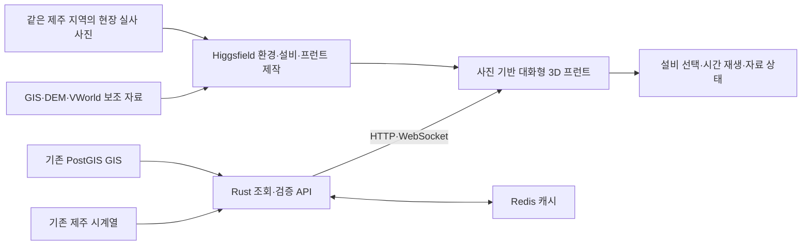
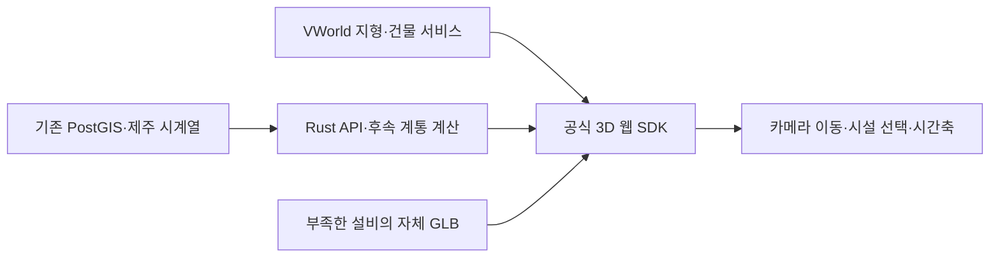

# 제주 전력망 디지털 트윈 구축 기획서 v0.2

## 제주 현장 이미지 반영 Higgsfield 대화형 3D 환경 · Rust 백엔드 · Docker·Redis·WebSocket

- 작성일: 2026-09-29, Asia/Seoul.
- 현재 정본 위치: `/home/dlwhdtmd/energy-digital-twin/jeju_power_grid_digital_twin_design.md`.
- 반영한 사용자 수정: 실제 제주 지역 사진을 Higgsfield에 반영해 지역 환경과 디지털 트윈 프런트를 만든다. VWorld/GIS/DEM은 위치·높이·배치의 보조 자료로 활용한다.
- 문서 단계: 사용자 검토용 설계 기획서. 구현 완료·통합시험 완료를 뜻하지 않는다.
- 작성 방식: Superpowers `brainstorming`의 architectural 경로. 기존 요구와 타당성 조사에 근거해 범위·구성·검증 기준을 정의한다.
- 선행 문서: [기획서 v0.1](jeju_power_grid_digital_twin_plan.md), [데이터·수학·Rust 타당성 검토](jeju_power_grid_data_and_modeling_review.md).
- 1차 결과물: 제주 전력설비를 실제 좌표에 배치하고, 카메라 이동·설비 선택·시간 변경이 가능한 연구·시연용 3D 앱.
- 추가 사용자 요구: Rust 백엔드를 Docker로 실행하고 Redis 캐시와 WebSocket을 사용한다. Higgsfield의 프런트 제작 가능성과 GPU 필요성을 검토한다.
- 실행안: **Higgsfield로 이미지 기반 3D 환경·대화형 프런트 제작 + Docker의 Rust 백엔드 + Redis 캐시 + WebSocket**. 이 방향은 사용자 요구다. Higgsfield의 구체적인 제작 흐름·결과 코드/자산 접근·외부 서버 연결·배포 조건은 첫 통합 검증에서 확인한다.
- 구현 준비에서 확인한 제약: 설치된 Higgsfield 플러그인의 `website-builder` 클라이언트는 image-to-3D/mesh 생성과 회전 가능한 3D 모델을 지원하지 않는다고 명시한다. 아래의 Higgsfield 3D 제작 경로는 사용자 목표이며 이 플러그인의 확인된 기능을 뜻하지 않는다. 16.2절의 최신 연결 상태와 [구현 계획](jeju_power_grid_implementation_plan.md)을 따른다.

## 1. 목적과 성공의 정의

사용자는 제주 전체 전력설비의 공간 분포와 시간별 수요·재생출력 변화를 함께 살펴보고, 선택한 지역의 실제 풍경·시설 외형과 확보된 정보를 확인한다. 실제 제주 현장 사진을 기준으로 Higgsfield에서 주변 환경·시설과 대화형 화면을 제작한다. 실제 위치·지형·선로 경로·데이터 시점은 GIS와 원천 자료에 근거한다.

첫 성공은 **같은 제주 지역의 사진이 반영된 Higgsfield 3D 환경에서 대표 설비 선택·카메라 이동·Rust API의 시간별 데이터 갱신을 수행하는 것**이다. 기존 모델·공간 자료가 이 환경 제작에 유용하면 재사용한다. 이후 제주 전체 지도와 주요 시설로 확대한다. 원 기획서의 Level 3를 1차 제품 목표로 삼되, 현재 확보한 시계열이 지역 집계 중심이라는 한계를 화면과 데이터 계약에 반영한다.

Higgsfield는 사진이 반영된 3D 자산·장면과 프런트 제작을 담당한다. 3D Jutsu의 editable scene/GLB와 Supercomputer의 대화형 웹 제작 기능을 구분해 연결한다(16절). 영상 출력은 선택 기능이다. 물리적 전력 흐름과 실제 설비 운전 상태는 검증된 모델·계측이 담당한다. Rust는 데이터 조회·검증·캐시·API·WebSocket·후속 계통 계산을 담당한다.

## 2. 합의한 요구와 설계 가정

| 구분 | 내용 |
|---|---|
| 사용자 요구 | 기존 제주 기획서와 두 마운트 데이터를 활용한다. Rust 중심으로 구현한다. 이미지를 참고해 실제 사용할 수 있는 3D 환경을 만든다 |
| 사용 목적 | 기존 기획서에 명시된 연구·시연용 공간·시간 전력망 탐색 |
| 우선 범위 | Level 3 MVP: GIS 공간 표시 + 지역 집계 시계열 + 설비 선택 |
| 백엔드 요구 | Docker 실행, Rust API·계산, Redis 캐시, WebSocket 최신 상태 전달 |
| 프런트 요구 | 실제 지역 사진을 반영해 Higgsfield로 제작한 대화형 3D 화면. Rust 서버 연결과 배포 경로는 실제 산출물로 검증 |
| 표현 정확도 | 제주 지형·시설 좌표·GIS 선로 경로는 원천에 근거. 시설 외형은 대표 모델과 참조 이미지 수준. 측량·CAD 수준의 시설 복원은 별도 범위 |
| 기존 자산 재사용 | PostgreSQL/PostGIS, 수급·기상·발전 수집기, 기존 GIS, 감사 산출물을 활용 |
| 검증 전 사용하지 않을 결과 | 현재 추정 DC 결과를 실제 선로 부하율·혼잡·HVDC 계측으로 표시하지 않음 |

이 문서의 실행 플랫폼·표현 수준은 수정 가능한 설계 결정이다. 전기 파라미터가 부족하다는 사실과 관측/추정의 구분은 실행 플랫폼을 바꿔도 유지한다.

## 3. 접근 방식 비교와 기본안

| 방식 | 장점 | 추가 작업 / 제약 | 선택 위치 |
|---|---|---|---|
| Rust API + Higgsfield 제작 웹 프런트·이미지 기반 3D | 이미지 기준 환경·시설·UI를 같은 제작 흐름으로 구성하고 웹에서 탐색 | 결과 자산/코드 접근, 좌표·ID·외부 REST/WS 연결과 브라우저 성능 확인 | **사용자가 지정한 기본안** |
| Rust API + Higgsfield GLB + Bevy | Higgsfield 이미지 기반 자산을 재사용하며 표시 실행부도 Rust로 구성 | GLB 호환·지형·좌표·빌드 검증. 프런트 실행부는 별도 개발 | 향후 사용자가 네이티브 실행을 선택할 때 대안 |
| VWorld 공공 공간 활용 | 제공된 지형·건물·geometry를 위치/외형 제작의 보조 자료로 활용 | 구역별 제공 범위·원본 이용 형식/권한 확인 | 기본 프런트를 대체하지 않는 보조 옵션 |

첫 범위는 제주 한 지역과 대표 시설로 제한한다. 광역 타일 스트리밍 엔진을 별도로 만드는 일은 MVP에 포함하지 않는다. Higgsfield가 제작한 결과의 렌더링 방식·좌표계·모델 node를 실제로 확인한 후 GIS를 연결한다.

검증 순서는 **같은 장소의 사진 → Higgsfield 3D 장면·프런트 → 시설 ID·GIS 정합 → Rust snapshot·WebSocket 갱신**이다. VWorld는 14.8절의 보조 옵션으로 유지한다. 서비스의 제작 기능과 실제 Rust 데이터 연결의 성공은 별도로 판정한다.

## 4. 1차 MVP 범위

### 4.1 포함하는 기능

1. 실제 제주 지형, 해안 경계, 발전설비·변전소·송전선·HVDC 세 경로의 공간 표시.
2. 카메라 이동·회전·확대/축소, 전체 제주 보기와 선택 시설로 이동.
3. 풍력·태양광·변전소·화력·HVDC 시설의 종류별 표시와 레이어 켜기/끄기.
4. 같은 제주 지역 사진을 Higgsfield에 반영해 해안/도로/돌담/식생·대표 설비의 작은 3D 환경과 프런트를 제작. 나머지 시설은 재사용 모델/표식으로 시작.
5. 설비 선택 시 이름·종류·좌표·확인된 용량·자료 기준일·확보된 상태 표시.
6. 제주 전체 수요·풍력·태양광·재생 합계·공급능력의 시간별 재생과 최신 자료 조회.
7. 실제 존재하는 시점을 선택하는 시간축, 재생/정지, 현재 선택 시점과 자료 출처 표시.
8. 자료 미확보·결측·품질 의심·갱신 지연을 명시하고, 확보하지 않은 값은 `—`로 표시.

지역 집계값은 제주 전체 HUD에 표시한다. 개별 설비의 발전량은 검증된 해당 설비 계량과 ID 대응이 있을 때만 표시한다. 자료가 없는 모든 발전기에 제주 합계를 자동 배분해 실제 출력처럼 보이게 하는 기능은 포함하지 않는다.

### 4.2 확장 단계로 분리하는 기능

- 실제 연결관계 기반 DC/AC 조류, 선로 혼잡·전압·변압기 부하 계산.
- HVDC별 실제 흐름과 운전제약을 반영한 재급전, ESS, 출력제어 최적화.
- 미래 수요·재생 예측과 위험도, N−1·상태 추정.
- 전 배전망·개별 수용가·보호·주파수/인버터 EMT 모델.
- 모든 시설의 정밀 외형, 다중 사용자 편집, Higgsfield 제작 자동화, 영상 제작.

확장은 아래 데이터 통과 조건에 따라 독립 설계·계획으로 구체화한다. 1차 MVP 완성을 위해 이 기능들을 함께 개발하지 않는다.

## 5. 보유 데이터와 사용 조건

아래 수량은 2026-09-29 감사 시점의 레코드 수다. 운영 DB 갱신으로 변할 수 있고, GIS 객체 수는 실제 회선·발전단지 수와 동일하지 않다.

| 자료 | 확인한 보유량 / 원천 | MVP 사용 | 선행 검증 |
|---|---|---|---|
| 선로 GIS | Hub `public.power_line`, 제주 51레코드 | 원천 선로 경로 표시 | HVDC 중복 제거, 전압 누락 5개 표시. 전기적 from/to는 별도 검증 |
| 변전소·변환소 | Hub `public.substation`, 13레코드 | 위치·명칭·전압 표시 | 이름 없는 시설 매핑. 같은 이름의 서로 다른 전압 설비 보존 |
| 풍력·발전설비 | Hub `public.power_plant`, wind 165·solar 704 등 | 시설/객체 유형별 표시 | 터빈과 발전단지의 관계, 출력 문자열·단위, OSM/인허가 중복 |
| PV 인허가 | Hub `public.pv_facility`, 제주 1,791레코드 | 위치·용량·상태 기준일 표시 | OSM solar와 중복 합산하지 않음. 등록 상태를 실시간 운전으로 해석하지 않음 |
| 제주 5분 수급 | Demand `public.jeju_supply_demand`, 602,673행, 2021–2026 | 지역 수요·재생 상태의 우선 원천 | 원천 시간대/구간, 품질 flags, 공급능력과 발전량 구분 |
| 제주 시간 수요 | Hub `jeju_demand_hourly`, 48,119행 | 보조 비교 및 이후 예측 | 49개 내부 시간 슬롯 누락, 자료원별 정의 확인 |
| 개별 발전 계량 | PV `plants`/`generation`, 제주 후보 2개 | ID·단위·시간 확인을 통과한 시설에 한해 선택 표시 | 용량 NULL, 한 시설의 지역 메타 오류, 음수 계량·시간 라벨 문제 |
| 기존 DEM 후보 | `/mnt/nvme/Energy-hub/research/data/raw/dem_korea.tif`, 218,364,148 bytes | 지역 환경의 기반 높이·전체 제주 공간 개요 | EPSG:4326과 제주 고도 포함을 확인. 원천·수직 기준·pixel 정합성은 추가 검증. 현장 사진을 대신하는 입력이 아님 |
| 2024 원별 거래량 | Hub `jeju_generation_mix`, 46,680행 | 후속 비교·연구 | 거래량 MWh와 실제 발전 MW의 의미·시장 범위 차이, oil 자료 공백 |
| 한전 접속정보 | Hub `research.kepco_grid`, 제주 99,860주소·15변전소 코드 | 후속 공간 배분·연결 검증 | 고객 주소 전체를 3D 객체로 렌더링하지 않음. 코드·용량 단위 확인 |
| 제주 ASOS | PV `weather_asos`, 4지점 각각 51,072행 | 후속 기상 연계 | 현재 table에 풍속/풍향 없음. 일사 결측·누적 단위 확인 |

MVP의 기본 조회는 Hub의 GIS와 Demand의 수급으로 충분하다. 개별 발전 계량을 표시하기로 검증한 경우에 PV 연결을 추가한다. FDW/복제 뷰의 동일 원천을 별도 데이터로 중복 집계하지 않는다.

마운트의 PostgreSQL 내부 저장 파일을 새 서버로 열어 읽지 않고 운영 DB의 조회 인터페이스를 사용한다. 현재 두 마운트는 조사 환경에서 읽기 전용이고, 2026.08/09 수급 CSV 두 개는 파일 내용 미검증이다. 해당 기간 DB 행의 조회 성공과 파일 전수검증은 구분한다.

## 6. 추가 확보 항목과 착수 조건

| 우선순위 | 필요한 입력 | 확보/처리 방향 | 통과 조건 |
|---|---|---|---|
| Higgsfield 제작 경로 확인 | 같은 지역의 사용 가능한 사진, 계정/연결, 편집 가능한 장면·프런트 결과 | Jutsu와 Supercomputer의 지원 제작 흐름을 확인 | 실제 사진 반영, 자산/코드 접근, 시설 선택과 Rust API·WS 연결 가능 여부 확인 |
| 공공 공간 보조 경로 | VWorld 키·도메인, 제주 관심 구역 | 제공 공간·좌표/속성을 확인해 제작에 보조 사용 | 지형·건물·텍스처의 범위/기준일/형식·이용 조건 확인 |
| 첫 통합 검증 | 대표 시설 ID·좌표, 참조 사진과 Higgsfield 장면·프런트 | Higgsfield로 사진 반영 환경을 제작하고 유용한 기존 모델을 보조 재사용 | 자산 로딩·크기/축·선택·GIS 배치·두 시점 이상 데이터 연결 성공 |
| 지형 포함 MVP | 기존 DEM의 제주 추출본, 해안선/육지 경계, 고도 기준·자료 조건 | Energy-hub DEM/지형 타일 후보를 검증해 재사용. 지역 외형은 현장 사진으로 재현 | 원본·해상도·CRS·수직 기준·NoData·사용 조건을 기록하고 사진 기반 지역 환경과 맞춤 |
| 전체 시설 표시 | GIS·공식 시설 master·3D 객체 대응 | 원천별 ID 보존, 검증한 시설만 병합 | 같은 시설/다른 전압·터빈/단지·중복 geometry를 구분 |
| 그래픽 실행 | 표시 PC 또는 브라우저의 그래픽 지원 | API 서버와 표시 클라이언트 분리 | 실제 표시 장치에서 로딩·조작·메모리/FPS 측정 |
| Level 4 | 회선/bus/변압기 연결, R/X/B·정격·tap, P/Q·발전 제어한계 | KEPCO/KPX 연구용 자료 및 독립 계측 | 출처·단위·운전시점이 있는 모델과 실측 비교 가능 |
| HVDC 운영 분석 | #1/#2/#3별 MW·방향·손실·가용한계·방향전환/램프 | 링크별 운영 자료·계측 | 정격·가용범위·관측값과 시나리오를 구분 |
| 예측/출력제어 | 풍속/풍향·예보 발행시각, 가용출력·제어 지령/실행량 | 기상/운영 원천 보강 | 미래 정보가 학습 입력에 섞이지 않는 시간순 검증 |

공식 Visit Jeju 페이지의 실사 사진 2장을 프로젝트에 저장·확인했다. 다만 배너 해상도/서로 다른 구도이며, 정밀 복원용 다중 사진과 제작에 사용할 사진별 조건은 아직 확보되지 않았다. export GLB와 Higgsfield 계정 접근도 실행 검증하지 않았다. 따라서 첫 통합 검증을 착수 단계에 둔다. 사진에서 보이지 않는 부분을 생성한 형상은 추정이며, 시설 정밀 재현에는 다중 시점 사진·도면·치수가 필요하다.

Copernicus GLO-30 같은 전 지구 DSM은 제주 전체 지형 후보지만 시설 상세 측량을 대신하지 않는다. 30m View Service의 최신 등록/접근 조건과 다운로드 권한을 별도로 확인한다. 설치형 Higgsfield Blender 플러그인은 공식 Windows/macOS 범위와 지원 Blender 버전을 확인하며, 현재 Linux 서버에서의 지원을 전제로 삼지 않는다.

## 7. 구성과 데이터 흐름

아래는 사용자가 지정한 Higgsfield 프런트 + Rust 백엔드 구성이다. 제작된 웹 앱의 3D 실행 코드에 API·WS를 연결한다. Higgsfield 생성 서비스에 매 프레임 새 이미지를 요청하는 구조로 만들지 않는다. 실행·캐시·전송 계약은 16절에 기록한다.

| 구성 요소 | 책임 | 최소 기술/산출물 |
|---|---|---|
| 기존 저장·수집 | 현재 GIS와 수급 원천을 유지 | PostgreSQL/PostGIS와 기존 수집기 재사용 |
| Rust 서비스 | 조회·단위/시간 검증, 캐시, snapshot·오류/품질·WS 전달 | `sqlx`, `axum`의 `ws`, `tokio`, `serde`, `redis`; Docker 실행 |
| Higgsfield 제작 프런트 | 사진 기반 환경/시설, 카메라·선택·시간축·표시값 갱신 | 지원 웹 제작 흐름으로 만든 코드와 3D 자산. 실제 renderer·원본 접근·배포 검증 |
| Redis 캐시 | 검증한 GIS/시계열 조회 결과의 일시 보관 | 원천 DB 기준 캐시, namespace·TTL·실패 시 DB 조회 |
| 자산/지형 묶음 | 원천·단위·축·좌표·라이선스·ID 대응을 보존 | GLB, 제주 지형 mesh, manifest |
| 후속 계산 | 검증한 계통과 snapshot을 이용한 계산 | 독립 입력/출력 계약. MVP API 경로에 미검증 solver를 연결하지 않음 |

초기에는 Rust API 서버 하나와 선택한 표시 클라이언트 하나로 시작한다. 추가 사용자 요구에 따라 Redis 캐시와 WebSocket을 사용하고 Docker로 실행한다(16절). 기존 PostgreSQL/PostGIS를 재사용하며 추가 메시지 브로커·새 시계열 DB·분산 실행·모델 플러그인 시스템은 만들지 않는다. Rust 의존성은 선택한 MSRV와 호환되는 버전을 고정하고 lockfile로 재현한다. 현재 Rust 1.96.0 설치 사실은 확인했지만 Bevy 빌드 호환성까지 검증한 상태는 아니다.

DB 접속정보는 서버 환경에서 읽고 클라이언트에는 API 주소만 전달한다. 1차 접속 범위는 서버와 표시 PC가 연결된 개발 네트워크로 둔다. 공개 서비스 배포는 별도 요구사항으로 다룬다.

### 7.1 좌표와 3D 자산

GIS 원본은 EPSG:4326으로 보존한다. 제주 기준 원점은 경도 126.5°, 위도 33.4°, 타원체 고도 0m로 두고 WGS84→ECEF→지역 ENU를 f64로 계산한다. Higgsfield 결과의 축·단위·원점을 확인하고 대응점을 이용해 이 기준과 정합한다. Bevy 대안에서는 X=동, Y=상, Z=남으로 매핑하고 화면용 좌표만 f32로 사용한다. 위경도를 그대로 미터 좌표처럼 넣지 않는다.

고도 자료의 기준이 평균해수면/지오이드이면 타원체 기준과의 변환을 기록한다. Bevy 경로의 첫 지형 제품은 고정 제주 범위의 오프라인 mesh와 해안 경계로 한정한다. VWorld 경로에서는 SDK의 지면 높이와 추가 모델의 고도 기준을 검증한다. 육지 HVDC terminal은 전체 지도 수준에서 함께 표시하고, 제주 밖 시설의 상세 지형·측량 정확도는 MVP 범위에 넣지 않는다.

자산 manifest는 scene/시설 종류, GLB 경로, scale(m), 방향 보정, pivot, 연결할 시설 ID, 사용한 실사 photo ID, 재구성 방법·추정 부분, 원천·버전·사용 조건을 담는다. facility ID는 자산 node 이름만으로 추측하지 않고 외부 대응표로 연결한다. 필수 glTF 확장·재질·텍스처·축/단위와 node 선택을 먼저 확인한다. 모델을 읽지 못하면 기본 표식으로 시설 선택과 정보 조회를 유지한다.

### 7.2 API와 시계열 계약

| API | 용도 | 동작 규칙 |
|---|---|---|
| `GET /api/v1/jeju/assets` | 제주 GIS와 시설 metadata | 안정 ID, 종류, EPSG:4326 geometry, 용량/전압의 단위·출처·기준일 전달. HVDC는 제주 내부 bbox만으로 잘라 버리지 않음 |
| `GET /api/v1/jeju/timeline?start=...&end=...` | 선택 가능한 실제 관측 시점 | timezone offset가 있는 시각 입력. 한 요청은 최대 7일, 초과는 422. 결측 시간 슬롯을 생성하지 않음 |
| `GET /api/v1/jeju/state?at=...` | 선택 시점 또는 최신 집계 | `at` 생략은 최신. 지정하면 정확히 일치하는 관측만 반환하고 없으면 404. 가장 가까운 과거 값을 조용히 대체하지 않음 |
| `GET /api/v1/jeju/ws` | HTTP upgrade 후 최신 상태 전달 | 접속 시 전체 최신 snapshot, 이후 변경 시 전달. 재접속 시 재동기화. 과거 재생은 HTTP 조회 사용(16.4절) |
| `GET /api/v1/health` | 서비스 준비 여부 | 필수 DB 조회 가능 여부를 구분. 의존 DB 실패를 성공으로 보고하지 않음 |

응답의 공통 항목은 schema version, 원천 시각, UTC offset가 있는 timestamp, source, quality flags다. 집계 항목은 `demand_mw`, `supply_capacity_mw`, `wind_mw`, `solar_mw`, `renewable_total_mw`이며 `supply_capacity_mw`는 원천 `supply_mw`를 의미에 맞게 표기한다. MW를 기본 전력 단위로 사용한다.

검증한 개별 계량이 있으면 state 응답의 `facility_states`에 안정 시설 ID별 값·원천 시각·source·단위·quality flags를 담는다. 해당 시점에 자료가 없거나 ID/시간/단위 검증 전이면 항목을 생략하고 시설 상세는 자료 미확보로 표시한다. 지역 합계를 이 map의 개별 값으로 복사하지 않는다.

원천 naive timestamp의 KST 여부와 구간 시작/종료 정의를 문서·원천 응답으로 확인한 뒤 변환한다. 확인하지 못한 개별 발전 계량을 임의로 ±1시간 옮겨 MVP에 넣지 않는다. 값 0은 유효 관측값이고 NULL/자료 부재와 구분한다. 비정상 후보 값은 자동 clip하지 않고 원천값과 품질 표시를 함께 유지한다.

NaN/Infinity 등 JSON 수치로 전달할 수 없는 값은 NULL과 품질 flag로 전달하고 원천 문제를 기록한다. source·timestamp·품질 정보를 버린 0 대체는 하지 않는다.

최신 모드는 서버가 60초마다 원천을 확인하고 변경된 snapshot을 WebSocket으로 전달한다. 클라이언트 수와 무관하게 서버의 확인 주기를 공유한다. 원천 자료 시각이 현재보다 15분 이상 오래되면 갱신 지연을 표시한다. 역사 재생 모드는 HTTP로 실제 관측을 조회하며 최신 WS 값이 이를 덮어쓰지 않게 한다. 늦게 도착한 이전 시간 선택의 응답을 적용하지 않는다. 서버에서 조회 구간과 행 수를 제한하고 렌더링 프레임마다 DB/API를 호출하지 않는다.

## 8. 사용자 동작과 표시 원칙

| 사용자 동작/상태 | 앱의 동작 |
|---|---|
| 시작 | 제주 전체, 자료 기준일, 최신 지역 집계를 표시. 로딩 중 상태와 완료 상태를 구분 |
| 시설 선택 | 같은 ID의 상세 정보와 모델을 표시. 시간 변경 중 선택 유지 |
| 시간 변경 | 해당 관측 시각의 전체 집계와 확보한 개별 계량만 갱신 |
| 발전량/용량 없음 | `—`와 자료 미확보 표시. 0 MW나 0%로 대체하지 않음 |
| GIS는 있지만 전기 연결 미검증 | 선로 경로는 표시하되 실제 조류·부하율로 설명하지 않음 |
| HVDC 링크 계측 없음 | 경로·종류·출처 있는 정격 표시. 방향 화살표·운전 MW는 표시하지 않음 |
| 자료 품질 의심 | 수치를 숨기거나 고치지 않고 해당 값에 품질 표시 |
| API 단절 | 마지막 성공 시점/값과 연결 오류 표시. 정적 GIS와 카메라 조작 유지 |
| 자산/지형 로딩 실패 | 실패 원인과 재시도 안내. 자산은 기본 표식으로 대체. 지형 실패 상태는 완성된 지형처럼 표시하지 않음 |

시설 모델의 회전·발광·색은 시각 표현 규칙이다. 계측이나 계산이 없는 터빈 회전수·선로 입자 속도를 실제 물리량으로 이름 붙이지 않는다. 관측이 있는 값은 ‘자료원 집계’, 배분 값은 ‘배분 추정’, 계산 시나리오는 ‘시뮬레이션’으로 구분한다.

한국어 글꼴의 문자 표시와 배포 조건을 확인하고 MW/MWh/kV, KST·UTC offset, 시설명·출처를 읽을 수 있게 한다. 시설 좌표와 metadata가 현재 기준이면 과거 시계열 재생에서도 그 기준일을 유지해 표시한다. 과거 전체 GIS를 복원한 것처럼 설명하지 않는다.

## 9. 수학 모델의 도입 순서

사용자가 추가로 요청한 시뮬레이션의 단계·시간 간격·계산/화면 연결·검증 기준은 17절에 구체화한다. 현재 데이터로 가능한 지역 집계 시나리오와 추가 전기 파라미터가 필요한 선로/전압 해석을 구분한다.

### 9.1 MVP: 시간·단위·좌표 정합성

시계열을 같은 시간·측정 범위로 맞추고 GIS 좌표를 렌더 좌표로 변환하는 것이 첫 수학적 작업이다. 에너지에서 평균 출력을 구할 때는 \(\bar P=E/\Delta t\)를 사용한다. MWh와 MW는 구간 길이를 확인한 뒤 변환한다. 현재 원별 시장 거래량을 그대로 도내 전체 발전으로 사용하지 않는다.

### 9.2 후속: 공간 배분과 DC 조류

bus별 P/Q 계량이 부족할 때는 지역 판매량·공급구역 등 근거 있는 가중치로 합계를 보존하는 배분 모델을 별도로 설계한다. \(\sum_i d_i=D\)를 만족해도 각 bus의 실제 부하가 식별됐다는 뜻은 아니다. 기존 EV 충전기 개수 배분은 비교 가정으로만 취급한다.

검증한 연결과 X가 확보되면 DC 모델 \(Af=p\), \(f_\ell=S_{base}(\theta_i-\theta_j)/x^{pu}_\ell\)부터 시작한다. 이 식은 tap=1·phase shift=0의 송전망 근사다. tap/phase shift가 있는 사례는 해당 항을 지원하는 모델로 검증한다. HVDC는 AC 선로와 구분한 제어 주입/링크 한계로 둔다. 섬 분리와 주입 수지 실패를 자동 가상 연결·무제한 slack으로 감추지 않는다.

선로 loading은 출처 있는 정격으로만 계산한다. R/X의 Ω와 pu를 한 번만 변환한다. 기존 코드의 `Line.x` 단위 불일치, 일괄 300MVA 정격, 화력/HVDC 50:50 분담, 계산 후 고정 `converged=True`를 이식하지 않는다.

### 9.3 데이터 확보 후: AC·운영 최적화·예측

R/X/B·tap·bus P/Q·발전기 제어한계가 확보되면 \(S_i=V_i\overline{\sum_jY_{ij}V_j}\)를 푸는 AC PF와 계측 비교를 진행한다. LP/MILP 기반 HVDC/ESS/출력제어 모델은 손실·방향전환·가용출력·SOC·램프 조건이 채워진 뒤 도입한다. `good_lp`는 선형 모델러이며 일반 AC OPF나 QP를 자동으로 해결하는 도구로 취급하지 않는다.

예측은 관측만으로 하루전 예보를 대신하지 않고 issue_time/valid_time을 보존한다. 2024.06 출력제어 라벨 변경과 2024.11 HVDC3 상업운전 전후를 시간순 평가에서 구분한다. Rust 언어 선택 자체를 수학적 신규성으로 주장하지 않는다. 모델 상세식·문헌은 선행 검토 보고서의 7–9절을 따른다.

## 10. 단계별 산출물과 통과 기준

| 단계 | 산출물 | 통과 기준 |
|---|---|---|
| G0 이미지·제작·실행 준비 | 사용 가능한 지역 사진, Higgsfield 제작/코드 접근, Docker·DB·Redis 설정, 시설 ID·좌표·시간/단위 명세 | 같은 지역 이미지 반영, 계정의 실제 기능·자료 사용 조건·그래픽 실행과 DB 연결 확인 |
| G1 첫 지역 통합 | 확보한 지역 3D 환경 + 대표 설비 표시·선택·Rust API 시간 재생 | 사진 대비 배치·실루엣·재질 검토. 추가 모델 scale/축·pivot, 같은 시설 ID 선택, 두 관측 시점의 집계값 갱신 확인. 개별 계량이 없으면 전체 HUD만 갱신 |
| G2 공간 확대 | 제주 지형·경계·주요 GIS·HVDC 세 경로 | 원천/기준일 보존, 중복 경로와 전압별 시설 구분, 실제 좌표 배치, 레이어·카메라·선택 동작 |
| G3 Level 3 MVP | 과거/최신 모드, 품질·결측·오류 표시, 실행 안내 | API 원천 대조, 시간 변경 응답 역전 방지, 0/NULL 구분, 단절·자산 실패 시 화면 유지 |
| G4 검증된 연구 모델 | 기준 사례와 비교한 Rust DC 코어, 출처 있는 제주 입력 또는 가정 사례 | 독립 설계 후 MATPOWER case14/30/118 비교. 동일 baseMVA·tap·status·slack·옵션, nodal balance와 finite/island 검사 |
| G5 Level 4/운영 연구 | AC·링크별 HVDC·최적화·예측 | 각 모델의 필요한 입력 및 독립 계측 확보, 제약 위반·잔차·시간순 예측 검증 |

G0–G3가 이번 MVP 설계의 범위다. G4–G5는 후속 프로젝트의 조건과 방향이며 이 문서만으로 상세 구현 범위를 승인한 것으로 보지 않는다. 일정은 달력 기간으로 확정하지 않고 통과 조건으로 관리한다. GLB/terrain 접근과 표시 장치가 준비되는 시점에 G0–G3 작업량을 산정한다.

## 11. 검증과 완료 판정

| 검증 영역 | 확인할 상황 | MVP 완료 기준 |
|---|---|---|
| 공간/좌표 | 변전소·대표 발전설비·HVDC terminal 포함 최소 5개 기준점 | f64 기준 좌표 변환과 표시 좌표 차이 1m 이내. 이는 원천 좌표 정확도를 새로 보증하는 수치가 아님 |
| 자산 | 참조 이미지에 대응하는 GLB와 unsupported extension·파일 실패 | 하나 이상의 참조 모델을 실제 표시·선택하고 외형 대응을 사용자 검토. 기본 GLB/표식으로 데이터 연동을 먼저 검증할 수 있지만 참조 외형 완료와 구분 |
| 집계/API | 정상 5분 시점, 0값, 결측 시점, 의심값, 비유한값, 최신/역사 모드 | 원천값과 같은 의미/단위로 전달. 결측 404, 과도한 구간 422, DB 실패 명시. 비유한값은 NULL+flag. 표시용 반올림만 적용 |
| 시점 경쟁 | 시간 A 선택 뒤 B 선택, A 응답이 늦게 도착 | 최종 화면의 시각과 값이 B에 일치 |
| ID/geometry | HVDC 중복 geometry, 같은 시설명의 서로 다른 전압, 지역 메타 오류 | 물리 회선으로 중복 합산하거나 이름/region만으로 시설을 잘못 병합하지 않음 |
| 단절/실패 | API timeout·DB 단절·GLB/terrain 실패 | 마지막 성공 시점과 오류 표시, 정적 조작 유지, 성공으로 오표시하지 않음 |
| Redis/WS | 캐시 miss·Redis 단절, WS 재접속·느린 소비자, 같은 관측 시각의 값 정정 | DB 원천으로 복구, 재접속 snapshot, 큐 누적 제한, 정정 전달. heartbeat를 새 관측으로 표시하지 않음 |
| 성능 | 시험 PC와 GPU/드라이버·OS 기록, 1920×1080, 감사 규모에 해당하는 단순 표식/선로 | 카메라 조작의 60초 측정에서 FPS p5≥30을 목표로 검증. 자산 정밀도·표시 밀도를 조정해 같은 조건으로 재측정. 미달이면 미달 결과 기록 |
| 화면 이해 | 전체 집계와 개별 계량, 공급능력, 관측/추정/시나리오 구분 | 사용자가 선택한 시점·값의 의미·미확보 범위를 확인 가능 |

성능 기준은 시험할 목표이며 현재 서버에서 달성한 결과가 아니다. 최신 수집 지연·자료 공백은 앱 성능 문제와 구분한다. 후속 수치 모델은 별도의 잔차·허용오차·비교 옵션을 고정한 테스트를 가진다. 화면의 애니메이션이 매끄럽다는 사실로 계통 계산 정확도를 판정하지 않는다.

## 12. 실행 환경과 남은 위험

현재 서버에서 Rust/cargo 1.96.0, x86_64 논리 CPU 64개, RAM 약 62GiB를 확인했다. 현재 세션은 tty이며 DISPLAY/Wayland 설정이 없고 `nvidia-smi`는 드라이버 통신에 실패했다. Blender·CMake·clang은 설치되어 있지 않다. 서버가 API/계산을 수행하고 다른 PC가 3D를 표시하는 기본안은 이 상태를 반영한다. native solver를 선택할 때 CMake/C++ 도구 요구를 추가 확인한다.

| 불확실성 | 대응 | 개발 진행에 미치는 영향 |
|---|---|---|
| VWorld 제주 현장 상세·데이터 기준일·네이티브 재사용 미검증 | 공식 SDK에서 관심 구역부터 확인. 부족 시설은 별도 자산으로 보완. 원본 파일 저장/변환 가능 여부 별도 확인 | API 제공 사실만으로 전 제주 실사 품질이나 Bevy import 가능을 확정하지 않음 |
| Higgsfield 계정의 기능 접근·GLB export·외부 WS 연결 미검증 | Jutsu 장면 제작과 Supercomputer 대화형 프런트 제작을 구분해 작은 산출물 하나 확인 | API 키 보유만으로 제작 기능 접근이나 화면 연결을 완료로 판정하지 않음 |
| Bevy glTF 확장/재질 호환 | 실제 파일 검사와 로딩, 필요한 경우 호환 형식으로 재export | 생성 성공과 Rust import 성공을 별도 판정 |
| 기존 DEM의 수직 기준·변환 품질과 현장 상세 미검증 | 제주 추출/manifest 검증, 실사 사진과 기준점으로 지역 scene 보완 | 고도 자료와 사진 기반 외형의 검증을 구분. 데이터 API 개발은 진행 가능 |
| 부정확한 시설 병합·연결 추정 | 원천 ID·전압·객체 종류 보존, 확인한 대응만 적용 | 지도와 검증된 전기 network를 구분 |
| 상세 계량·전기 파라미터 부족 | 지역 집계 MVP를 완료하고 기관 자료/계측 보강 | 실제 혼잡·전압·개별 HVDC 상태의 검증 범위 제한 |
| 표시 장치·웹 호환 미확정 | 실제 PC 또는 브라우저에서 G1과 성능 검증 | 화면 배포 선택이 빌드·자산 크기 기준에 반영됨 |

## 13. 설계 검토와 다음 산출물

이 기획서는 사용자가 합의한 목적과 확보 데이터에 근거한 검토용 v0.2다. 검토 시에는 Higgsfield 이미지 반영·프런트 제작·외부 데이터 연결, Docker·Redis·WS 계약, 관측/추정 구분과 G0–G3 완료 기준을 확인한다.

기획서 검토가 끝나면 G0–G3에 한정한 상세 구현 계획을 Superpowers `writing-plans`로 작성한다. 그 계획은 파일·인터페이스·검증 명령·작업 순서를 고정한다. 제품 코드 작성·의존성 설치·외부 프로젝트 생성·Higgsfield 과금 실행은 아직 수행하지 않았다.

## 14. 제주 실물 사진 반영과 Higgsfield 환경 제작

### 14.1 수집 단위와 첫 지역

**같은 장소의 실제 사진을 Higgsfield에 반영해 해안·도로·돌담·식생·건물·전력설비와 탐색 가능한 3D 화면을 만든다.** 기존 공공 모델이나 geometry가 이 제작에 유용하면 보조 자료로 재사용한다. 전체 제주 개요에서 상세 지역을 선택하면 그 현장 환경으로 이동하는 구조다. 위성영상만으로 현장 모습 재현을 완료 판정하지 않는다.

첫 후보는 공식 현장 사진을 확보한 **신창풍차해안도로와 인접 해안 구간**이다. 해안·도로·바위·바다·풍력설비를 함께 비교할 수 있다. 관광지 명칭을 DB의 Hangyoung 발전소 ID와 자동 연결하지 않고 실제 시설/터빈의 대응을 별도로 확인한다. 관광지 좌표도 사진을 찍은 카메라 좌표와 구분한다.

첫 지역은 약 300m×300m 수준의 제한된 범위부터 제작하는 설계 목표다. 실제 작업 범위는 수집한 사진에 보이는 지물과 확인한 기준점을 기준으로 경계를 정한다. 보이지 않는 지역 전체를 정확하게 복원했다고 표시하지 않는다.

### 14.2 사진을 어디서 모으는가

| 수집 경로 | 활용 | 확인한 사실 / 진행 상태 |
|---|---|---|
| 제주관광공사 Visit Jeju의 지역 상세·사진 서비스 | 특정 장소의 전경·도로·해안·주변 환경 참고 | 신창 현장 사진 2장 다운로드·decode·육안 확인. Photo Jeju 페이지에는 BY-NC-SA 안내가 나타나지만 이 안내를 두 사진의 개별 조건으로 확정하지 않음 |
| 한국관광공사 포토코리아 | 지역명으로 고해상도 전경·지물 사진 후보 수집 | 공식 서비스와 사진별 공공누리 유형 안내 확인. 회원/용도와 개별 원본 다운로드는 아직 실행하지 않음 |
| 실제 시설 운영자의 사진·도면 | 같은 풍력·PV·변전소·HVDC 시설의 전체 외형과 배치 | 대응 시설의 원본과 제공 범위 확보 필요. 보도 사진의 이용 조건을 시설 운영자 사진과 동일하게 가정하지 않음 |
| 직접 촬영 또는 사용 가능한 현장 원본 | 같은 장소의 겹치는 여러 시점 사진, 정밀 복원 | 정확한 공간을 만들 때 우선. 촬영 세트·카메라·시간·위치/기준 치수를 함께 기록 |

온라인 사진은 해당 지역을 찾아보고 재질/구도를 정하는 데 먼저 쓴다. 실제 텍스처나 생성 서비스 입력으로 사용할 사진은 파일별 이용 조건과 사용할 목적을 확인한 원본으로 선정한다. 변경 가능한 공공누리 유형 또는 직접 촬영/제공받은 사진을 우선 후보로 삼고, 라이선스가 확인되지 않은 자료는 출처 링크와 로컬 참고 상태로 기록한다.

### 14.3 지금 저장한 실사 사진

| 파일 | 직접 확인한 내용 | 용도와 한계 |
|---|---|---|
| [신창풍차해안도로 실사](reference_photos/jeju/sinchang_wind_coast_reference.webp) | 현무암 해안·조간대·산책로·풍력 터빈 일부·조형물/글자 구조물. 1280×373 | 해안의 지물·색·구도 참고. 전면 글자와 터빈 잘림 때문에 정밀 시설 복원/텍스처 원본으로 바로 사용하지 않음 |
| [신창–차귀 해안도로 실사](reference_photos/jeju/sinchang_chagwi_coast_reference.webp) | 해안도로·현무암·바다·노을·풍력 타워 일부. 1242×362 | 도로 곡선·해안 배치·조명 참고. 역광/flare와 터빈 상부 잘림, 카메라·촬영시각 미확인 |
| [사진 목록·출처·파일 검증](reference_photos/jeju/photo_catalog.json) | 공식 페이지·사진 URL·ID·크기·SHA256·육안 관찰·이용 상태 | CDN 경로 날짜를 촬영일로 기록하지 않음. 두 장을 검증된 SfM 촬영 세트로 취급하지 않음 |

이 두 장은 실제 사진 수집의 시작 자료다. 풍력 전체 형상·도로 반대 방향·해안 지물의 측면/후면이 부족하므로 다음 수집에서 보강한다. 사진을 추가하기 전 현재 두 장으로 원본 지역의 완전한 3D 복원이 가능하다고 판단하지 않는다.

### 14.4 추가 사진의 수집 목록

| 사진 역할 | 수집할 내용 | 첫 지역의 설계 목표 |
|---|---|---|
| 지역 전경 | 도로와 해안, 시설이 함께 보이는 넓은 구도 | 같은 지역의 여러 방향 사진 6–10장 |
| 이동 시점 | 실제 카메라가 몇 걸음씩 이동한 겹치는 연속 시점 | 사진 참고 제작은 12–20장으로 시작. 정밀 SfM/MVS를 선택하면 약 80–150장부터 촬영 품질과 실제 등록률로 평가 |
| 시설 외형 | 풍력 전체·타워/나셀/블레이드, 변전소 외관 등 해당 시설 | 확인한 대표 시설의 전체 형상과 여러 측면 8–12장 |
| 지물/재질 | 현무암·돌담·도로·펜스·지면·식생의 가까운 사진 | 역할별 2–4장. 그림자·반사·글자가 재질로 고정되지 않게 선정 |
| 기준 정보 | 위치, 카메라/렌즈·촬영시각, 알려진 길이 또는 기준점 | 확인한 값만 기록. 지도 관광지 좌표나 추정 GPS를 카메라 EXIF처럼 사용하지 않음 |

장수는 수집을 계획하기 위한 목표이고, 많은 사진만으로 복원 성공을 보장하지 않는다. 이미지 등록과 시점 연결이 되는지 검사한다. COLMAP 공식 지침에 따라 같은 물체가 최소 3개 사진에서 보이도록 겹침을 확보하고, 카메라 위치를 실제로 이동시키며 비슷한 조명 조건을 유지한다. 바다·하늘·움직이는 블레이드·반복적인 흰 표면은 정적 형상 복원이 어려워 환경 표현/별도 자산으로 처리할 수 있다. [COLMAP 공식 촬영·복원 지침](https://colmap.github.io/tutorial.html).

photo catalog에는 photo/scene ID, 대상 시설 ID, 공식 페이지/원본 URL, 촬영자·사용 조건, 실제 촬영일과 위치의 확인 수준, 카메라 정보, 크기·hash, 역할, 제작 사용 가능 여부를 기록한다. 원본 사진과 전처리/생성 결과의 대응을 남긴다.

### 14.5 사진에서 3D 환경을 만드는 두 경로

**기본 경로 — Higgsfield에서 사진이 반영된 편집 가능한 환경·프런트 제작**

1. 같은 지역의 실사 사진을 확인하고 해안/도로/바위/돌담/식생/시설로 구성을 나눈다.
2. 확인한 GIS 위치·도로/해안 기준과 치수에 맞춘 작은 장면의 기본 형상을 만든다.
3. 사용 가능한 실사 사진을 reference로 Higgsfield 3D Jutsu/지원 제작 도구에서 주변 환경과 시설 mesh를 제작·수정한다. 사진의 전경을 화면 배경으로 붙이는 작업으로 완료 판정하지 않는다.
4. 사용할 수 있는 지물 사진으로 재질을 구성하고, 글자·그림자·원근이 그대로 표면에 굳는 부분을 검토한다. 입력에 없는 뒤쪽 형상과 재질은 추정 제작으로 기록한다.
5. 시설과 환경을 따로 선택 가능한 object로 유지하고, 정리한 장면을 GLB로 export한다.
6. Higgsfield Supercomputer의 대화형 웹 제작 흐름으로 환경 탐색·시설 선택·시간축 화면을 만들고, 확인한 GLB/장면과 우리 시설 ID를 연결한다. 결과 코드의 Rust HTTP·WebSocket 연동을 검증한다.

이 경로의 결과는 실사 사진을 참고해 제작한 3D 재현이다. Higgsfield의 장면 생성이 실제 치수·모든 후면·전기 연결을 측정해 준다고 전제하지 않는다. 실제 계정의 생성과 export는 G0/G1에서 검증한다.

**정밀 경로 — 같은 장소의 다중 시점 사진으로 복원**

동일 세션의 충분한 사진이 확보되면 기존 COLMAP 같은 도구로 **사진 → SfM 카메라/희소점 → MVS 깊이/밀집점 → mesh·texture → 경량화·선택 가능한 시설 분리 → GLB**를 검증한다. 서로 다른 장소/시기/조명의 관광 사진 모음만으로 이 경로가 성립한다고 가정하지 않는다.

복원 도구가 출력한 point cloud/mesh와 재질은 제작 도구에서 검토·정리한 후 GLB로 내보내는 변환 단계를 둔다. COLMAP이 선택 가능한 완성 GLB 장면을 직접 제공한다고 가정하지 않는다.

SfM의 주요 모델은 영상 관측점과 카메라 투영의 재투영 오차를 줄이는 것이다.

\[
\min_{\{R_i,t_i,K_i,X_j\}}\sum_{(i,j)\in\mathcal O}
\rho\!\left(\|u_{ij}-\pi(K_i(R_iX_j+t_i))\|^2\right).
\]

단안 사진으로 복원한 모델은 절대 scale·방향·원점이 정해지지 않을 수 있어, 알려진 치수/기준점으로 \(p_{geo}=sRp_{sfm}+t\) 정합을 추가한다. 충분한 비퇴화 대응점과 독립 확인점을 두고 정합 잔차를 기록한다. 촬영 위치 GPS만으로 시설 내부의 미터 정확도가 확보됐다고 판정하지 않는다.

기존 복원/제작 도구를 자료 준비에 사용하고, 최종 탐색·데이터 연결·계통 계산은 Rust에서 실행한다. Gaussian Splatting/NeRF는 별도 검증 후보이며 선택 가능한 시설 mesh와 데이터 대응이 필요한 첫 MVP의 기본 렌더 경로로 넣지 않는다.

### 14.6 GIS/DEM이 보조하는 범위

실사 사진은 Higgsfield 환경 제작의 주 입력이며 주변 지물·시설 외형·재질·구도의 대조 기준이다. GIS/DEM은 지역의 위치·바닥 높이·범위를 맞추는 보조 자료다. 공공 3D를 활용하면 제공된 모델의 상세·기준일과 사진에서 확인한 모습을 함께 검토한다. 현장 사진의 카메라 구도를 전체 지형의 정사영상처럼 투영하지 않는다.

이번에 두 iSCSI 마운트 밖의 기존 Energy-hub에서 DEM과 terrain 타일을 발견했다. 다음은 실제 읽기 결과이며 지역 실사 사진 확보와는 다른 자료다.

- DEM: /mnt/nvme/Energy-hub/research/data/raw/dem_korea.tif, EPSG:4326, 28,808×21,606, bounds [124,33,132,39], int16, NoData −32768.
- 제주 부분 [126.1,33.2,126.9,33.6]을 512×1024로 샘플링한 고도: −117~1,931m. 양수 고도 샘플 300,471개를 확인해 제주 고도 포함을 확인했다. 이 범위는 해안 마스크/원천 정확도 검증 결과가 아니다.
- 기존 terrain PNG 16,713개, 제주 z10 예시 10/871/411.png, 10/870/411.png, 10/872/410.png 존재 확인.
- terrain-rgb PNG는 높이를 인코딩한 자료이고 NDVI는 식생지수다. 현장 실사 사진으로 분류하지 않는다.
- admin_boundary 스키마와 행정경계 API는 기존 코드에 있다. 실제 제주 polygon·해안 정합성은 후속 확인하며 행정경계를 시설 상세 측량의 대체로 사용하지 않는다.

### 14.7 지역 환경의 완료 판정

첫 사진 기반 환경은 사용자가 현장 사진과 비교했을 때 주요 도로 방향·해안/돌담/지물·시설 종류와 배치를 알아볼 수 있어야 한다. 같은 scene 안에서 다른 방향으로 카메라를 이동하고 시설을 선택할 수 있어야 한다. 여러 곳의 사진을 섞어 특정 실제 장소의 복원으로 설명하지 않는다.

원본 사진에 맞춘 확인 시점과 새 카메라 시점을 모두 검토하고, 후면·가림·scale 등의 추정 부분을 기록한다. 정밀 경로에서는 사진 등록률·재투영 오차·기준점 오차·빈 영역을 추가 검사한다. 발전 데이터는 검증한 시설 ID 또는 전체 제주 HUD에 연결한다.

현재 완료한 것은 **공식 현장 사진 2장 수집·육안 확인·출처 목록 기록과 설계 보완**이다. 고해상도 다중 촬영 세트 확보, Higgsfield 생성/export, COLMAP 재구성, Bevy 장면 실행은 아직 수행하지 않았다.

### 14.8 국토부 VWorld API의 보조 활용 범위

VWorld는 제주 공간 자료·위치·높이·기존 외형의 보조 후보로 조사했다. **현재 기본안은 이미지가 반영된 Higgsfield 환경·프런트이며, 이 절의 VWorld SDK 화면은 자료 확인용 선택 경로다.** 지형·건물 서비스, 현장 거리 파노라마, 내려받아 편집할 원본 모델은 각각 제공 방식이 다르다.

| 경로 | 활용할 내용 | 이번에 확인한 범위와 남은 확인 |
|---|---|---|
| VWorld WebGL 3D 지도 API 3.0 | 제공된 3D 지역 공간에 설비 모델·선로·정보를 추가 | 공식 안내는 JavaScript SDK와 KTX 2.0 기반 3D Tiles 적용을 설명. 운영기관은 3D 건물·시설물 제공을 안내. 프로젝트 키로 신창 구역의 지형/건물/텍스처와 기준일을 실제 확인해야 함 |
| VWorld 2D데이터·WMS/WFS | 건물·도로·경계 등 제공되는 geometry/속성을 배치 근거로 활용 | 좌표·속성 또는 지도 레이어를 얻는 경로. 현장 사진이나 모든 건물 외벽 텍스처를 반환하는 API로 취급하지 않음. 실제 레이어·필드·사용 조건 확인 필요 |
| 현장 사진/거리 파노라마 API | 실제 도로 시점 확인·비교 | 이번 확인에서 VWorld 자체의 현장 거리 사진 API는 확인하지 못함. 별도 Kakao 로드뷰 공식 API는 인근 파노라마 조회·표시를 제공하며 모든 좌표에 사진이 있는 것은 아님. 3D mesh나 제작용 원본 사진 제공을 뜻하지 않음 |
| 3D 원본 자료를 받아 Bevy에 넣기 | 화면까지 Rust, 로컬 모델 편집·독립 실행 | 현재 VWorld 웹 지도 사용 가능성과 원본 모델 저장·변환 가능성은 별도. 공식 제공 형식·권한·샘플을 확보한 뒤 판단. 지도에서 보이는 건물을 바로 GLB로 내려받을 수 있다고 가정하지 않음 |

[VWorld 3D API 공식 안내](https://www.vworld.kr/dev/v4dv_opnws3dmap3guide_s001.do), [공공데이터포털의 국토부 3D API](https://www.data.go.kr/data/3073144/openapi.do), [운영기관의 제공 서비스](http://www.spacen.or.kr/vworld_mgm/business_info.do), [국토부 2D데이터 API](https://www.data.go.kr/data/15140372/openapi.do), [Kakao 로드뷰 공식 예제](https://apis.map.kakao.com/web/sample/basicRoadview/).

**자료 확인용 선택 경로: VWorld 공식 웹 SDK에서 관심 구역 확인**

VWorld 공식 예제에는 `viewer.entities.add`의 model URI로 자체 GLB를 추가하는 흐름이 있다. 따라서 지도 배경에 없는 풍력 터빈·변전소를 자체 모델로 보완하고, 우리 시설 ID로 선택·상태를 연결하는 구성을 검증할 수 있다. 이 예제는 **사용자 모델을 지도에 넣는 기능**의 근거이며 지도 건물을 GLB로 export하는 기능의 근거는 아니다. [VWorld 공식 GLB 추가 예제](https://github.com/V-world/V-world_API_sample/blob/master/%5BWebGL%5D%20glb%20%EC%9B%80%EC%A7%81%EC%9D%B4%EA%B8%B0.html).

웹 안에서는 SDK가 지형/건물 스트리밍·카메라를 담당하고 작은 JavaScript 화면이 Rust API의 GIS·시계열을 연결한다. 자체 모델과 선로는 우리 ID를 유지하며 VWorld 건물 ID를 전력설비 ID로 자동 대체하지 않는다. 시계열은 우리 시설 레이어와 HUD를 갱신하고 배경 건물의 촬영/구축 시점을 바꾸지 않는다. 모든 Cesium 기능이 지원되는 것은 아니므로 필요한 선택·재질 갱신·GeoJSON 기능은 공식 SDK 범위에서 확인한다.

화면까지 Rust로 구현하려면 Bevy 안을 사용한다. 이때 웹 SDK를 Rust에서 HTTP 호출하는 것만으로 렌더러를 대체할 수 없다. 권한이 확인된 지형/모델 샘플의 형식·텍스처·좌표·LOD를 확인하고 기존 로더/변환 도구가 처리하는지 먼저 검증한다. 3D Tiles·압축 텍스처·과거 전용 바이너리를 Bevy 기본 GLB 로더가 바로 처리한다고 가정하지 않으며, 샘플 확인 전에 새 타일 엔진이나 전용 파서를 만들지 않는다.

**착수 시 필요한 것과 확인 순서**

1. 이 프로젝트에서 사용할 VWorld 계정·3D API 인증키와 등록 도메인/개발 주소를 확인한다. 공식 안내의 초기화 URL은 `https://map.vworld.kr/js/webglMapInit.js.do?version=3.0&apiKey=<프로젝트키>&domain=<등록도메인>` 형태다. 공식 예제에 포함된 키를 재사용하지 않는다. 키·배포 조건·현재 트래픽 정책은 프로젝트 등록에서 확인한다.
2. 신창 해안의 확정 관심 구역을 SDK로 열고 지도 이동/회전, 지형, 건물 유무, 외벽·지붕 텍스처, 풍력·해안 지물의 표현과 자료 기준일을 기록한다. 전국 서비스라는 안내를 해당 구역의 상세 모델 제공 보증으로 해석하지 않는다.
3. Higgsfield 제작에 도움이 되는 도로 방향·해안·건물 위치/높이와 누락 지물을 확인한다. 제공 원본을 가져올 수 있는 경우에만 형식·권한을 확인해 제작 입력으로 사용한다. 지도 화면을 볼 수 있다는 사실만으로 원본 모델 확보를 완료 판정하지 않는다.
4. 제공 자료가 Higgsfield 제작에 필요한 부분을 보완할 수 있는지 판단한다. 모델을 가져와 편집할 때는 원본 자료의 저장·변환·배포 가능 여부를 확인한다. SDK 무료 사용 안내만으로 원본 타일의 일괄 저장을 허용한 것으로 해석하지 않는다.

기존 `/mnt/nvme/Energy-hub/research/scripts/geocode_vworld_fallback.py`에는 VWorld 주소→좌표 API 호출이 있다. 이는 기존 공간 자료 준비 경로의 근거이며 3D API 인증·제주 표출이 검증됐다는 근거는 아니다. 계정·키·SDK 호환을 확인하지 않고 기존 스크립트의 값을 새 제품에 복사하지 않는다.

현재 완료 범위는 **공식 API·GLB 추가 기능의 문헌 확인과 구현 경로 비교**다. 프로젝트 키를 사용한 제주 3D 실행, 해당 구역의 상세 텍스처 확인, 원본 모델 다운로드·변환, Rust API 연결은 아직 수행하지 않았다. 따라서 공공 3D 기반 구현 경로는 유효한 후보지만 신창 지역의 현장 수준 품질은 미검증이다.

## 15. 근거와 참조

- [원 기획서 v0.1](jeju_power_grid_digital_twin_plan.md): 최초 목적·Level 정의·지형/계통/3D 요구.
- [마운트 데이터·타당성 조사](jeju_power_grid_data_and_modeling_review.md): 실제 DB·CSV·품질 문제·환경 점검과 수학/언어 선택 근거.
- [DB 감사 증거](exa-results/jeju-grid-audit-2026-09-29/database_audit.txt), [CSV inventory](exa-results/jeju-grid-audit-2026-09-29/csv_inventory.json).
- [제주 공식 자료·문헌](exa-results/jeju-grid-audit-2026-09-29/jeju_sources.md), [수식·필요 관측·문헌](exa-results/jeju-grid-audit-2026-09-29/math_literature.md), [Rust 조사](exa-results/jeju-grid-audit-2026-09-29/rust_feasibility.md).
- [신창풍차해안도로 공식 사진 페이지](https://www.visitjeju.net/kr/detail/view?contentsid=CNTS_200000000007676), [신창–차귀해안도로 공식 사진 페이지](https://m.visitjeju.net/kr/detail/view?contentsid=CONT_000000000500403), [Photo Jeju](https://www.visitjeju.net/photojeju/category), [포토코리아](https://phoko.visitkorea.or.kr/main/index.kto): 지역 실사 사진과 파일별 사용 조건을 확인할 원천.
- [COLMAP 공식 tutorial](https://colmap.github.io/tutorial.html): 겹치는 여러 시점 사진으로 카메라·형상·밀집점·mesh를 복원하는 경로와 촬영 조건.
- [Higgsfield 3D Jutsu](https://higgsfield.ai/blog/higgsfield-3d-jutsu), [Blender 기능/요구사항](https://higgsfield.ai/blog/higgsfield-blender-plugin), [help center](https://higgsfield.ai/creator-hub/help-center/integrations/external-integrations-higgsfield): 이미지/참조 기반 editable scene와 GLB, 설치형 지원 범위. 계정 실제 사용과 export는 미검증.
- [Bevy glTF 공식 문서](https://docs.rs/bevy/latest/bevy/gltf/index.html), [Bevy setup](https://bevy.org/learn/quick-start/getting-started/setup/): Rust 표시 경로와 GLB 호환·설치 조건.
- [Cesium georeference](https://cesium.com/learn/cesium-unreal/ref-doc/classACesiumGeoreference.html): 원 기획서 광역 좌표 기능과 Bevy 대안의 차이.
- [Copernicus DEM](https://dataspace.copernicus.eu/explore-data/data-collections/copernicus-contributing-missions/collections-description/COP-DEM), [2026.08 View Service 접근 조건](https://dataspace.copernicus.eu/news/2026-8-25-copernicus-dem-30m-view-service-update): 지형 후보의 해상도·DSM 의미·접근 조건.

외부 문서에 대한 기능 판단은 선행 조사와 이번 설계 작성에 사용한 문서 근거다. 사용자 계정의 권한, 실제 다운로드·자산 생성·렌더링·수치 계산의 성공을 대신하는 증거는 아니다.

## 16. 구현 구성 검토: Higgsfield 프런트 + Docker의 Rust·Redis·WebSocket

### 16.1 결론과 현재 준비 상태

사용자 요구인 **실제 제주 사진 → Higgsfield 3D 환경·프런트 → Rust 데이터/계산 → Redis 캐시·WebSocket 갱신**을 구현 기준으로 둔다. 백엔드는 CPU로 시작할 수 있다. 키가 저장됐다는 사실과 이미지 반영·화면 실행·데이터 연결이 성공했다는 사실은 구분한다.

2026-09-29의 읽기 전용 점검 결과는 다음과 같다.

- 프로젝트 `.env`의 `higs_key`, `vworld_key`는 비어 있지 않다. `higs_key`는 공식 인증 예제의 `ID:Secret` 형태와 일치한다. 값은 출력하지 않았고 실제 인증·기능 접근·잔액은 확인하지 않았다.
- 현재 `.env`에는 DB 연결 문자열과 `REDIS_URL` 설정이 없다. Rust 프로젝트의 `Cargo.toml`과 Docker Compose 파일도 아직 없다.
- 기존 `energy-hub-db`, `demand-postgres`, `pv-data-postgres`, `energy-hub-redis` 컨테이너가 실행 중이다. Redis는 `src_energy-hub-net`, Demand/PV DB는 `pv-pipeline-network`에 있고 Hub DB는 두 네트워크에 있다.
- 기존 Redis의 설정은 256MiB·`allkeys-lru`다. 재사용 시 `edt:dev:v1:` namespace와 짧은 TTL·응답 크기 제한을 적용한다. 공용 캐시의 자원 영향은 실제 부하에서 확인하며 설정 변경이나 전체 flush로 관리하지 않는다.
- 현재 `nvidia-smi`는 드라이버 통신에 실패한다. 아래 CPU 서버 구성의 착수 조건에는 서버 GPU를 넣지 않는다.

### 16.2 Higgsfield가 만드는 부분과 첫 제작 지시

**구현 준비 중 확인한 현재 클라이언트 범위:** 설치된 `app-6a3293e129088191abf0875820e839da:website-builder` 지침은 “No image-to-3D. No mesh generation, rigging, or animation clips.”와 “Games built here are 2D”를 명시한다. 따라서 이 플러그인을 호출하면 사진에서 실제 3D 장면·GLB가 만들어진다는 기존 가정은 성립하지 않는다. Plugin Management 조회에서는 Higgsfield가 installed/enabled 상태지만, 현재 세션의 호출 가능 도구 목록에는 Higgsfield 생성·사이트 편집 도구가 노출되지 않았다. 설치 상태와 실제 호출/기능 지원을 구분한다.

사용자의 실제 3D 목표와 Higgsfield 활용 요구는 유지한다. 별도 Higgsfield 제작 경로에서 편집 가능한 장면/GLB 및 프런트 코드를 실제 확보·검증한 뒤 연결한다. 그 경로가 지원되지 않으면 대체 제작/표시 방식을 사용자와 결정한다. 2D 깊이 효과를 실제 3D 완료로 제시하지 않는다. 독립적인 Rust API·시뮬레이션·Docker 구성은 이 확인과 분리해 진행할 수 있다.

3D Jutsu 공식 문서는 reference가 반영된 편집 가능한 장면과 GLB import/export를 안내한다. Supercomputer는 대화형 웹사이트·앱 제작을 안내하고, Games는 3D 대화형 경험의 생성·배포를 안내한다. Apps 문서에는 React 코드와 직접 Git 접근이 명시되어 있다. 따라서 Higgsfield로 프런트를 제작하고 코드의 데이터 연결부를 수정하는 경로를 검토할 수 있다. 다만 Apps의 생성 도구 템플릿과 일반 웹사이트·Games 흐름은 서로 다르므로, 우리의 조회 중심 디지털 트윈에 맞는 흐름을 선택한다. [3D Jutsu](https://higgsfield.ai/blog/higgsfield-3d-jutsu), [Supercomputer](https://higgsfield.ai/creator-hub/help-center/tools/how-do-i-use-supercomputer), [Apps 코드 접근](https://higgsfield.ai/creator-hub/help-center/tools/what-are-higgsfield-apps), [대화형 3D 경험](https://higgsfield.ai/blog/higgsfield-mcp-gpt6-astra-games-2).

첫 제작 지시는 다음 요구를 포함한다. 사용할 사진은 14절의 이용 조건 확인을 통과한 원본으로 선정한다.

> 첨부한 같은 제주 지역 사진을 반영해 해안·도로·현무암·돌담·식생·대표 풍력설비가 있는 작은 대화형 3D 환경을 만든다. 카메라 이동·회전·확대와 시설 클릭, 이름/정보 패널, 시간 선택을 제공한다. 시설은 따로 선택 가능한 객체로 유지하고 외부 `facility_id`에 대응시킨다. 위치·치수는 제공하는 GIS와 기준점을 적용하고, 사진에서 보이지 않는 형상은 추정으로 기록한다. 상태값은 Rust HTTP API와 WebSocket에서 받아 표시하며, 자료가 없는 개별 발전량을 임의 생성하지 않는다. API 주소는 실행 설정으로 받아 코드의 데이터 연결부를 수정할 수 있게 한다.

먼저 사진 1세트·장면 1개·대표 시설 1개로 이미지 대응과 외부 snapshot 연결을 확인한다. 생성 장면의 GLB와 별도로 대화형 프런트 코드/실행 결과를 확보한다. GLB export만으로 WebSocket과 시간축이 구현된 것으로 판정하지 않는다. 좌표·시설 ID·원천 시각은 우리 데이터 계약을 따른다.

현재 이 세션에 연결된 Higgsfield 호출 도구는 발견되지 않았다. 저장한 미디어 API 키가 Supercomputer/Apps/Games/Jutsu 계정 연결을 자동 제공한다고 가정하지 않는다. 계정 또는 지원 MCP/플러그인 흐름과 실제 결과 접근을 확인해야 한다. 공식 미디어 REST 문서는 이미지·영상의 비동기 요청을 설명하며, 이것만으로 장면·앱 생성 endpoint를 확정하지 않는다. [Higgsfield API](https://docs.higgsfield.ai/docs).

### 16.3 Docker 실행과 키·DB 연결

“개발 키를 Docker로 띄운다”는 요청은 **개발 서비스를 Docker로 띄우고 키를 실행 시 주입한다**는 구성으로 반영한다. Compose의 `.env`는 값 치환에 쓰이며, 컨테이너 전달은 `environment` 또는 `env_file`로 지정해야 한다. Rust에서 기존 이름 `higs_key`, `vworld_key`를 읽거나 명시적으로 매핑한다. DB 접속에는 `HUB_DATABASE_URL`, `DEMAND_DATABASE_URL`, 캐시에는 `REDIS_URL`을 추가하고, 검증한 개별 발전 조회를 넣을 때 `PV_DATABASE_URL`을 추가한다. [Compose 환경 변수](https://docs.docker.com/compose/how-tos/environment-variables/set-environment-variables/).

Rust 서비스는 기존 Docker 네트워크를 external로 참조해 DB/Redis의 이름과 컨테이너 포트를 사용한다. 컨테이너 안의 `localhost:5437`은 호스트의 Hub DB가 아니다. 기존 DB를 새로 띄우거나 iSCSI PostgreSQL 저장 디렉터리를 새 서버에 마운트해 여는 방식은 쓰지 않는다. [Compose 네트워크](https://docs.docker.com/compose/how-tos/networking/).

Higgsfield 미디어 API 비밀키와 DB/Redis 인증정보는 Rust 서비스/제작 작업에만 주입한다. 브라우저에는 공개 가능한 API 주소와 필요한 클라이언트 설정만 전달한다. `.env`는 이미지의 `COPY` 대상과 Git에 포함하지 않는다. `docker compose config`의 전체 출력처럼 치환한 키가 노출되는 검증은 피한다.

프런트 코드 접근·빌드·서비스 의존성을 확인할 수 있으면 Higgsfield가 만든 프런트를 프로젝트 Docker에서 실행하고 `/api`와 `/api/v1/jeju/ws`를 Rust로 proxy한다. 자체 배포 가능 여부는 실제 산출물로 확인한다. Higgsfield 호스팅에서 실행하면 브라우저가 접근 가능한 HTTPS API/WSS 주소와 허용 Origin을 설정한다. HTTPS 화면에서 HTTP/WS 개발 서버를 그대로 연결하는 구성은 사용하지 않는다. 계정 전용 DB·로그인·생성 기능이 결과에 포함되면 필요한 의존성을 확인하고 우리 원천 DB와 역할을 구분한다.

### 16.4 Rust·HTTP·WebSocket의 책임

Rust 백엔드는 `axum`·`tokio`·`sqlx`·`serde`·비동기 `redis` 클라이언트로 구성한다. HTTP와 WebSocket은 같은 서비스에 둔다. HTTP는 GIS·시간 목록·과거 조회를 담당하고 WS는 최신 상태를 전달한다. GLB·텍스처와 큰 파일은 HTTP로 제공한다. [axum WS](https://docs.rs/axum/latest/axum/extract/ws/index.html), [Redis Rust 연결](https://redis.io/docs/latest/develop/clients/rust/).

- `GET /api/v1/jeju/ws` 연결 직후 최신 전체 snapshot을 보내고, 서버가 60초마다 DB 원천을 확인해 값/품질이 변경됐을 때 전달한다. 같은 관측 시각의 정정도 반영한다. 원천의 5분 자료를 WS 사용만으로 초단위 계측으로 바꾸지 않는다.
- 메시지는 `type`, `schema_version`, `observed_at`, `sent_at`, `state_version`, `source`, `quality_flags`, `data`를 포함한다. `state_version`은 의미 있는 payload 변경을 식별하고 `observed_at`은 원천 관측 시각이다.
- 재접속 시 전체 snapshot을 다시 받는다. 마지막 성공 값·시각과 연결 상태를 구분하고, heartbeat는 새 관측으로 취급하지 않는다. 15분 원천 지연 규칙은 유지한다.
- 첫 서버 한 개에서는 `tokio::sync::watch`로 최신 snapshot을 공유한다. 느린 클라이언트의 오래된 상태를 무한 큐에 쌓지 않고 최신 상태로 재동기화하며 송신 timeout/연결 종료를 처리한다. [Tokio watch](https://docs.rs/tokio/latest/tokio/sync/watch/index.html).
- 과거 재생은 기존 `state?at`·`timeline` HTTP 계약으로 조회한다. 역사 모드에서는 최신 WS 메시지가 선택한 시점의 값을 덮어쓰지 않게 한다.
- WS handshake의 Origin, 입력 메시지 크기·종류·시설 ID를 검증한다. 연산 요청을 지원하게 되면 CPU 작업을 async I/O 처리와 분리하고 동시 실행 수를 제한한다. [Tokio blocking 작업](https://docs.rs/tokio/latest/tokio/task/fn.spawn_blocking.html).

첫 MVP에서 Redis는 캐시다. 서버를 여러 개로 확장할 때 상태 알림에 Pub/Sub를 검토하며, 그 전달은 누락될 수 있어 재접속 snapshot을 유지한다. 재전송·이력 보장이 필요할 때만 Streams를 별도로 설계한다. [Redis 전달 의미](https://redis.io/docs/latest/develop/pubsub/).

### 16.5 캐시 범위와 정확성

| 조회 결과 | 초기 TTL 제안 | 규칙 |
|---|---|---|
| 제주 GIS·시설 metadata | 1시간 | schema/원천 버전과 조회 범위를 key에 포함. 변경·기준일을 보존 |
| 최신 상태의 HTTP 응답 | 30초 | 서버의 최신 원천 확인은 캐시를 우회해 변경을 감지. 원천 시각/품질을 함께 저장 |
| 특정 시각·시간 목록 | 5분 | 정규화한 시각·범위와 의미/버전을 key에 포함. 정정과 원천 갱신에 대응 |

TTL은 구현 시 검증할 초기값이다. cache-aside로 읽고, miss이면 DB 결과를 검증한 뒤 저장한다. Redis가 끊기면 DB로 조회하고 cache degraded를 기록한다. DB 실패를 오래된 캐시의 새 관측으로 숨기지 않는다. 0/NULL·단위·출처·원천 시각과 quality를 캐시에도 그대로 유지한다. 캐시와 원본 DB의 같은 시점 응답을 대조한다.

VWorld 원본 3D 타일 전체나 GLB·이미지 원본을 Redis에 쌓지 않는다. 제작 자산은 파일 저장·manifest·HTTP 캐시로 제공한다. 서버 상태는 모델을 다시 생성하는 대신 기존 객체의 값·표시를 갱신한다.

### 16.6 GPU가 필요한 위치

| 작업 | 처음 사용할 실행 자원 | GPU 판단 |
|---|---|---|
| Rust API·DB·Redis·WebSocket·단위/시간 검증 | 서버 CPU | 서버 GPU 불필요 |
| 첫 DC 조류·통상적인 AC/LP/MILP 연구 계산 | 서버 CPU solver | GPU를 선행 조건으로 두지 않음. 모델 규모·시나리오 수별 실제 시간 측정 후 가속 검토 |
| Higgsfield 서비스의 환경·자산·프런트 제작 | 외부 서비스 | 우리 서버 GPU를 할당하는 구조가 아님. 계정의 기능·산출물·서비스 조건 확인 |
| 사진 기반 3D 화면 렌더링 | 접속 PC의 브라우저/그래픽 장치 | 클라이언트 그래픽 지원 필요. 내장 그래픽도 실제 장면으로 평가하며 별도 GPU 구매를 선행하지 않음 |
| 로컬 dense MVS·NeRF·딥러닝 학습 또는 서버 렌더링 | 선택한 도구의 별도 실행 환경 | 도구별 GPU/CUDA 요구 확인. 이번 데이터 서버 MVP에 포함하지 않음 |

CPU 계산을 먼저 선택하는 것은 이 MVP의 설계 판단이며 실제 계산 속도를 측정했다는 뜻은 아니다. 일반 웹 3D는 사용자 장치의 그래픽 가속을 이용한다. COLMAP의 자체 dense reconstruction은 CUDA 지원 요구를 별도 확인해야 하므로 모든 사진 복원 단계가 CPU만으로 같은 경로를 지원한다고 가정하지 않는다. [WebGL 그래픽 실행](https://developer.mozilla.org/en-US/docs/Web/API/WebGL_API), [COLMAP GPU/CUDA 범위](https://colmap.github.io/faq.html#available-functionality-without-gpu-cuda).

현재 서버의 GPU 드라이버 통신 실패를 Docker의 GPU 옵션만으로 해결된 것으로 판단하지 않는다. 먼저 GPU 없는 Rust 서버를 실행하고, 3D 화면은 지원 PC에서 시험한다. 서버 렌더링·GPU 학습을 추가할 때 별도 환경으로 검증한다.

### 16.7 구현 착수 순서와 통과 조건

1. 같은 지역의 사용 가능한 참조 사진과 Higgsfield 계정/제작 연결을 확인한다. 이미지가 반영된 작은 환경과 시설 선택 가능한 프런트 결과의 접근·편집·실행을 확인한다.
2. Docker의 Rust API를 기존 DB와 Redis에 연결한다. 실제 원천 snapshot을 HTTP로 대조하고 캐시 miss/hit/단절에서도 값의 의미가 유지되는지 검사한다.
3. Higgsfield 제작 프런트에서 대표 시설 ID 선택과 두 관측 시점 변경을 확인하고, WS 연결·새 snapshot·재접속을 검증한다. 원천의 신규 자료 대기 없이도 실제 과거 두 snapshot을 시험 환경에서 순서대로 전달해 연결 동작을 검증할 수 있다. 이를 현재 계측이라고 표시하지 않는다.
4. 이미지 대비 외형, 좌표·축·scale, 결측·원천 지연, WS와 역사 모드의 충돌 방지, 느린 소비자, 브라우저 FPS를 검사한 뒤 제주 전체로 확대한다.

현재 완료 범위는 **키의 존재/인증 형태·컨테이너와 Redis 설정·공식 제작 기능 확인 및 기획서 보완**이다. 키의 실제 인증, Higgsfield 이미지 반영/장면·프런트 생성, Docker 빌드, Rust DB 연결, 캐시·WS 통합시험과 GPU 성능 시험은 아직 수행하지 않았다.

## 17. 시뮬레이션 설계: Rust 계산과 Higgsfield 장면 연결

### 17.1 역할과 첫 목표

시뮬레이션의 수치 계산은 Rust 백엔드에서 수행하고, Higgsfield가 제작한 장면은 시설 선택·시나리오 입력·결과 표현을 담당한다. 사진은 실제 지역의 외형과 배치를 만드는 입력이다. 전기적 연결·임피던스·부하·운전 제약은 별도의 데이터와 수학 모델에서 얻는다.

첫 목표는 **같은 날짜를 기준으로 수요/재생 변화·HVDC 가용성·가상 ESS 조건을 바꿨을 때 지역 수급 결과를 비교하는 것**이다. 실제 과거값 재생은 시뮬레이션의 기준 자료이며, 변경한 조건의 계산 결과는 시나리오로 표시한다. 이 절은 추가 설계 제안이고 시뮬레이터 구현·수치 검증을 완료했다는 뜻은 아니다. G0–G3의 장면/데이터 통합 뒤 계산 기능을 단계별로 연결한다.

### 17.2 데이터에 따른 구현 단계

| 단계 | 계산/사용자 질문 | 현재 가능한 범위와 추가 입력 |
|---|---|---|
| S0 관측 재생 | 선택 날짜의 제주 수요·풍력·태양광과 순부하 비교 | 보유 5분 자료 사용. 관측 재생이며 미래 예측이나 계통 해석과 구분 |
| S1 지역 수급 시나리오 | 수요 +10%, 재생 출력 변화, HVDC #3 정지, 가상 ESS 추가 시 부족/잉여 변화 | 지역 집계 모델로 시작. 도내 발전·링크별 교환·ESS 제원은 검증값 또는 명시적인 입력 가정 필요 |
| S2 선로별 DC 조류 | 특정 회선 정지 후 전력 경로·모델상 MW 한계 초과 | from/to bus·전압별 연결·X·tap/phase shift·정격·노드 주입 확보 후. 부족 입력은 연구 가정 사례로만 실행 |
| S3 AC·N−1 | 전압·무효전력·손실·설비 탈락의 정상상태 영향 | R/X/B·P/Q·변압기·발전기 제어한계·사고 후 운전 규칙 확보 후 |
| S4 운영 최적화 | HVDC/발전/ESS/출력제어를 어떤 계획으로 운전할지 | 비용·램프·가용출력·SOC·방향전환 등 제약 확보 후 LP/MILP와 AC 사후검증 |

처음에는 S0–S1을 선택한다. 제주 전체 수요 합계와 GIS 선분만으로 선로별 실제 흐름·전압을 식별하지 않는다. S2–S3는 각 시점의 정상상태 해석이며, 고장 직후 주파수·전압 과도응답이나 인버터 스위칭을 계산하는 동적/EMT 모델은 추가 범위다.

### 17.3 첫 지역 수급 모델과 ESS

원천 수요·풍력·태양광을 D, W, S(MW)로 두면 관측 순부하는 N=D−W−S다. N은 나머지 공급원이 감당할 전력이며, 그 값만으로 실제 화력과 HVDC의 분담을 알 수는 없다. 원천의 공급능력 `supply_mw`를 실제 발전량으로 대입하지 않는다.

첫 시나리오는 관측 프로파일에 명시한 배율을 적용한다. 예를 들어 D′=1.10D, W′=0.80W는 수요 증가·풍력 출력 감소 가정이다. 풍속을 20% 낮추는 물리 모델이나 미래 예측을 뜻하지 않는다. 관측 발전량은 이미 출력제어 후 결과일 수 있으므로 가용출력·실제 출력제어량을 역산하지 않는다.

도내 비재생 발전 G와 링크별 순수입 H_k를 입력한 시나리오의 ESS 투입 전 잔차는 다음과 같다. H_k의 양수는 제주 수입, 음수는 수출이다.

\[
r_t=D'_t-W'_t-S'_t-G_t-\sum_{k=1}^{3}H_{k,t}.
\]

G/H가 미확보면 사용자/검증 사례의 가정을 요구하거나 순부하까지만 반환한다. 미확보값을 실제 0으로 채우지 않는다. 링크별 가용 범위·방향전환·운전시점은 별도 입력하고, #3 정지 조건은 해당 링크의 가용성과 교환을 0으로 둔다. 세 링크를 동일한 자유 양방향 정격으로 가정하지 않는다. 첫 집계 사례는 송전 손실·ESS 대기 손실을 생략한 모델임을 기록한다.

ESS 에너지 e(MWh)는 다음 식으로 갱신한다. P_ch/P_dis는 계통 측 충전/방전 MW, η는 효율, Δt는 시간(h)이다.

\[
e_{t+1}=e_t+\eta_{ch}P_{ch,t}\Delta t-P_{dis,t}\Delta t/\eta_{dis}.
\]

처음에는 r>0일 때 방전, r<0일 때 충전하는 규칙을 사용한다. 방전은 잔차·방전 MW 상한·(e−e_min)η_dis/Δt 중 최솟값, 충전은 잉여·충전 MW 상한·(e_max−e)/(η_chΔt) 중 최솟값으로 제한한다. 한 구간의 충전/방전은 동시에 실행하지 않는다. 남은 양의 잔차는 추가 공급 필요량, 음의 잔차는 잉여로 표시한다. 이를 실측 정전이나 실제 출력제어량으로 표시하지 않는다. [저장장치 에너지 보존식](https://docs.pypsa.org/latest/user-guide/optimization/storage/).

가상 ESS의 MW/MWh·효율·초기 에너지·SOC 범위는 입력값으로 보존한다. 예시 100MW/200MWh·초기 SOC 50%는 가상의 비교 조건이며 실제 제주 설치 제원이 아니다. 같은 초기 SOC의 ESS 없는 사례와 비교하고, 최종 SOC도 결과에 포함해 저장된 에너지를 소모한 효과를 숨기지 않는다. 경제성 최적화에서는 말기 SOC 조건을 별도로 적용한다.

입력 검증은 유한한 수치, 비음수 수요/출력 배율과 MW 한계, 양수 MWh 용량·Δt, 0<η≤1, 0≤e_min≤e_0≤e_max≤용량, 링크별 허용 범위와 정지 조건을 확인한다. 명시한 모델의 운전 제약을 만족하지 못하는 입력은 오류로 반환한다.

### 17.4 계산 시간과 화면 재생

첫 실행 범위는 최대 하루·5분 간격 288구간으로 제안한다. 관측 시각의 구간 정의를 확인한 뒤, 시나리오에서는 구간 내 전력을 일정하게 두는 가정을 기록한다. 이때 Δt=1/12h로 계산한 MWh는 모델 에너지이며 원천 계량 MWh와 자동으로 동일시하지 않는다. 필요한 원천값이 결측이면 해당 실행을 incomplete로 반환하며 누락 구간을 조용히 메우지 않는다.

1. Higgsfield 프런트에서 기준 날짜·수요/재생 배율·HVDC 가용성·ESS 조건을 입력한다.
2. Rust가 원천 시점/단위/품질과 시나리오 입력을 검증하고 기준/변경 사례를 계산한다. 기존 Redis는 입력 조회 캐시에 사용한다.
3. 결과에는 실행 ID, 모델/원천 버전, 입력 가정, 관측/시나리오 구분, 시점별 값, 최종 SOC, 수지 잔차와 실행 상태를 포함한다.
4. 프런트가 결과의 시간축을 재생하고 시설 ID에 맞춰 값·표시를 갱신한다. 실시간 관측 WS가 시나리오 화면을 덮어쓰지 않게 모드를 구분한다.

S1의 짧은 실행은 동일 Rust 서비스의 `POST /api/v1/jeju/simulate`에서 계산·HTTP 결과 반환으로 시작한다. WebSocket은 기존 최신 관측 전달을 유지한다. 장시간 작업이 실제로 생길 때 실행 ID별 진행·완료 알림을 WS에 추가한다. CPU 계산은 I/O와 분리하고 동시 실행을 제한한다. 시뮬레이션용 별도 메시지 브로커·분산 작업 서버를 착수 조건으로 만들지 않는다.

계산 구간·화면 FPS·재생 속도를 분리한다. 5분 모델 결과를 화면에서 1초에 한 구간씩 재생해도 1초 계통 모델로 바뀌지 않는다. 카메라/터빈 표현은 브라우저에서 움직이고, 사진 기반 모델을 매 구간 재생성하지 않는다. 터빈 회전은 실제 RPM 자료가 없으면 시각 표현으로 표시한다.

### 17.5 선로 조류와 최적화의 도입

검증한 AC 망의 DC 근사는 Bθ=p/S_base를 풀고 선로 흐름을 계산한다. 단순 tap=1·phase shift=0이면 f_ij=S_base(θ_i−θ_j)/x_ij^pu다. HVDC는 별도 제어 주입으로 모델링하고, island마다 수지·기준각·가용한 조정원을 검사한다. 수렴과 정격 위반은 별개로 검사한다. [MATPOWER DC 기준 모델](https://matpower.app/manual/matpower/DCPowerFlow.html).

AC 단계는 P/Q 수지와 전압 크기/각도를 푸는 모델로 확장한다. 계산이 수렴해도 발전기 Q·선로 정격·전압 허용범위를 만족하는지 별도로 검사한다. N−1 결과는 어떤 회선/발전기/링크가 탈락했고 어떤 재급전을 허용했는지 함께 기록한다. 이 계산으로 사고 직후 주파수 응답까지 얻었다고 판단하지 않는다. [MATPOWER AC 모델과 제약 검사 범위](https://matpower.app/manual/matpower/ACPowerFlow.html).

운영 최적화 단계에서는 Rust에서 제약·목적함수를 구성하고 검증된 solver를 호출한다. HiGHS의 Rust 연결을 후보로 삼으며 실제 버전·native 빌드·Docker 실행을 검증한다. 백엔드를 Rust로 작성하는 것과 외부 C++ solver를 새로 Rust로 재작성하는 것은 별개다. 자체 LP/MILP solver를 만드는 일은 포함하지 않는다. [HiGHS Rust 연결 안내](https://ergo-code.github.io/HiGHS/stable/interfaces/other/).

### 17.6 첫 검증과 화면 완료 기준

- S0는 원천 시점·MW 값과 순부하 산술을 대조한다. S1은 ESS 비활성·정지 HVDC 0·SOC 경계·충방전 배타성·효율을 포함한 에너지 보존·결측 거부를 검증한다.
- 비교 조건은 기준 사례, 수요 +10%, 풍력 −20%, #3 정지, 가상 ESS 추가다. 변화 방향과 크기는 입력한 G/H/ESS 가정에 따라 달라지므로 결과를 미리 단정하지 않는다.
- DC/AC는 같은 MATPOWER case14/30/118과 baseMVA·tap·status·slack·Q-limit 옵션을 고정해 독립 결과와 비교한다. 작은 잔차가 실제 제주 입력의 정확성을 보증하지는 않는다.
- 첫 화면은 지역 집계 변화·가정한 HVDC 상태·가상 ESS SOC·부족/잉여를 표시한다. 선로별 흐름 색과 화살표는 S2의 대응 회선 결과가 있을 때, 전압 색은 S3 결과가 있을 때 연결한다. 선로 정격이 없으면 부하율을 표시하지 않는다.
- 관측 재생·가정 시나리오·노드별 배분 추정은 화면과 결과 파일에서 구분한다. 모델/입력 버전과 가정을 보존해 같은 입력을 다시 실행할 수 있게 한다.

S0–S2와 첫 운영 최적화는 CPU로 시작한다. 이 설계는 수치 처리시간이나 정확도 시험 결과가 아니다. 서버 GPU보다 우선 필요한 것은 검증한 입력·단위·모델·기준 사례이며, GPU 가속은 측정한 병목과 사용 solver의 지원에 따라 검토한다.
