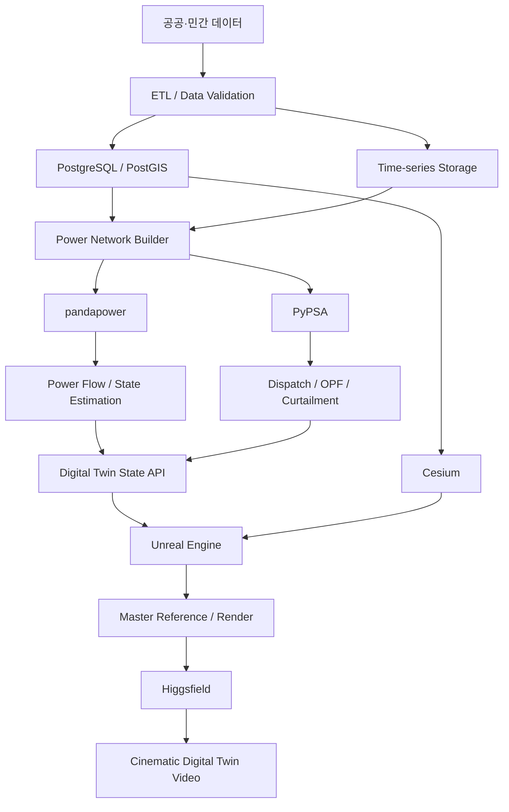

# 제주 전력망 디지털 트윈 구축 기획서

> 후속 설계: [Rust·제주 실사 사진 기반 대화형 3D 기획서 v0.2](jeju_power_grid_digital_twin_design.md). 아래 v0.1은 초기 기획이며, 현재 합의한 범위와 구현 조건은 v0.2를 기준으로 검토한다.

## GIS·전력계통 시뮬레이션·3D 시각화·Higgsfield 기반 생성형 영상 연계

- **문서 버전:** v0.1
- **작성일:** 2026-09-29
- **대상 지역:** 제주특별자치도
- **핵심 목표:** 실제 공간·계통 데이터를 기반으로 제주 발전설비, 송·배전망, HVDC 및 시간별 전력 상태를 통합한 연구·시연용 전력망 디지털 트윈 구축

---

## 1. 프로젝트 개요

### 1.1 배경

제주 전력계통은 섬 지역이라는 공간적 특성과 높은 재생에너지 비중, 육지 계통과의 HVDC 연계가 동시에 존재하는 대표적인 독립·연계 혼합형 전력계통 사례이다. 따라서 발전소, 변전소, 송·배전선, HVDC, 발전량, 부하 및 기상 정보를 하나의 공간·시간 시스템으로 통합할 경우 전력계통의 상태와 재생에너지 변동성을 직관적으로 표현할 수 있다.

본 프로젝트는 단순한 3D 지도 제작이 아니라 다음과 같은 구조를 갖는 **데이터 기반 전력망 디지털 트윈**을 구축하는 것을 목표로 한다.

\[
\text{공간 데이터}
+
\text{전력계통 데이터}
+
\text{시간 데이터}
+
\text{전력계통 해석}
+
\text{3D 시각화}
+
\text{생성형 영상}
\]

특히 Higgsfield는 전력망의 물리 계산 엔진으로 사용하는 것이 아니라, 실제 GIS 및 전력계통 계산 결과로 구축한 Master Reference를 기반으로 카메라 이동, 시네마틱 영상, 시나리오 연출을 생성하는 **Presentation Layer**로 활용한다.

---

## 2. 프로젝트 목표

### 2.1 최종 목표

제주도의 발전소, 재생에너지 설비, 주요 변전소, 송·배전선 및 HVDC 연계망을 실제 지리 좌표 위에 구축하고, 발전량·부하·기상·계통해석 결과를 시간에 따라 반영하는 3D 디지털 트윈을 구현한다.

최종적으로 다음 흐름을 구현한다.

```text
Weather
   ↓
Renewable Generation / Load Forecast
   ↓
Power-System State
   ↓
Power Flow / Grid Constraint
   ↓
Risk / Curtailment / Congestion
   ↓
3D Digital Twin
   ↓
Higgsfield Cinematic Visualization
```

### 2.2 세부 목표

1. 제주도 실제 지형과 전력설비의 공간정보 통합
2. 발전소·변전소·송전선·배전선의 전력망 topology 구성
3. 시간별 발전량 및 부하 데이터 연계
4. AC/DC Power Flow 기반 계통 상태 계산
5. 재생에너지 출력증가, 송전제약, HVDC 역송 등의 시나리오 구현
6. Cesium + Unreal Engine 기반 3D Digital Twin 구현
7. Higgsfield 기반 시네마틱 영상 및 발표용 시나리오 제작
8. 향후 예측 AI 및 위험도 분석 모델과 연동 가능한 구조 확보

---

# 3. 디지털 트윈의 정의와 구축 수준

본 프로젝트에서는 디지털 트윈을 다음 네 단계로 구분한다.

| 수준 | 보유 데이터 | 구현 가능 범위 |
|---|---|---|
| Level 1 | 발전소 위치 | 발전설비 3D 지도 |
| Level 2 | 발전소 + 송·배전망 | 정적 전력망 Digital Twin |
| Level 3 | Level 2 + 발전량/부하 시계열 | 동적 전력망 Digital Twin |
| Level 4 | Level 3 + 선로/변압기 전기 파라미터 | Power Flow 및 계통해석 가능한 Digital Twin |

본 프로젝트의 1차 목표는 **Level 3**, 전기 파라미터 확보 시 **Level 4**까지 확장한다.

---

# 4. 핵심 데이터

## 4.1 발전소 위치 데이터

### 필수 필드

```text
plant_id
name
latitude
longitude
fuel_type
capacity_mw
operator
status
```

### 활용

- 실제 발전소 위치 표시
- 발전원별 3D Asset 분류
- 설비용량에 따른 크기 또는 중요도 표현
- 발전량 시계열과 연결
- 발전원별 색상 및 상태 표현

### 공개 데이터 예시

제주특별자치도 풍력발전 현황 데이터는 발전소명, 설비용량, 설치장소, 원동력 종류 등을 제공한다.

제주특별자치도 태양광발전소 현황 데이터는 상호, 설비용량, 설치장소, 사업개시일 등의 정보를 제공한다.

---

## 4.2 송·배전선 데이터

전력망 Digital Twin에서 가장 중요한 데이터 중 하나이다.

### 권장 형식

- GeoJSON
- Shapefile
- GeoPackage
- PostGIS Geometry

### 필수 필드

```text
line_id
from_bus
to_bus
voltage_kv
geometry
line_type
length_km
```

### 계통해석 고도화 시 추가 필드

```text
r_ohm_per_km
x_ohm_per_km
c_nf_per_km
max_i_ka
max_mva
parallel
```

### 역할

송·배전선 데이터가 존재하면 발전소와 변전소가 단순한 Point가 아니라 실제 Network로 연결된다.

```text
Generator
   ↓
Substation
   ↓
Transmission Line
   ↓
Substation
   ↓
Distribution Grid
   ↓
Load
```

즉, 전력망 topology가 형성된다.

---

## 4.3 변전소 데이터

### 필수 필드

```text
substation_id
name
latitude
longitude
voltage_kv
capacity_mva
type
```

### 변압기 데이터 확보 시

```text
transformer_id
hv_bus
lv_bus
sn_mva
vn_hv_kv
vn_lv_kv
vk_percent
vkr_percent
tap_position
```

변전소는 GIS 공간 데이터와 Power Flow Network의 Bus를 연결하는 핵심 노드로 활용한다.

---

## 4.4 발전량 시계열

### 권장 구조

```text
timestamp
plant_id
generation_mw
```

예:

```text
2026-01-01 00:00, WIND_001, 24.2
2026-01-01 01:00, WIND_001, 28.8
2026-01-01 02:00, WIND_001, 31.5
```

### 활용

시간에 따라 발전소 출력, 송전선 전력 흐름, HVDC 흐름 및 재생에너지 비율을 변화시킨다.

---

## 4.5 부하 데이터

### 권장 구조

```text
timestamp
bus_id
load_mw
```

세부 지역 부하 데이터가 없을 경우 행정구역·변전소·인구·전력판매량 등을 기반으로 배분하는 근사 모델을 사용할 수 있다.

---

## 4.6 기상 데이터

### 주요 변수

```text
timestamp
latitude
longitude
wind_speed
wind_direction
temperature
solar_radiation
humidity
precipitation
```

### 활용

```text
Weather
   ↓
Wind / Solar Generation
   ↓
Grid State
```

즉, 기상 변화가 발전량과 계통 상태 변화로 이어지는 시나리오를 구현한다.

---

# 5. 데이터 조합에 따른 프로젝트 가치

## 5.1 발전소 위치만 확보된 경우

구현 가능:

- 발전설비 지도
- 발전원 분포
- 발전소 용량 시각화
- 3D Asset 배치

한계:

- 전력망의 연결 관계를 표현할 수 없음
- 전력 흐름 계산 불가능

따라서 GIS 기반 발전설비 지도 수준이다.

---

## 5.2 발전소 위치 + 송·배전선

구현 가능:

- 발전소-변전소-송전망 연결
- 제주 전력망 topology
- 3D Network Visualization

이 시점부터 **정적 Digital Twin**이라고 부를 수 있다.

---

## 5.3 발전소 + 송·배전선 + 발전량

구현 가능:

- 시간대별 발전량 변화
- 발전소별 상태 변화
- 전력 흐름 Animation
- 재생에너지 비율 변화
- 시간축 기반 시나리오

이 시점부터 **동적 Digital Twin**으로 확장된다.

---

## 5.4 발전소 + 송·배전선 + 발전량 + 부하 + 전기 파라미터

다음 분석까지 가능하다.

- AC Power Flow
- DC Power Flow
- Voltage profile
- Transmission loading
- Congestion
- Contingency
- Renewable curtailment
- Optimal Power Flow
- HVDC dispatch

이 단계는 연구용 전력계통 Digital Twin에 가깝다.

---

# 6. 시스템 아키텍처



---

# 7. 기술 스택

## 7.1 데이터 계층

- Python
- Polars 또는 Pandas
- GeoPandas
- PostgreSQL
- PostGIS
- Parquet
- GeoJSON

## 7.2 전력계통 계층

### pandapower

주요 역할:

- AC Power Flow
- DC Power Flow
- 3-phase Power Flow
- State Estimation
- Contingency Analysis
- Short-Circuit
- Time-series Simulation
- Topology Analysis

### PyPSA

주요 역할:

- Economic Dispatch
- Unit Commitment
- Renewable Generation
- Storage
- Network Optimization
- Optimal Power Flow
- Curtailment 분석
- Multi-snapshot Power Flow

권장 사용 방식은 다음과 같다.

```text
pandapower
→ 실제 계통 상태 / Power Flow 중심

PyPSA
→ Dispatch / 최적화 / 재생에너지 시나리오 중심
```

필요에 따라 하나만 사용해도 되며, 초기 MVP는 pandapower 중심으로 시작할 수 있다.

---

# 8. 3D 공간 Digital Twin

## 8.1 Cesium

Cesium for Unreal을 이용하여 WGS84 실제 좌표 기반으로 제주도를 구성한다.

주요 입력:

- Terrain
- Satellite imagery
- 3D Tiles
- 발전소 좌표
- 변전소 좌표
- 송배전선 Geometry

### 흐름

```text
DEM / Terrain
     ↓
Cesium Terrain

Satellite Imagery
     ↓
Raster Overlay

Plant / Substation
     ↓
3D Object

Transmission Line
     ↓
Spline / Polyline

Power Flow Result
     ↓
Material / Particle Animation
```

---

## 8.2 Unreal Engine

Unreal Engine은 다음을 담당한다.

- 3D 자산
- 카메라
- 라이팅
- 사용자 Interaction
- Particle-based Power Flow
- Grid state visualization
- Scenario Animation
- HUD
- 영상 렌더링

예:

```text
Wind Farm      312 MW
Substation     87 % Loading
HVDC          -184 MW
Renewable       43.2 %
Grid Demand    1.12 GW
```

---

# 9. Higgsfield의 역할

Higgsfield는 물리 기반 Digital Twin Engine으로 사용하지 않는다.

## 9.1 담당 역할

- Image Reference 기반 영상 생성
- First / Last Frame 기반 장면 연결
- Camera Movement
- Multi-shot Scenario
- Cinematic Presentation
- 발표·홍보·시연 영상 제작

## 9.2 담당하지 않는 역할

다음은 Higgsfield가 아니라 계통 시뮬레이터 및 GIS가 담당한다.

- 송전망 topology
- 발전소 실제 좌표
- Power Flow
- Voltage
- Phase Angle
- Line Loading
- OPF
- 발전량 계산

즉,

```text
잘못된 접근

Higgsfield
   ↓
Jeju Grid 생성
```

보다 다음 방식이 적절하다.

```text
권장 접근

GIS / Power System Data
   ↓
Cesium / Unreal
   ↓
Accurate Master Reference
   ↓
Higgsfield
```

---

# 10. 이미지 Reference 전략

Higgsfield에서 일관된 결과물을 생성하려면 Reference Image를 역할별로 분리한다.

## Reference 1. Master Reference

**가장 중요한 이미지**

포함:

- 제주 실제 지형
- 해안선
- 발전소
- 주요 변전소
- 송전망
- HVDC 연결
- 정확한 GIS 좌표

이 이미지는 QGIS / Cesium / Unreal에서 생성한다.

권장:

- 16:9
- Bird's-eye View
- 3D Isometric 또는 High-altitude Camera
- 텍스트 최소화

---

## Reference 2. Environment Reference

목적:

- 제주도의 지형
- 해안
- 한라산
- 자연환경
- 전체적인 공간 분위기

Higgsfield가 지형 스타일을 크게 왜곡하지 않도록 보조한다.

---

## Reference 3. Asset Reference

설비 형태를 고정한다.

예:

- 풍력발전기
- 송전탑
- 변전소
- 태양광 패널
- 화력발전소
- HVDC 변환소

정확한 설비를 표현해야 할 경우 생성형 이미지보다 실제 시설 사진 또는 자체 제작 3D Asset을 우선한다.

---

## Reference 4. Grid Reference

전력망의 논리적 구조를 전달한다.

예:

```text
Mainland
   │
 HVDC
   │
Jeju Converter
   │
Transmission Grid
   ├── Wind
   ├── Solar
   ├── Thermal
   └── Load
```

단, Grid schematic은 시각 참고용이며 실제 계통 topology의 Source of Truth는 GIS/DB로 관리한다.

---

## Reference 5. Style Reference

Digital Twin UI의 스타일을 결정한다.

권장 방향:

- Industrial
- Scientific
- Semi-realistic
- Dark background
- Power-flow particle
- Minimal HUD
- Unreal / Omniverse 계열 시각화

---

# 11. Higgsfield 장면 구성 예시

## Scene 1. 제주 전체

```text
Camera:
High altitude bird's-eye view

Objects:
Jeju Island
Hallasan
Main transmission network
Major generation plants
HVDC links
```

---

## Scene 2. 재생에너지 증가

```text
Wind speed ↑
      ↓
Wind Generation ↑
      ↓
Transmission Flow ↑
      ↓
HVDC Export ↑
```

3D 화면에서는:

- 풍력발전기 회전
- 발전소 출력 HUD 증가
- 송전선 Particle 속도 증가
- HVDC Flow 방향 변화

---

## Scene 3. 송전 제약

```text
Renewable Output ↑
        ↓
Line Loading ↑
        ↓
Congestion
        ↓
Curtailment
```

화면 표현:

```text
Line A : 63 %
Line B : 88 %
Line C : 103 %  → Constraint
```

---

## Scene 4. 설비 고장

```text
Line Fault
    ↓
Line Disconnection
    ↓
Power Flow Redistribution
    ↓
Nearby Line Loading ↑
```

이는 Contingency Analysis와 직접 연결할 수 있다.

---

# 12. Power Flow 모델

각 Bus \(i\)에서 AC Power Flow는 다음 조건을 만족한다.

\[
S_i = P_i+jQ_i
\]

\[
S_i = V_i I_i^*
\]

\[
I_i = \sum_j Y_{ij}V_j
\]

따라서

\[
S_i
=
V_i
\left(
\sum_j Y_{ij}V_j
\right)^*
\]

를 해결하여 각 Bus의

\[
V_i,\theta_i
\]

및 각 선로의

\[
P_{ij},Q_{ij},I_{ij}
\]

를 계산한다.

Digital Twin은 이 결과를 3D 공간과 연결한다.

---

# 13. 시각화 변수

## 발전소

```text
generation_mw
capacity_factor
available_capacity
status
```

## 변전소

```text
voltage_pu
active_power_mw
reactive_power_mvar
transformer_loading
```

## 송전선

```text
p_from_mw
p_to_mw
q_from_mvar
current_ka
loading_percent
```

## HVDC

```text
power_mw
direction
capacity_mw
loading_percent
```

---

# 14. 제주 HVDC 표현

제주 계통에서 HVDC는 핵심 요소이다.

현재 공개 자료를 기준으로 주요 육지-제주 연계 구조는 다음과 같다.

```text
해남 ───── 제주
       HVDC #1

진도 ───── 서제주
       HVDC #2

완도 ───── 동제주
       HVDC #3
```

한전 공개자료에 따르면 제3연계선은 완도변환소와 동제주변환소를 연결하며, 2024년 11월 상업운전을 시작했다. 설비용량은 200 MW, 직류전압은 ±150 kV, 길이는 약 98 km이다.

제3연계선은 전압형 HVDC로 구축되어 제주 재생에너지 증가 시 육지 방향 역송을 포함한 시나리오 표현에 특히 유용하다.

---

# 15. 데이터 저장 구조

## 15.1 plant.csv

```csv
plant_id,name,lat,lon,fuel_type,capacity_mw
WIND001,Example Wind Farm,33.x,126.x,wind,30
```

---

## 15.2 substation.csv

```csv
sub_id,name,lat,lon,voltage_kv,capacity_mva
SUB001,Example Substation,33.x,126.x,154,300
```

---

## 15.3 line.geojson

```json
{
  "type": "Feature",
  "properties": {
    "line_id": "LINE001",
    "from_bus": "SUB001",
    "to_bus": "SUB002",
    "voltage_kv": 154
  },
  "geometry": {
    "type": "LineString",
    "coordinates": []
  }
}
```

---

## 15.4 generator_timeseries.parquet

```text
timestamp
plant_id
generation_mw
```

---

## 15.5 load_timeseries.parquet

```text
timestamp
bus_id
load_mw
```

---

## 15.6 weather.parquet

```text
timestamp
grid_id
temperature
wind_speed
wind_direction
solar_radiation
humidity
```

---

# 16. 데이터베이스 설계

권장 DB:

```text
PostgreSQL + PostGIS
```

### 주요 테이블

```text
plants
substations
transmission_lines
distribution_lines
transformers
hvdc_links

generation_timeseries
load_timeseries
weather_timeseries
powerflow_results
scenario_results
```

### Geometry

```text
plants.geom                POINT
substations.geom           POINT
transmission_lines.geom    LINESTRING
distribution_lines.geom    LINESTRING
```

---

# 17. API 구조

Digital Twin Frontend와 계통 시뮬레이션을 분리한다.

```text
GET /plants
GET /substations
GET /lines
GET /network/topology

GET /state?t=2026-01-01T12:00
GET /generation?t=...
GET /load?t=...

POST /simulation/powerflow
POST /simulation/contingency
POST /simulation/renewable-surge
```

예:

```json
{
  "timestamp": "2026-01-01T12:00:00",
  "line_id": "LINE_143",
  "flow_mw": 121.4,
  "loading_percent": 72.0
}
```

---

# 18. AI 연계 확장

향후 사용자의 기존 전력수요예측·기상 기반 예측 연구와 결합할 수 있다.

## 18.1 Load Forecast

\[
\hat L_{t+h}=f(X_{t-k:t})
\]

---

## 18.2 Renewable Generation Forecast

\[
\hat P^{wind}_{t+h}
=
f(
v_t,
\theta_t,
T_t,
P_t
)
\]

\[
\hat P^{solar}_{t+h}
=
g(
GHI_t,
T_t,
cloud_t
)
\]

---

## 18.3 미래 상태 계산

예측값을 Power Flow에 넣는다.

\[
(\hat P^{gen}_{t+h},\hat P^{load}_{t+h})
\rightarrow
\text{Power Flow}
\]

따라서

\[
\hat V_{i,t+h},
\hat P_{ij,t+h},
\hat L_{ij,t+h}
\]

를 계산할 수 있다.

최종적으로는 **현재 상태를 보여주는 Digital Twin**에서 **미래 위험을 예측하는 Predictive Digital Twin**으로 발전시킬 수 있다.

---

# 19. 주요 시나리오

## Scenario A. 정상 운전

```text
Generation = Demand + Export
```

정상적인 발전·수요·HVDC 상태 표현.

---

## Scenario B. 강풍

```text
Wind Speed ↑
→ Wind Generation ↑
→ Line Flow ↑
→ HVDC Export ↑
```

---

## Scenario C. 재생에너지 과잉

```text
Renewable Generation ↑↑
       ↓
Grid Constraint
       ↓
Curtailment
```

---

## Scenario D. 송전선 고장

```text
Line Outage
  ↓
Network Reconfiguration
  ↓
Flow Redistribution
  ↓
Overloaded Line Detection
```

---

## Scenario E. 태풍

```text
Typhoon
 ↓
Wind Speed Extreme
 ↓
Wind Turbine Cut-out
 ↓
Generation Drop
 ↓
HVDC Import ↑
```

---

# 20. MVP 범위

처음부터 제주 전체 배전망까지 구현하지 않는다.

### MVP 포함

- 제주 지형
- 주요 발전소
- 주요 풍력단지
- 주요 태양광 클러스터
- 주요 변전소
- 주요 송전망
- HVDC #1 / #2 / #3
- 발전량 시계열
- 기본 부하
- Power Flow
- Unreal 3D
- Higgsfield Demo Video

### MVP 제외 또는 후순위

- 저압 배전선 전체
- 개별 가구
- 실시간 SCADA
- 보호계전
- EMT Simulation
- 상세 배전 자동화

---

# 21. 개발 단계

## Phase 0. Data Audit

목표:

현재 확보된 데이터의 활용 가능성을 먼저 평가한다.

확인 항목:

- 좌표계
- 공간 해상도
- 시간 해상도
- 결측
- 중복
- 발전소 ID 일치 여부
- 변전소 ID
- Line topology
- 발전량 데이터 연결 가능 여부
- 전기 파라미터 존재 여부

---

## Phase 1. Spatial Twin

```text
제주 Terrain
+
발전소
+
변전소
+
송배전선
```

산출물:

- GIS Network
- PostGIS DB
- 제주 전력망 2D map
- 3D Master Reference

---

## Phase 2. Power Network Model

```text
GIS
 ↓
Bus / Line / Generator
 ↓
pandapower
```

산출물:

- Network Model
- Power Flow
- Line Loading
- Voltage Profile

---

## Phase 3. Time-series Twin

```text
Generation(t)
Load(t)
Weather(t)
     ↓
Power Flow(t)
```

시간축에 따라 상태가 변하는 Digital Twin 구현.

---

## Phase 4. Unreal Digital Twin

- Cesium terrain
- Asset placement
- Power flow animation
- Timeline
- HUD
- Camera
- Scenario control

---

## Phase 5. Higgsfield

Unreal 출력 이미지를 Master Reference로 활용한다.

예:

```text
START FRAME
Jeju whole-grid view

↓ Fly over

Wind Farm

↓ Follow transmission line

Substation

↓ Zoom

HVDC Converter

END FRAME
Mainland connection
```

---

# 22. 평가 기준

## 22.1 공간 정확도

- 발전소 위치 오차
- 변전소 위치 오차
- 송전선 Geometry 일치도

## 22.2 Topology 정확도

- Bus-Line 연결 정확도
- 발전소-Bus Mapping
- HVDC Mapping

## 22.3 전력계통 정확도

가능한 경우 실제 측정값과 비교한다.

\[
MAE =
\frac{1}{N}
\sum_{t=1}^{N}
|P_t-\hat P_t|
\]

\[
RMSE=
\sqrt{
\frac{1}{N}
\sum_{t=1}^{N}
(P_t-\hat P_t)^2
}
\]

## 22.4 Digital Twin 시각 정확도

Higgsfield 영상 자체를 Source of Truth로 평가하지 않는다.

정확성 기준은:

```text
GIS
Power Flow
Simulation
```

결과이며 Higgsfield는 presentation quality 중심으로 평가한다.

---

# 23. 데이터가 부족할 경우

## Case 1. 선로 Geometry는 있으나 R/X가 없음

선로:

- 전압
- 길이
- 선종

을 이용해 대표 파라미터를 추정한다.

단, 추정값임을 명확히 표시한다.

---

## Case 2. 변전소 연결 정보가 없음

송전선 Geometry endpoint를 이용해 nearest substation snapping을 수행한 후 수동 검증한다.

---

## Case 3. 개별 발전소 발전량이 없음

가능한 경우 발전원별 총 발전량을 설비용량 비율로 분배하거나 기상 기반 발전모델을 사용한다.

단, 이는 실제 발전량이 아닌 추정 상태로 명확하게 구분한다.

---

## Case 4. 부하가 제주 전체값만 존재

변전소 용량, 행정구역 전력사용량, 인구, 산업시설 등을 이용해 spatial disaggregation을 수행할 수 있다.

---

# 24. 중요한 한계

## 24.1 공개 데이터 기반 Twin의 한계

공개자료만으로 실제 전력회사 EMS/SCADA와 동일한 Digital Twin을 구성하기는 어렵다.

부족할 가능성이 높은 정보:

- 정확한 설비 topology
- 선로 R/X/B
- 변압기 임피던스
- Tap
- Switch 상태
- 실시간 전압
- 실시간 무효전력
- 보호계전 정보
- SCADA measurement

따라서 프로젝트 결과물은 초기에는 다음처럼 정의한다.

> **Research-grade / Visualization-grade Jeju Power Grid Digital Twin**

실제 운영제어 시스템과 동일하다고 표현하지 않는다.

---

# 25. 권장 프로젝트 디렉터리

```text
jeju-digital-twin/
│
├── data/
│   ├── raw/
│   ├── interim/
│   └── processed/
│
├── gis/
│   ├── plants.geojson
│   ├── substations.geojson
│   ├── transmission.geojson
│   └── distribution.geojson
│
├── database/
│   └── schema.sql
│
├── power_system/
│   ├── network_builder.py
│   ├── powerflow.py
│   ├── contingency.py
│   └── scenarios.py
│
├── forecasting/
│   ├── load/
│   ├── wind/
│   └── solar/
│
├── api/
│   └── main.py
│
├── unreal/
│
├── higgsfield/
│   ├── references/
│   ├── prompts/
│   └── storyboards/
│
├── notebooks/
│
└── docs/
    └── project_plan.md
```

---

# 26. 권장 최종 아키텍처

```text
                  ┌───────────────────────┐
                  │       Higgsfield      │
                  │ Cinematic Generation  │
                  └───────────▲───────────┘
                              │
                  ┌───────────┴───────────┐
                  │ Unreal Engine + Cesium│
                  │ 3D Digital Twin       │
                  └───────────▲───────────┘
                              │
                  ┌───────────┴───────────┐
                  │    Digital Twin API   │
                  └───────────▲───────────┘
                              │
          ┌───────────────────┴───────────────────┐
          │                                       │
 ┌────────┴────────┐                    ┌─────────┴────────┐
 │   pandapower    │                    │      PyPSA       │
 │ Grid State/PF   │                    │ Dispatch / OPF   │
 └────────▲────────┘                    └─────────▲────────┘
          │                                       │
          └───────────────────┬───────────────────┘
                              │
                  ┌───────────┴───────────┐
                  │ PostgreSQL + PostGIS  │
                  └───────────▲───────────┘
                              │
      ┌───────────────────────┼────────────────────────┐
      │                       │                        │
   발전소/발전량           송배전망/GIS              기상/부하
```

---

# 27. 프로젝트의 핵심 차별점

단순 Digital Twin 시각화 프로젝트가 아니라 다음을 하나의 pipeline으로 통합한다.

### 1. 실제 GIS

```text
Physical Location
```

### 2. 전력계통 물리 모델

```text
Power Flow / OPF
```

### 3. AI 예측

```text
Load / Renewable Forecast
```

### 4. 미래 시나리오

```text
Forecast → Grid State
```

### 5. 생성형 AI 영상

```text
Simulation → Cinematic Visualization
```

따라서 최종 시스템은 다음과 같이 정의할 수 있다.

> **AI-driven Jeju Power Grid Predictive Digital Twin**

---

# 28. 최종 권장 방향

가장 중요한 원칙은 **정확한 데이터와 생성형 AI를 분리하는 것**이다.

```text
GIS / Power System
      ↓
 Ground Truth Layer

Simulation
      ↓
 State Layer

Unreal / Cesium
      ↓
 Visualization Layer

Higgsfield
      ↓
 Presentation Layer
```

Higgsfield가 발전소 위치나 송전망을 임의로 생성하도록 하지 않는다.

실제 데이터로 정확한 Master Reference를 만든 후 Higgsfield는 해당 구조를 기반으로 영상과 카메라 연출만 담당하도록 한다.

---

# 29. 첫 번째 구현 목표

가장 먼저 다음 결과물을 만든다.

## Jeju Grid Master Reference v1

포함:

- 제주도 전체 지형
- 한라산
- 주요 발전소
- 주요 풍력단지
- 주요 변전소
- 주요 송전선
- HVDC #1/#2/#3

형식:

```text
16:9
4K
Bird's-eye view
GIS-accurate
Minimal labels
Semi-realistic digital twin
```

이 Master Reference가 완성되면 이후:

```text
Master Reference
→ Power Flow Overlay
→ Time-series Animation
→ Scenario Render
→ Higgsfield Video
```

순으로 확장한다.

---

# 30. 착수 시 우선 확인해야 할 데이터

현재 데이터가 확보되어 있다면 아래 순서로 검사한다.

### A. 송배전선

- 파일 형식
- 좌표계
- voltage level
- from/to node
- Geometry
- Line ID
- 전기 파라미터 여부

### B. 발전소

- 발전소명
- 위경도
- 설비용량
- 발전원
- 발전소 ID

### C. 발전량

- timestamp
- 발전소 ID
- MW
- 시간 해상도
- 결측률

### D. 변전소

- 위치
- 전압
- 용량
- Bus ID

### E. 부하

- 제주 전체인지
- 변전소 단위인지
- 행정구역 단위인지
- 시간 해상도

이 다섯 데이터의 스키마를 확인한 뒤 실제 구현 가능한 Digital Twin 수준을 확정한다.

---

# 31. 결론

송·배전선 데이터, 발전소 위치 데이터 및 발전량 시계열을 확보하고 있다면 본 프로젝트의 가능성은 크게 높아진다.

세 데이터는 각각 다음 역할을 담당한다.

```text
송배전선 → Network Structure
발전소 위치 → Physical Asset
발전량 → Dynamic State
```

여기에 변전소, 부하 및 전기 파라미터가 추가되면 실제 Power Flow 기반 연구용 Digital Twin으로 발전시킬 수 있다.

따라서 권장 개발 순서는 다음과 같다.

\[
\boxed{
\text{Data Audit}
\rightarrow
\text{GIS Network}
\rightarrow
\text{Power System Model}
\rightarrow
\text{Time-series Twin}
\rightarrow
\text{Cesium/Unreal}
\rightarrow
\text{Higgsfield}
}
\]

핵심은 **Higgsfield를 디지털 트윈의 기반으로 삼는 것이 아니라, 정확한 Digital Twin 위에 Higgsfield를 시각화·영상 레이어로 추가하는 것**이다.

---

# 32. 참고 자료

1. **Higgsfield API — Kling O3 Image Reference**  
   https://open.higgsfield.ai/models/kling-video/o3/image-reference/api-reference  
   - 이미지 레퍼런스 기반 영상 생성
   - First/Last Frame
   - Multi-shot
   - 16:9 등 Aspect Ratio 지원

2. **Cesium for Unreal**  
   https://cesium.com/platform/cesium-for-unreal/  
   - WGS84 기반 실제 지구 좌표
   - Terrain / Imagery / Photogrammetry / 3D Tiles
   - Unreal Engine 연동

3. **pandapower Documentation**  
   https://pandapower.readthedocs.io/en/latest/  
   - Power Flow
   - State Estimation
   - Contingency Analysis
   - Time-series Simulation
   - Topological Search

4. **PyPSA**  
   https://pypsa.org/  
   https://docs.pypsa.org/latest/user-guide/power-flow/  
   - Power Flow
   - Economic Dispatch
   - Network Optimization
   - Renewable / Storage Modeling

5. **전력통계정보시스템 EPSIS — 발전기 현황**  
   https://epsis.kpx.or.kr/epsisnew/selectEkpoBcrGrid.do  
   - 발전기 및 발전설비 관련 통계

6. **제주특별자치도 풍력발전현황 — 공공데이터포털**  
   https://www.data.go.kr/data/15047557/fileData.do  
   - 발전소명
   - 설비용량
   - 설치장소
   - 원동력 종류

7. **제주특별자치도 태양광발전소현황 — 공공데이터포털**  
   https://www.data.go.kr/data/3082724/fileData.do  
   - 발전소 상호
   - 설비용량
   - 설치장소
   - 사업개시일

8. **한국전력 — 제주 제3 HVDC 연계선 관련 공개자료**  
   https://www.kepco.co.kr/KEPCO_FILE/html/2026_04/sight.html  
   - 완도–동제주 제3연계선
   - 200 MW
   - ±150 kV
   - 약 98 km
   - 2024년 11월 상업운전

---

## Appendix A. 가장 먼저 받을 데이터 예시

가능하면 다음 파일을 하나의 폴더로 준비한다.

```text
01_plants.csv
02_substations.csv
03_transmission_lines.shp
04_distribution_lines.shp
05_generation_timeseries.csv
06_load_timeseries.csv
07_weather.csv
```

파일 확보 후 첫 번째 작업은 모델 개발이 아니라 **데이터 스키마·좌표계·ID 연결 관계를 검증하는 Data Audit**이다.

---

## Appendix B. 최종 데모 Storyboard

```text
[00:00]
제주 전체 Bird's-eye view

[00:05]
발전소 및 주요 송전망 표시

[00:10]
풍력발전량 증가

[00:15]
송전선 Power Flow 증가

[00:20]
HVDC 제주 → 육지 역송

[00:25]
송전선 Constraint 발생

[00:30]
Curtailment 실행

[00:35]
계통 상태 정상화

[00:40]
Jeju Power Grid Digital Twin 전체 화면
```

실제 전력계통 상태는 pandapower/PyPSA 결과에 기반하고, Higgsfield는 해당 장면의 시네마틱 전환과 시각적 연출을 담당한다.
